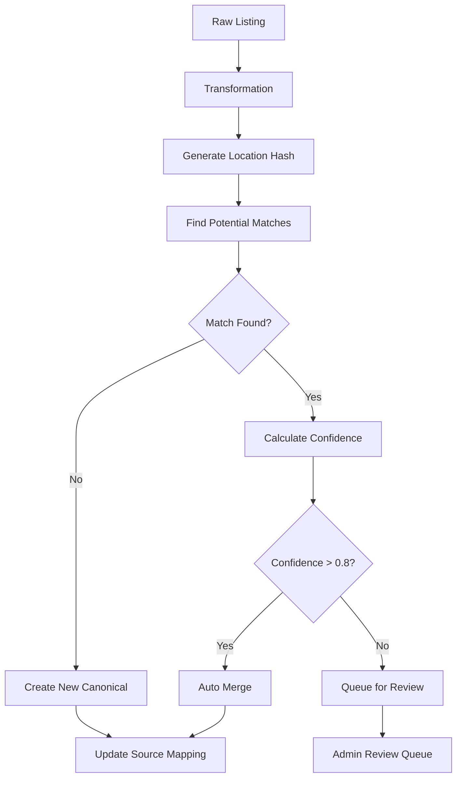

# Listings Pipeline Design
**goal:** implement an enterprise grade listings pipeline with a powerful graphical interface for configuring scraping jobs; managing transformations, ingestions and updates; handling conflicts; scheduling jobs and queues; managing manual data updates.

### **Overview**

The listings pipeline follows a sophisticated DMO-source relationship where **DMOs serve as the source systems** for scraping jobs, and each listing has a **master listing part** (global data) stored in 'listings' records, and **detail parts** (DMO-specific data) stored in `listing_info` records. This architecture enables white-label functionality where the same physical listing can have different descriptions, contact info, images, and visibility controls for different DMOs.

## key features
- **ingest listings from many sources:** uploaded csv files, html scrapers, WordPress API, Drupal API, affiliate API like Priceline, poi data sets (like ESRI, HERE)
- **preserve provenance:** source, original ID, fetch metadata
- **deduplicate and reconcile records:** into canonical listings
- **scale via queue/workers:** avoid overloading target sites and our servers
- **Surface status/metrics and admin controls:** Retries, re-run, ignore, or manual merge
- **UI interface for administration of each pipeline stage:**

## architecture summary
- **Multi-Source Ingestion**: uploaded csv files, html scrapers, WordPress API, Drupal API, affiliate API like Priceline, poi data sets (like ESRI, HERE)
- **Raw Storage Pipeline**: S3 for raw payloads + PostgreSQL for metadata
- **Transformed Storage Pipeline**: S3 for transformed payloads + PostgreSQL for metadata
- **Image Storage Pipeline**: S3 for images from transform urls
- **Queue/Worker System**: Redis/Bull for scalable background processing with image handling
- **Provenance Tracking**: Complete data lineage with source metadata and original IDs
- **Deduplication Engine**: Intelligent matching including image hash comparison
- **Image Processing**: Download, validate, resize, thumbnail generation, S3 storage
- **Safe Sync Operations**: Non-destructive updates with admin review workflow
- **Dual-Level Visibility Control**: Listing-level and listing_info-level visibility and status management
- **White-Label Support**: DMO-specific visibility controls for multi-tenant architecture
- **Admin Control Panel**: Status monitoring, retry logic, manual merge operations
- **Public API**: `/v1/listings` - Anonymous listing search and discovery
- **Admin API**: `/v1/admin/listings` - Authenticated listing management operations
- **Frontend**: Hybrid atomic design + feature-based architecture

## data flow overview
```bash
Scrape/Upload from dmos. Dmos is another word for our data sources.
    ↓
 store raw data in S3 as .json.gz, .csv.gz, .xls.gz; create metadata records
    ↓
Transformation (clean, geotag, normalize, dedup, enrich)
    ↓
 store transformed data in S3 as .json.gz; create metadata records
    ↓
Stage upsert (PostgreSQL - ingest transformed data into staging candidate records for canonical)
    ↓
Image download & canonicalization (async job)
    ↓
Production (PostgreSQL -> promote staged to production / Canonical Listings: listings and listing_info tables)
```

### DMO as Source System
- **DMOs are the source systems** for scraped/uploaded data
- Each DMO has a `dmo_type_id` (`SCRAPED` (1), `TRAVEL_SITE` (2), `CLIENT` (3), `PARTNER` (4) )
- Each DMO has a `source_type` that specifies how to ingest data: `WORDPRESS`, `WEBSITE`, `API`, or `DRUPAL`
- Each DMO will need new db columns to store scrape job control data (base_url, config, etc)
- Scraping jobs are configured per DMO
- The pipeline ingests data **on behalf of** a specific DMO, tied to the listing, but the detail record is stored in listing_info

### Image download & canonicalization (async job)
- Download images from original URLs.
- Store in S3/CDN (canonical/images/...).
- Update staging_listings with canonical_image_url.

### S3 file naming

s3://trippl-data/{stage: raw, transformed}/{data-domain: listings, reviews, events}/{country: xx}/{state/province: xx}/dmo-name/{date: YYYYMMDD}/{batch: nnn}-{timestamp: YYYYMMDDTHHMMSS}.{format: json, csv, xls}.gz

### Metadata for S3 raw and transformed files
Add a metadata table in Postgres (data_jobs):
```sql
CREATE TABLE data_jobs (
    id SERIAL PRIMARY KEY,          -- DB job ID
    job_code TEXT,                  -- optional human-readable code
    source TEXT NOT NULL,           -- e.g., mtl.org
    stage TEXT NOT NULL,            -- raw, transformed
    s3_path TEXT NOT NULL,          -- exact S3 file path
    status TEXT NOT NULL,           -- success, failed, partial
    record_count INT,
    created_on TIMESTAMP DEFAULT NOW()
);
```

### S3 image naming

s3://trippl-data/images/{stage: raw, transformed}/{data-domain: listings, reviews, events}/{country}/{state}/{dmo-name}/{date: YYYYMMDD}/{listing-id}/{image-seq}-{timestamp}.{ext}

Images are binary, not batch files, so each image usually corresponds to a single listing (or multiple images per listing).

Original source URL vs canonical URL — you’ll want to encode the source in some way.

# Stages

## 1 Raw Data Stage (immutable)

**Source:** Scraper, API, customer upload

**Contents:**
- Original fields from source (name, address, description, category, images, etc.)
- Often incomplete or inconsistent
- May include source-specific IDs

**Actions:**
- Store as-is in S3 
- Compress (e.g., .json.gz) for storage efficiency
- Create metadata db records: source, file path, stage = raw, record count, ingest timestamp

**Notes:**
- Raw files are immutable


## 2. Transform Stage

**Goal:** Clean, normalize, enrich, deduplicate, track which scraped listings correspond to exising listings → producing data ready for ingestion.

### recap of table structure
```
listings                  -- canonical, immutable-ish
 └─ location_id           -- FK → locations
listing_info          -- per DMO/source, FK → listings
      ├─ listing_id
      └─ contact_info_id  -- FK → contact_info
opening_dates
 └─ listing_info_id       -- 
opening_hours
 ├─ day_id                --
 └─ opening_dates_id       -- 
listing_images
 └─ listing_info_id
bridge_attributes_listings
 └─ listing_id

```
- One canonical listing can have multiple listing_info rows for different DMOs/sources.

**Processing Steps:**

**A. Clean / normalize**
- Trim strings, lowercase text, remove extra whitespace/punctuation
- Standardize common fields (phone number formats, website URLs)
- Normalize categories/tags to your controlled vocabulary (this used to be done via GooglePlaces API lookup)
- Remove obvious duplicates within the file (optional)

### Bridge Table Implementation

- **Table:** bridge_source_listings
| Column      | Description                                                         |
| ----------- | ------------------------------------------------------------------- |
| record_hash | SHA256 hash of key fields (name + address + city/postal if desired) |
| listing_id  | FK → `listings.id`                                                  |
| file_path   | Full S3 path of transformed file                                    |
| created_at  | Timestamp                                                           |

- Workflow:
1 During transformation:
- Compute a hash for each record based on its key fields.
- use a hash-based matching approach that avoids unnecessary geotag API calls. The key idea is: hash on fields that are cheap to compute and mostly unique, then fallback to geotag only if no match is found.
- Attempt to match record to an existing listing via bridge table (record_hash).
- Store mapping (file_path, record_hash, listing_id) in the bridge table.
2 During ingestion:
- Join transformed file records on (file_path, record_hash) → listing_id in listings.
- Insert or update listing_info and linked contact_info/locations/hours based on resolved listing_id.
3 Benefits:
- Keeps raw and transformed files immutable.
- Supports multiple sources and rematching if rules change.
- Full audit trail of which file record maps to which canonical listing.

**B. Deduplicate against existing listings**
- Compute record hash: e.g., SHA256 of normalize(name) + normalize(address)
- Check bridge table (file_listing_mappings) for existing match:
- If match → assign listing_id
- If no match → leave listing_id = null (new listing candidate)

**C. Geotag / enrich**
- Conditional geotag: only call API for unmatched/new records
- Add coordinates (lat/lng) to record
- Optionally enrich with other metadata (hours, amenities, etc.)

**D. Standardize fields**
- Map source fields → canonical schema:
- Ensure field types and JSON structure consistent for ingestion

**E. Deduplicate / merge within transform**
- If multiple records from the same source refer to the same entity (hash match), merge them:
- Keep most complete/most recent data
- Merge image lists

**F. Output transformed file**
- Store in S3: transformed/listings/...
- Include listing_id (if matched) for easy ingestion
- Record metadata in data_jobs

**G. Optional Pre-Ingest Checks**
- Validate required fields (name, lat/lng, category)
- Flag records with missing critical info
- Generate logs of any transformations applied

## 3. Update / Ingest Logic
**A. Location Updates**
- Compute hash of location fields (address + city + postal + lat/lng).
- Compare with existing locations via listings.location_id.
- If different → insert new locations row (optionally versioned) and update listings.location_id.

**B. Contact Info Updates**
- Compute hash of contact fields (phone + website + opening_hours).
- Compare with contact_info row linked via listing_info.contact_info_id.
- If changed → insert new contact_info row and update listing_info.contact_info_id.

**C. Listing Info Updates**
- Compare other source-specific fields (description, category, status).
- Update existing listing_info row if changes exist.
- Always update last_seen_at.


## Economical hashing approach
**1. Choose hash fields**
- Since name + address is usually enough to uniquely identify a listing, your hash can be:
- record_hash = SHA256(lower(trim(name)) + '|' + lower(trim(address)))

- Normalize text: lowercase, trim spaces, remove punctuation if you want
- Exclude lat/lng at this stage — you don’t have it yet

Optional: include city or postal_code if available to reduce hash collisions.

**2. Transform workflow with conditional geotagging**
- Compute record hash on raw record.
- Check hash in file_listing_mappings or staging DB:
- const existingListing = await findListingByHash(record_hash);

If match found:
- Use the existing listing_id
- No geotagging needed

If no match found:
- Call geotag API (GooglePlacesAPI) to get lat/lng
- Create new listing in listings
- Store hash → listing_id in bridge table

**3. Optional hash enhancements**
- Include a normalized name: remove accents, punctuation, common suffixes like “Ltd”, “Inc”.
- Include city or postal code for regional uniqueness.
- Keep a secondary hash including lat/lng after geotagging to detect duplicates in future scrapes.

**4. Example pseudocode (TypeScript)**
```typescript
function normalizeText(str: string) {
  return str.toLowerCase().trim().replace(/[^\w\s]/g, '');
}

function computeRecordHash(name: string, address: string) {
  const normalized = normalizeText(name) + '|' + normalizeText(address);
  return crypto.createHash('sha256').update(normalized).digest('hex');
}

async function processRecord(record) {
  const hash = computeRecordHash(record.name, record.address);
  const listingId = await findListingByHash(hash);

  if (listingId) {
    // existing listing, no geotag call
    return listingId;
  } else {
    // call geotag API
    const coords = await geotag(record.name, record.address);
    const newListing = await createListing({ ...record, location: coords });
    await insertBridgeMapping(record.file_path, hash, newListing.id);
    return newListing.id;
  }
}
```

**5. Benefits**
- Minimizes geotag API usage — only unmatched records trigger geotag calls.
- Immutable raw files — hash only used in transform/bridge table.
- Reliable deduplication — hash prevents creating duplicate listings for repeated scrapes.
- Compatible with multi-source ingestion — each source can have its own bridge table.

## Matching Process before Staging ingestion
implement an admin interface to show staging ingestion status and to resolve any problems or conflicts


## deletions and soft-removals
### soft-delete / visibility system:
- Listings = the canonical, “core” record (stays always visible in DB)
- Listing_Info = the DMO-specific detail record, which can be hidden/soft-deleted per source

### 1. Tables
**listings**
| Column      | Type                                   | Description                                                             |
| ----------- | -------------------------------------- | ------------------------------------------------------------------------|
| id          | SERIAL                                 | Primary key                                                             |
| name        | TEXT                                   | Global listing name                                                     |
| location_id | GEOGRAPHY                              | Coordinates (PostGIS)                                                   |
| created_at  | TIMESTAMP                              | When listing was created                                                |
| updated_at  | TIMESTAMP                              | Last update from any source                                             |
| listing_visible | BOOLEAN                            | Is the entire listing visble                                            |
| listing_status  | ENUM('active','archived', ...)     | Global listing state (e.g., for legal removal, invalid, or mass delete) |

Notes:
- Listings are never deleted; use status for global archival or deprecation.

**listing_info**
| Column         | Type                               | Description                                         |
| -------------- | ---------------------------------- | --------------------------------------------------- |
| id             | SERIAL                             | PK                                                  |
| listing_id     | SERIAL                             | FK → listings.id                                    |
| dmo_id         | SERIAL                             | Which DMO this info comes from                      |
| source_id      | TEXT                               | Original source identifier                          |
| name           | TEXT                               | DMO-specific name (optional override)               |
| info_visible   | BOOLEAN                            | Is this DMO detail record visble                    |
| info_status    | ENUM('active','removed','pending') | More granular state per DMO record                  |
| last_seen_at   | TIMESTAMP                          | Last scrape/update from source                      |
| created_at     | TIMESTAMP                          | Record creation                                     |
| updated_at     | TIMESTAMP                          | Last update                                         |

Notes:
- info_visible determines if the listing is shown in the app for a given DMO.
- status tracks DMO-specific lifecycle (removed, pending, etc.).


### 2. Workflow
### A. New scrape or ingest
1 Upsert listings
- New listing → insert
- Existing → update metadata (name, location)

2 Upsert listing_info
- Set info_visible = TRUE for listings seen in this scrape
- Update last_seen_at

### B. Soft-delete a listing for a DMO
UPDATE listing_info
SET info_visible = FALSE,
    status = 'removed'
WHERE listing_id = <id>
  AND dmo_id = <dmo_id>;

- Listing remains in listings
- Other DMOs’ listing_info unaffected

### C. Automatic soft-delete from scrapes

- If a listing_info hasn’t been seen in N scrapes:

UPDATE listing_info
SET info_visible = FALSE,
    status = 'removed'
WHERE dmo_id = <dmo_id>
  AND last_seen_at < NOW() - INTERVAL 'N days';

### D. Archival vs Hidden

- Hidden (info_visible = FALSE):
    - DMO-specific; can be reactivated
    - App hides it from front-end
- Archived (listing_status = 'archived' on listings):
    - Globally removed (all DMOs)
    - All listing_info should also be hidden

### 4. Benefits
- DMO-specific visibility independent
- Historical records preserved (last_seen_at + status)
- Clear separation between global archive vs DMO-specific hiding
- Compatible with automated scrapes and manual removals

## Correct Behavior When Admin Manually Updates a Listing

### 1. **Mark Listing as Modified in DB**

Add flags or timestamps in your database to reflect the admin change:

- `manually_modified: true`
- `manually_modified_at: TIMESTAMP`
- Optional: `modified_by_admin_id: UUID`

### 2. **Preserve Original S3 Files**

Keep the original raw and transformed files untouched.

### 3. **Use DB as the Source of Truth for Live Data**

Your application should always serve listings from your **listings table** in the database — not from the raw/transformed files.

### 4. **Prevent Overwriting on Next Import**

When you re-import new scrapes:

- Detect if a listing was manually modified
- **Skip overwriting those fields** unless the update is significant or confirmed
- Optionally log any differences to a review queue

## Data Pipeline queue management
- needs design

## Admin pages

- finish the dmos admin page with complete CRUD capability.

for Trippl’s listings ingestion/sync pipeline, you’ll want admin pages that let you monitor, debug, and manually intervene across the stages (raw → transform → ingest → listings). Here’s a structured list:

1. Source Management

Sources Dashboard

List all sources (scrapers, APIs, customer imports, affiliate feeds)

Status: active/inactive, last run, error rate

Config: frequency, region, credentials

Source Detail Page

History of scrapes/imports

File counts (raw, transformed)

Error logs

2. Job & Pipeline Monitoring

Data Jobs Dashboard

Shows each job (scrape/import/transform/ingest)

Status: queued, running, completed, failed

Metrics: record count, duration, error count

Retry / re-run controls

Job Detail Page

Job metadata (source, region, timestamps)

Files processed (raw → transformed)

Error list with downloadable logs

3. File Management

Raw Files Browser

Browse raw files in S3 (by source, date, region)

View raw JSON/CSV payloads

Transformed Files Browser

Browse transformed files

Preview standardized records (with hash + optional listing_id)

See enrichment flags (e.g., “geotagged”, “enriched”)

4. Matching & Mapping

Hash/Bridge Table Viewer

See raw record hashes → mapped listing IDs

Detect conflicts (two sources map to same listing)

Manual override tool (“force match to listing”)

Duplicate Management Page

Show potential duplicates across sources

Merge/unmerge controls

5. Listing Management

Listings Dashboard

Global search of all canonical listings

Filters: active/inactive, source, category, region

Stats: counts by status (new, updated, archived)

Listing Detail Page

Canonical listing profile (name, address, lat/lng, description, images)

All linked listing_info records per DMO/source

Timeline of updates (when/why changed)

Manual edit & override controls

Visibility toggle (is_visible, status)

6. Archival & Deletion

Soft-deleted Listings Page

List of listings or listing_info marked inactive

Filters by source, last seen, reason for deactivation

Manual restore option

7. Image Management

Image Pipeline Page

Queue of image fetch/processing jobs

Stats: successful fetches, failures, missing images

Preview and re-fetch controls

8. System Health

Metrics Dashboard

Job throughput, error rates, geotag API usage

Cost tracking (API usage, storage growth)

Alerts & Notifications

Failed jobs, excessive duplicates, API quota warnings

✅ With this set of admin pages, you’ll have full visibility and control:
- From sources → files → transform → match → listings → images → system health.
- Lets you monitor automated flows but also step in manually when needed.

# Schema Updates
needs design

**tables:**
pipeline_queue
pipeline_files
pipeline_jobs
pipeline_configs
bridge_source_listing

stage_listings
stage_listing_info

