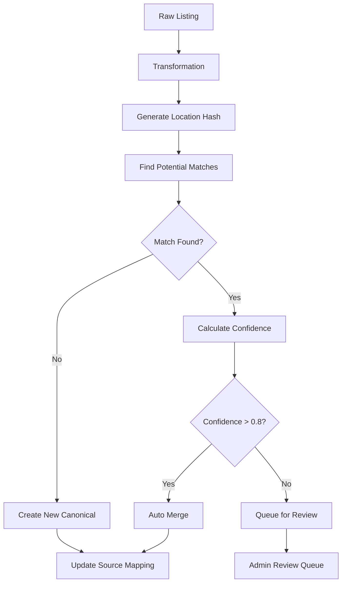
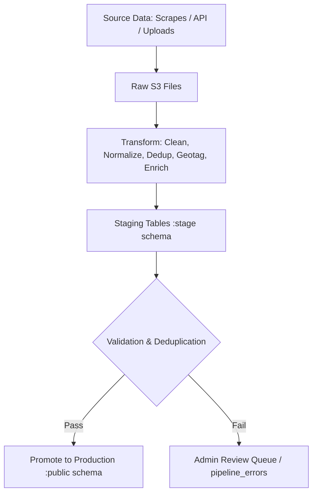
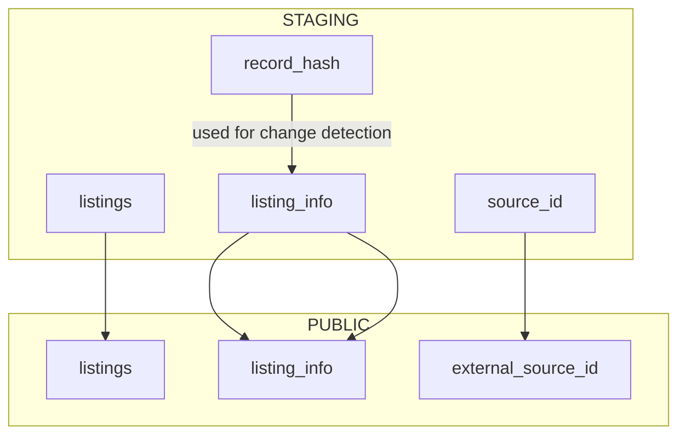

# Listings Pipeline Design
**goal:** implement an enterprise grade listings pipeline with a powerful graphical interface for configuring scraping jobs; managing transformations, ingestions and updates; handling conflicts; scheduling jobs and queues; managing manual data updates.

### **Overview**

The listings pipeline follows a sophisticated DMO-source relationship where **DMOs serve as the source systems** for scraping jobs, and each listing has a **master listing part** (global data) stored in 'listings' records, and **detail parts** (DMO-specific data) stored in `listing_info` records. This architecture enables white-label functionality where the same physical listing can have different descriptions, contact info, images, and visibility controls for different DMOs.

## key features
- **ingest listings from many sources:** uploaded csv files, html scrapers, WordPress API, Drupal API, affiliate API like Priceline, poi data sets (like ESRI, HERE)
- **preserve provenance:** source, original ID, fetch metadata
- **deduplicate and reconcile records:** into canonical listings
- **scale via queue/workers:** avoid overloading target sites and our servers
- **Surface status/metrics and admin controls:** Retries, re-run, ignore, or manual merge
- **UI interface for administration of each pipeline stage:**

## architecture summary
- **Multi-Source Ingestion**: uploaded csv files, html scrapers, WordPress API, Drupal API, affiliate API like Priceline, poi data sets (like ESRI, HERE)
- **Raw Storage Pipeline**: S3 for raw payloads + PostgreSQL for metadata
- **Transformed Storage Pipeline**: S3 for transformed payloads + PostgreSQL for metadata
- **Image Storage Pipeline**: S3 for images from transform urls
- **Queue/Worker System**: Redis/Bull for scalable background processing with image handling
- **Provenance Tracking**: Complete data lineage with source metadata and original IDs
- **Deduplication Engine**: Intelligent matching including image hash comparison
- **Image Processing**: Download, validate, resize, thumbnail generation, S3 storage
- **Safe Sync Operations**: Non-destructive updates with admin review workflow
- **Dual-Level Visibility Control**: Listing-level and listing_info-level visibility and status management
- **White-Label Support**: DMO-specific visibility controls for multi-tenant architecture
- **Admin Control Panel**: Status monitoring, retry logic, manual merge operations
- **Public API**: `/v1/listings` - Anonymous listing search and discovery
- **Admin API**: `/v1/admin/listings` - Authenticated listing management operations
- **Frontend**: Hybrid atomic design + feature-based architecture

## data flow overview
```bash
Scrape/Upload from dmos. Dmos is another word for our data sources.
    ↓
 store raw data in S3 as .json.gz, .csv.gz, .xls.gz; create metadata records
    ↓
Transformation (clean, geotag, normalize, dedup, enrich)
    ↓
 store transformed data in S3 as .json.gz; create metadata records
    ↓
Stage upsert (PostgreSQL - ingest transformed data into staging candidate records for canonical)
    ↓
Image download & canonicalization (async job)
    ↓
Production (PostgreSQL -> promote staged to production / Canonical Listings: listings and listing_info tables)
```

### DMO as Source System
- **DMOs are the source systems** for scraped/uploaded data
- Each DMO has a `dmo_type_id` (`SCRAPED` (1), `TRAVEL_SITE` (2), `CLIENT` (3), `PARTNER` (4) )
- Each DMO has a `source_type` that specifies how to ingest data: `wordpress`, `website`, `api`, `csv`, `drupal`
- Each DMO will need new db columns to store scrape job control data (base_url, config, etc)
- Scraping jobs are configured per DMO
- The pipeline ingests data **on behalf of** a specific DMO, tied to the listing, but the detail record is stored in listing_info

### Image download & canonicalization (async job)
- Download images from original URLs.
- Store in S3/CDN (canonical/images/...).
- Update staging_listings with canonical_image_url.

### S3 file naming

s3://{environment: dev, staging, app}-trippl-data/{stage: raw, transformed}/{data-domain: listings, reviews, events}/{country: xx}/{state/province: xx}/{dmo-id}/{date: YYYYMMDD}/{batch: nnn}-{timestamp: YYYYMMDDTHHMMSS}.{format: json, csv, xls}.gz

### Metadata for S3 raw and transformed files
Add a metadata table in Postgres (data_jobs):
```sql
CREATE TABLE data_jobs (
    id SERIAL PRIMARY KEY,          -- DB job ID
    job_code TEXT,                  -- optional human-readable code
    source TEXT NOT NULL,           -- e.g., mtl.org
    stage TEXT NOT NULL,            -- raw, transformed
    s3_path TEXT NOT NULL,          -- exact S3 file path
    status TEXT NOT NULL,           -- success, failed, partial
    record_count INT,
    created_on TIMESTAMP DEFAULT NOW()
);
```

### S3 image naming

s3://{environment: dev, staging, app}-trippl-images/{country}/{state}/{dmo-id}/{listing-id}/{filename}.{ext}
 
Images are binary, not batch files, so each image usually corresponds to a single listing (or multiple images per listing).

Original source URL vs canonical URL — you’ll want to encode the source in some way.

# Stages

## 1 Raw Data Stage (immutable)

**Source:** Scraper, API, customer upload

**Contents:**
- Original fields from source (name, address, description, category, images, etc.)
- Often incomplete or inconsistent
- May include source-specific IDs

**Actions:**
- Store as-is in S3 
- Compress (e.g., .json.gz) for storage efficiency
- Create metadata db records: source, file path, stage = raw, record count, ingest timestamp

**Notes:**
- Raw files are immutable


## 2. Transform Stage

**Goal:** Clean, normalize, enrich, deduplicate, track which scraped listings correspond to exising listings → producing data ready for ingestion.

### recap of table structure
```
listings                  -- canonical, immutable-ish
 └─ location_id           -- FK → locations
listing_info          -- per DMO/source, FK → listings
      ├─ listing_id
      └─ contact_info_id  -- FK → contact_info
opening_dates
 └─ listing_info_id       -- 
opening_hours
 ├─ day_id                --
 └─ opening_dates_id       -- 
listing_images
 └─ listing_info_id
bridge_attributes_listings
 └─ listing_id

```
- One canonical listing can have multiple listing_info rows for different DMOs/sources.

**Processing Steps:**

**A. Clean / normalize**
- Trim strings, lowercase text, remove extra whitespace/punctuation
- Standardize common fields (phone number formats, website URLs)
- Normalize categories/tags to your controlled vocabulary (this used to be done via GooglePlaces API lookup)
- Remove obvious duplicates within the file (optional)

### Bridge Table Implementation

- **Table:** bridge_source_listings
| Column      | Description                                                         |
| ----------- | ------------------------------------------------------------------- |
| record_hash | SHA256 hash of key fields (name + address + city/postal if desired) |
| listing_id  | FK → `listings.id`                                                  |
| file_path   | Full S3 path of transformed file                                    |
| created_at  | Timestamp                                                           |

- Workflow:
1 During transformation:
- Compute a hash for each record based on its key fields.
- use a hash-based matching approach that avoids unnecessary geotag API calls. The key idea is: hash on fields that are cheap to compute and mostly unique, then fallback to geotag only if no match is found.
- Attempt to match record to an existing listing via bridge table (record_hash).
- Store mapping (file_path, record_hash, listing_id) in the bridge table.
2 During ingestion:
- Join transformed file records on (file_path, record_hash) → listing_id in listings.
- Insert or update listing_info and linked contact_info/locations/hours based on resolved listing_id.
3 Benefits:
- Keeps raw and transformed files immutable.
- Supports multiple sources and rematching if rules change.
- Full audit trail of which file record maps to which canonical listing.

**B. Deduplicate against existing listings**
- Compute record hash: e.g., SHA256 of normalize(name) + normalize(address)
- Check bridge table (file_listing_mappings) for existing match:
- If match → assign listing_id
- If no match → leave listing_id = null (new listing candidate)

**C. Geotag / enrich**
- Conditional geotag: only call API for unmatched/new records
- Use existing Google Places API integration (`getGooglePlaceFromAddress`)
- Add coordinates (lat/lng) to record
- Optionally enrich with other metadata (hours, amenities, etc.)
- Rate limiting: 100ms delay between API calls
- Fallback: keep original listing if geotagging fails

**D. Standardize fields**
- Map source fields → canonical schema using configurable field mappings
- Support different source types: wordpress, website, api, drupal, csv
- Transform functions: parseFloat, trim, normalize, etc.
- Ensure field types and JSON structure consistent for ingestion

**Field Mapping Examples:**
- wordpress: `post_title` → `name`, `meta.address` → `address1`
- csv: `Name` → `name`, `Address1` → `address1`
- api: `business_name` → `name`, `street_address` → `address1`

**E. Deduplicate / merge within transform**
- If multiple records from the same source refer to the same entity (hash match), merge them:
- Keep most complete/most recent data
- Merge image lists

**F. Output transformed file**
- Store in S3: transformed/listings/...
- Include listing_id (if matched) for easy ingestion
- Record metadata in data_jobs

**G. Optional Pre-Ingest Checks**
- Validate required fields (name, lat/lng, category)
- Flag records with missing critical info
- Generate logs of any transformations applied

## 3. Update / Ingest Logic
**A. Location Updates**
- Compute hash of location fields (address + city + postal + lat/lng).
- Compare with existing locations via listings.location_id.
- If different → insert new locations row (optionally versioned) and update listings.location_id.

**B. Contact Info Updates**
- Compute hash of contact fields (phone + website + opening_hours).
- Compare with contact_info row linked via listing_info.contact_info_id.
- If changed → insert new contact_info row and update listing_info.contact_info_id.

**C. Listing Info Updates**
- Compare other source-specific fields (description, category, status).
- Update existing listing_info row if changes exist.
- Always update last_seen_at.


## Economical hashing approach
**1. Choose hash fields**
- Since name + address is usually enough to uniquely identify a listing, your hash can be:
- record_hash = SHA256(lower(trim(name)) + '|' + lower(trim(address)))

- Normalize text: lowercase, trim spaces, remove punctuation if you want
- Exclude lat/lng at this stage — you don’t have it yet

Optional: include city or postal_code if available to reduce hash collisions.

**2. Transform workflow with conditional geotagging**
- Compute record hash on raw record.
- Check hash in file_listing_mappings or staging DB:
- const existingListing = await findListingByHash(record_hash);

If match found:
- Use the existing listing_id
- No geotagging needed

If no match found:
- Call geotag API (GooglePlacesAPI) to get lat/lng
- Create new listing in listings
- Store hash → listing_id in bridge table

**3. Optional hash enhancements**
- Include a normalized name: remove accents, punctuation, common suffixes like “Ltd”, “Inc”.
- Include city or postal code for regional uniqueness.
- Keep a secondary hash including lat/lng after geotagging to detect duplicates in future scrapes.

**4. Example pseudocode (TypeScript)**
```typescript
function normalizeText(str: string) {
  return str.toLowerCase().trim().replace(/[^\w\s]/g, '');
}

function computeRecordHash(name: string, address: string) {
  const normalized = normalizeText(name) + '|' + normalizeText(address);
  return crypto.createHash('sha256').update(normalized).digest('hex');
}

async function processRecord(record) {
  const hash = computeRecordHash(record.name, record.address);
  const listingId = await findListingByHash(hash);

  if (listingId) {
    // existing listing, no geotag call
    return listingId;
  } else {
    // call geotag API
    const coords = await geotag(record.name, record.address);
    const newListing = await createListing({ ...record, location: coords });
    await insertBridgeMapping(record.file_path, hash, newListing.id);
    return newListing.id;
  }
}
```

**5. Benefits**
- Minimizes geotag API usage — only unmatched records trigger geotag calls.
- Immutable raw files — hash only used in transform/bridge table.
- Reliable deduplication — hash prevents creating duplicate listings for repeated scrapes.
- Compatible with multi-source ingestion — each source can have its own bridge table.

## Matching Process before Staging ingestion
implement an admin interface to show staging ingestion status and to resolve any problems or conflicts


## deletions and soft-removals
### soft-delete / visibility system:
- Listings = the canonical, “core” record (stays always visible in DB)
- Listing_Info = the DMO-specific detail record, which can be hidden/soft-deleted per source

### 1. Tables
**listings**
| Column      | Type                                   | Description                                                             |
| ----------- | -------------------------------------- | ------------------------------------------------------------------------|
| id          | SERIAL                                 | Primary key                                                             |
| name        | TEXT                                   | Global listing name                                                     |
| location_id | GEOGRAPHY                              | Coordinates (PostGIS)                                                   |
| created_at  | TIMESTAMP                              | When listing was created                                                |
| updated_at  | TIMESTAMP                              | Last update from any source                                             |
| listing_visible | BOOLEAN                            | Is the entire listing visble                                            |
| listing_status  | ENUM('active','archived', ...)     | Global listing state (e.g., for legal removal, invalid, or mass delete) |

Notes:
- Listings are never deleted; use status for global archival or deprecation.

**listing_info**
| Column         | Type                               | Description                                         |
| -------------- | ---------------------------------- | --------------------------------------------------- |
| id             | SERIAL                             | PK                                                  |
| listing_id     | SERIAL                             | FK → listings.id                                    |
| dmo_id         | SERIAL                             | Which DMO this info comes from                      |
| source_id      | TEXT                               | Original source identifier                          |
| name           | TEXT                               | DMO-specific name (optional override)               |
| info_visible   | BOOLEAN                            | Is this DMO detail record visble                    |
| info_status    | ENUM('active','removed','pending') | More granular state per DMO record                  |
| last_seen_at   | TIMESTAMP                          | Last scrape/update from source                      |
| created_at     | TIMESTAMP                          | Record creation                                     |
| updated_at     | TIMESTAMP                          | Last update                                         |

Notes:
- info_visible determines if the listing is shown in the app for a given DMO.
- status tracks DMO-specific lifecycle (removed, pending, etc.).


### 2. Workflow
### A. New scrape or ingest
1 Upsert listings
- New listing → insert
- Existing → update metadata (name, location)

2 Upsert listing_info
- Set info_visible = TRUE for listings seen in this scrape
- Update last_seen_at

### B. Soft-delete a listing for a DMO
UPDATE listing_info
SET info_visible = FALSE,
    status = 'removed'
WHERE listing_id = <id>
  AND dmo_id = <dmo_id>;

- Listing remains in listings
- Other DMOs’ listing_info unaffected

### C. Automatic soft-delete from scrapes

- If a listing_info hasn’t been seen in N scrapes:

UPDATE listing_info
SET info_visible = FALSE,
    status = 'removed'
WHERE dmo_id = <dmo_id>
  AND last_seen_at < NOW() - INTERVAL 'N days';

### D. Archival vs Hidden

- Hidden (info_visible = FALSE):
    - DMO-specific; can be reactivated
    - App hides it from front-end
- Archived (listing_status = 'archived' on listings):
    - Globally removed (all DMOs)
    - All listing_info should also be hidden

### 4. Benefits
- DMO-specific visibility independent
- Historical records preserved (last_seen_at + status)
- Clear separation between global archive vs DMO-specific hiding
- Compatible with automated scrapes and manual removals

## Correct Behavior When Admin Manually Updates a Listing

### 1. **Mark Listing as Modified in DB**

Add flags or timestamps in your database to reflect the admin change:

- `manually_modified: true`
- `manually_modified_at: TIMESTAMP`
- Optional: `modified_by_admin_id: UUID`

### 2. **Preserve Original S3 Files**

Keep the original raw and transformed files untouched.

### 3. **Use DB as the Source of Truth for Live Data**

Your application should always serve listings from your **listings table** in the database — not from the raw/transformed files.

### 4. **Prevent Overwriting on Next Import**

When you re-import new scrapes:

- Detect if a listing was manually modified
- **Skip overwriting those fields** unless the update is significant or confirmed
- Optionally log any differences to a review queue

## Data Pipeline queue management
- needs design

## Admin pages

- finish the dmos admin page with complete CRUD capability.

for Trippl’s listings ingestion/sync pipeline, you’ll want admin pages that let you monitor, debug, and manually intervene across the stages (raw → transform → ingest → listings). Here’s a structured list:

1. Source Management

Sources Dashboard

List all sources (scrapers, APIs, customer imports, affiliate feeds)

Status: active/inactive, last run, error rate

Config: frequency, region, credentials

Source Detail Page

History of scrapes/imports

File counts (raw, transformed)

Error logs

2. Job & Pipeline Monitoring

Data Jobs Dashboard

Shows each job (scrape/import/transform/ingest)

Status: queued, running, completed, failed

Metrics: record count, duration, error count

Retry / re-run controls

Job Detail Page

Job metadata (source, region, timestamps)

Files processed (raw → transformed)

Error list with downloadable logs

3. File Management

Raw Files Browser

Browse raw files in S3 (by source, date, region)

View raw JSON/CSV payloads

Transformed Files Browser

Browse transformed files

Preview standardized records (with hash + optional listing_id)

See enrichment flags (e.g., “geotagged”, “enriched”)

4. Matching & Mapping

Hash/Bridge Table Viewer

See raw record hashes → mapped listing IDs

Detect conflicts (two sources map to same listing)

Manual override tool (“force match to listing”)

Duplicate Management Page

Show potential duplicates across sources

Merge/unmerge controls

5. Listing Management

Listings Dashboard

Global search of all canonical listings

Filters: active/inactive, source, category, region

Stats: counts by status (new, updated, archived)

Listing Detail Page

Canonical listing profile (name, address, lat/lng, description, images)

All linked listing_info records per DMO/source

Timeline of updates (when/why changed)

Manual edit & override controls

Visibility toggle (is_visible, status)

6. Archival & Deletion

Soft-deleted Listings Page

List of listings or listing_info marked inactive

Filters by source, last seen, reason for deactivation

Manual restore option

7. Image Management

Image Pipeline Page

Queue of image fetch/processing jobs

Stats: successful fetches, failures, missing images

Preview and re-fetch controls

8. System Health

Metrics Dashboard

Job throughput, error rates, geotag API usage

Cost tracking (API usage, storage growth)

Alerts & Notifications

Failed jobs, excessive duplicates, API quota warnings

✅ With this set of admin pages, you’ll have full visibility and control:
- From sources → files → transform → match → listings → images → system health.
- Lets you monitor automated flows but also step in manually when needed.

# Trippl Database & Pipeline Summary

**1. Schemas Overview**

| Schema     | Purpose                                                                                       |
| ---------- | ----------------------------------------------------------------------------------------------|
| `staging`  | pre-production data. Used for checking new, updates, soft-deletes before promotion.           |
| `public`   | Production/canonical data for all listings and related tables. Immutable-ish identity.        |
| `pipeline` | Pipeline management tables: Keeps scraping, metadata, queue, job status, and mapping info.    |   


**2. Staging / Public Tables**

Mirrored structure in staging and public:

Key Principles:
- Staging mirrors production schema for safe promotion.
- Staging holds all rows for the batch being ingested, not just deltas.
- bridge_source_listing and hashes track source record → canonical listing mapping.

**3. Pipeline Management Tables (Schema: pipeline)**
| Table                   | Purpose                                                                                           |
| ----------------------- | ------------------------------------------------------------------------------------------------- |
| `queue`                 | Queued jobs/tasks for scraping, transforming, or ingestion.                                       |
| `files`                 | Metadata about raw and transformed files: S3 path, stage, batch, source.                          |
| `jobs`                  | Tracks execution of individual jobs (status, start/end time, record counts).                      |
| `configs`               | Scrape/ingest configuration per DMO/source (base URL, paths, mappings of HTML elements → fields). |
| `bridge_source_listing` | Maps source record hash → canonical listing ID.                                                   |
| `errors`                | Record-level errors for admin review.                                                             |
| `metadata`              | Summary of batch ingestion: record counts, status, processing info.                               |

**Bridge Table Example:**
```sql
file_path TEXT NOT NULL,
record_hash CHAR(64) NOT NULL,  -- SHA256 of name + address
listing_id UUID NOT NULL,        -- FK → listings.id
created_at TIMESTAMP DEFAULT now(),
PRIMARY KEY (file_path, record_hash)
```

**4. Data Flow Overview**


**Workflow:**
1. Scrape / upload → save raw files to S3.
2. Transform stage → clean, normalize, hash for deduplication, conditional geotag, enrichment. Store transformed files to S3.
3. Staging → load transformed data into staging.* tables for validation, deduplication, and pre-ingestion checks.
4. Promotion to public → insert/update canonical listings, listing_info, contact_info, and locations.
5. Bridge table tracks mapping of source records (record_hash) → canonical listings.
6. Errors / admin review → pipeline_errors table or queue for manual resolution.

**5. Key Principles**
- Immutable raw/transformed files → always stored in S3.
- Canonical listings → immutable-ish identity in production (public.listings).
- Hash-based deduplication → reduces unnecessary geotag calls and avoids duplicate listings.
- Multiple sources per listing → each source gets a listing_info + contact_info.
- Auditability → bridge table + pipeline tables provide full trace of source → staging → production.
- Staging mirrors production schema → simple promotion queries and easier validation.

**6. File Naming Conventions (S3)**

Raw / Transformed Files:

s3://{environment: dev, staging, app}-trippl-data/{stage: raw, transformed}/{data-domain: listings, reviews, events}/{country}/{state-province}/{dmo-id}/{date: YYYYMMDD}/{batch: nnn}-{timestamp: YYYYMMDDTHHMMSS}.{format: json, csv, xls}.gz

Images (canonical):

s3://{environment: dev, staging, app}-trippl-images/{country}/{state}/{dmo-id}/{listing-id}/{filename}.{ext}


✅ Summary:
- Schemas: staging (pre-prod data), public (production), pipeline (pipeline management).
- Staging mirrors production tables; contains full batch of incoming data for validation.
- Pipeline tables track jobs, files, configs, errors, and bridge source listings.
- Immutable files + bridge table + staging → production workflow ensures safe, auditable, and efficient ingestion.

---

# Design things that came up after the initial design

## job scheduling
the design doc didn't specify how jobs would be scheduled - 

(still have to pick a system, it will prob include next_import_at system)

**if dmo config changes** then add a dialog at save time that checks for scheduled jobs and lets user leave or delete.  Changes to schedule shouldn't be an issue, though an old job with old config might overwrite new job(s).

options?:

🔹 1. Central Scheduler (cron-like)
-	•	A background process (or cron job) wakes up on an interval (say every 5 minutes).
-	•	It queries the DB for sources where next_run_at <= NOW().
-	•	For each, it enqueues a scrape job with the source’s config.
-	•	After enqueueing, update next_run_at = NOW() + frequency.
-	•	✅ Predictable, easy to manage, DB is the source of truth.

⸻

🔹 2. Queue-native Delays
-	•	When you enqueue a scrape job, also set a delay = frequency in your queue system (BullMQ, SQS, etc.).
-	•	The job reschedules itself after completion, using its own frequency.
-	•	✅ Less DB polling, queue handles scheduling.
-	•	⚠️ Harder to see the “future schedule” across all sources unless you also record metadata in DB.

⸻

🔹 3. Hybrid
-	•	Keep a scrape_sources table with frequency, last_run_at, next_run_at.
-	•	A scheduler service queries it on a loop and enqueues jobs into your queue (Option 1).
-	•	Each job still logs its config snapshot at runtime.
-	•	✅ Best for auditing, debugging, and managing dynamic frequencies.


## scrape config

We'll need a scrape config for each dmo. this will be the current config, and no history is kept.

Each time a job is scheduled a snapshot of the current config is taken and used for that job.

So where does the config live - with pubic.dmos or pipeline.configs? shared table or two?
->  keep configs with pipeline.  Keep 2 tables, one for dmo configs, and one for per job configs.

➡️ **Keep DMO defaults in a separate pipeline.pipeline_config table, linked via FK.**
-	•	Keep per-job config snapshots in scrape_jobs.
-	•	Do not overwrite per-job configs with DMO defaults — snapshot them at enqueue time.

### interfaces
Use two interfaces, one for pipeline_config and one for import_jobs. Extract shared pieces into a base type.
```ts
interface BaseImportConfig {
  id: number;
  dmo_id: number;
  frequency: 'manual' | 'hourly' | 'daily' | 'weekly' | 'monthly';
  source_type: 'wordpress' | 'website' | 'api' | 'drupal' | 'csv';
  base_url?: string;
  field_mappings?: any;
  config_params?: any;
}

export interface ImportConfig extends BaseImportConfig {
  dmo_id: number;
  version?: number;
  created_at: Date;
  updated_at: Date;
}

export interface JobImportConfig extends BaseImportConfig {
  job_id: number;
  status?: 'queued' | 'running' | 'failed' | 'success';
}
```

## better table design

```sql
changes to public.dmos
change created_on to _at
change updated_on to _at
remove account_id
move domain_url to dmo_info
add last_job_id to public.listings and listing_info


CREATE TABLE pipeline.configs (
    id              BIGSERIAL PRIMARY KEY,
    dmo_id          INT NOT NULL REFERENCES public.dmos(id),
    source_type     TEXT NOT NULL,         -- 'csv', 'wordpress', 'drupal', 'website', 'api'
    data_domain     TEXT NOT NULL,        -- 'listings', 'events', 'reviews'
    config_params   JSONB NOT NULL,
    version         INT NOT NULL DEFAULT 1,  -- changes just increment version number, not new record
    schedule        TEXT NOT NULL,         -- 'manual', 'hourly', 'daily', 'weekly', 'monthly'
    active          BOOLEAN DEFAULT TRUE,
    created_at      TIMESTAMP DEFAULT now(),
    updated_at      TIMESTAMP DEFAULT now()
);

CREATE TABLE pipeline.jobs (
    id              BIGSERIAL PRIMARY KEY,
    status          TEXT NOT NULL,        -- 'queued','in_progress','succeeded','failed','stale', 'deleted'
    created_at      TIMESTAMP DEFAULT now(),
    started_at      TIMESTAMP,
    finished_at     TIMESTAMP,
    error_summary   TEXT
);

CREATE TABLE pipeline.job_configs (
    job_id          BIGINT PRIMARY KEY REFERENCES pipeline.jobs(id) ON DELETE CASCADE,
    dmo_id          INT NOT NULL REFERENCES public.dmos(id),
    source_type     TEXT NOT NULL,         -- 'csv', 'wordpress', 'drupal', 'website', 'api'
    data_domain     TEXT NOT NULL,        -- 'listings', 'events', 'reviews'
    config_params   JSONB NOT NULL,
    config_version  INT NOT NULL DEFAULT 1,
    schedule        TEXT NOT NULL,         -- 'manual', 'hourly', 'daily', 'weekly', 'monthly'
    created_at      TIMESTAMP DEFAULT now(), -- snapshot creation time
    source_updated_at TIMESTAMP NOT NULL     -- when the source config was last updated
);

CREATE TABLE pipeline.job_files (
    id              BIGSERIAL PRIMARY KEY,
    job_id          BIGINT NOT NULL REFERENCES pipeline.jobs(id) ON DELETE CASCADE,
    s3_path         TEXT NOT NULL,
    stage           TEXT NOT NULL,        -- 'raw', 'transformed'
    data_domain     TEXT,                 -- 'listings', 'reviews', 'events'
    country         TEXT,
    dmo_id          INT,
    file_date       DATE,
    batch           INT,
    format          TEXT,                 -- 'json', 'csv', 'xls'
    file_size       BIGINT,
    record_count    INT,
    created_at      TIMESTAMP DEFAULT now()
);

CREATE TABLE pipeline.job_results (
    job_id          BIGINT PRIMARY KEY REFERENCES pipeline.jobs(id) ON DELETE CASCADE,
    records_total   INT,
    records_new     INT,
    records_updated INT,
    records_deleted INT,
    records_duplicates INT,
    records_unchanged INT,
    records_error   INT,
    created_at      TIMESTAMP DEFAULT now()
);

CREATE TABLE pipeline.job_errors (
    id              BIGSERIAL PRIMARY KEY,
    job_id          BIGINT NOT NULL REFERENCES pipeline.jobs(id) ON DELETE CASCADE,
    file_id         BIGINT REFERENCES pipeline.job_files(id),
    record_id       TEXT,          -- unique identifier of the source record, ie hash
    original_record JSONB,         -- the actual failed record
    error_type      TEXT,          -- e.g. 'parse_error', 'missing_field'
    error_message   TEXT,
    created_at      TIMESTAMP DEFAULT now()
);

CREATE TABLE pipeline.job_queue (
    job_id          BIGINT PRIMARY KEY REFERENCES pipeline.jobs(id) ON DELETE CASCADE,
    enqueued_at     TIMESTAMP DEFAULT now(),
    dequeue_attempts INT DEFAULT 0,
    next_attempt_at TIMESTAMP,
    locked_by       TEXT,
    locked_at       TIMESTAMP
);

CREATE TABLE pipeline.bridge_source_listing (
    id                  BIGSERIAL PRIMARY KEY,
    job_file_id         BIGINT NOT NULL REFERENCES pipeline.job_files(id),
    source_record_hash  TEXT NOT NULL,
    listing_id          BIGINT REFERENCES public.listings(id),
    certainty_score     NUMERIC(5,4) DEFAULT 1.0,   -- 0.0 to 1.0
    mapped_at           TIMESTAMP DEFAULT now(),
    error_type          TEXT,          -- e.g. 'parse_error', 'missing_field', 'multiple_close_matches'
    error_message       TEXT,
    UNIQUE (job_file_id, source_record_hash)
);
```

# how our staging -> public promotion works

Deterministic staging → public promotion process with certainty scores

- we only find matches for listings and listing_info
- things like contact_info, hours etc don't need to be matched. update/delete the object that the matched listings and listing_info object points to, or create new objects.

```
1. Staging Schema (staging)
	•	staging.listings
	  •	Primary key: id (staging-only)
	  •	No FK to public; purely staging.
	  •	Other tables reference this staging listing when staging-specific (like bridge_attributes_listings), but not public.
	•	staging.listing_info
	  •	Primary key: id (staging-only)
	  •	listing_id → staging.listings.id
	  •	contact_info_id → staging.contact_info.id (new or copied if updating an existing public record)
	•	staging.contact_info
	  •	Primary key: id
	  •	Not matched by default; updates/deletes are determined by which listing_info references it in public.
	•	staging.listing_images, staging.opening_dates, staging.opening_hours, etc.
	  •	Each references staging.listing_info.id
	  •	No matching; these are created/updated/deleted based on the public listing_info FK during promotion.
	•	staging.bridge_attributes_listings
	  •	listing_id → staging.listings.id
	  •	attribute_id → staging.attributes.id
	  •	No matching; promotion will link to public IDs.

⸻

2. Public Schema (public)
	•	public.listings
	  •	Primary key: id
	  •	listing_info references this via listing_id.
	•	public.listing_info
	  •	Primary key: id
	  •	listing_id → public.listings.id
	  •	contact_info_id → public.contact_info.id
	  •	Other dependent objects (images, opening_dates, opening_hours) reference this id.
	•	public.contact_info
	  •	Primary key: id
	  •	Can be updated in place if staging.listing_info references the same contact_info_id.
	•	Dependent objects:
	  •	public.listing_images.listing_info_id → public.listing_info.id
	  •	public.opening_dates.listing_info_id → public.listing_info.id
	  •	public.opening_hours.opening_date_id → public.opening_dates.id

⸻

3. Promotion Rules / FK Implications
	•	Listings & listing_info matching
	  •	Only these two have deterministic matches (staging.listings → public.listings, staging.listing_info → public.listing_info)
	  •	Use these matches to decide updates vs. inserts.
	•	Dependent objects (contact_info, images, hours, etc.)
	  •	FK relationships exist through public.listing_info, not through staging.
	  •	Example:

staging.listing_info -> staging.contact_info
promotion -> public.listing_info -> public.contact_info

 •	If listing_info matches, update the linked public contact_info.
 •	If new, create new contact_info and link.

 •	No FK from staging → public
 •	Staging is isolated; promotion code resolves IDs and updates FKs.

⸻
```

4. Summary Table of FK Relationships

### Staging Table FKs

| Table                     | FK Column           | References (staging)       | Notes                                           |
|----------------------------|-------------------|---------------------------|------------------------------------------------|
| listing_info               | listing_id         | listings.id              | Staging match only                             |
| listing_info               | contact_info_id    | contact_info.id          | Updated via matched public record             |
| listing_images             | listing_info_id    | listing_info.id          | Updated via matched public record             |
| opening_dates              | listing_info_id    | listing_info.id          | Updated via matched public record             |
| opening_hours              | opening_date_id    | opening_dates.id         | Updated via matched public record             |
| bridge_attributes_listings | listing_id         | listings.id              | Updated via matched public record             |
| bridge_attributes_listings | attribute_id       | attributes.id            | Updated via matched public record             |

### Public Table FKs

| Table                     | FK Column           | References (public)       | Notes                                           |
|----------------------------|-------------------|--------------------------|------------------------------------------------|
| listing_info               | listing_id         | listings.id              | Deterministic match                            |
| listing_info               | contact_info_id    | contact_info.id          | Updated in place if matched                   |
| listing_images             | listing_info_id    | listing_info.id          | Updated via promotion                          |
| opening_dates              | listing_info_id    | listing_info.id          | Updated via promotion                          |
| opening_hours              | opening_date_id    | opening_dates.id         | Updated via promotion                          |
| bridge_attributes_listings | listing_id         | listings.id              | Updated via promotion                          |


✅ Key Takeaways
	1.	Only listings and listing_info are deterministically matched during promotion.
	2.	All dependent objects use the matched public IDs for updates or inserts.
	3.	Staging FKs are internal to staging; public FKs drive real updates.
	4.	contact_info changes are applied to the public record pointed to by matched listing_info.contact_info_id.


### Mermaid Diagram of Staging → Public FK Relationships
```mermaid
%% Staging vs Public FK Diagram

%% Staging schema
subgraph STAGING
    SL[listings]
    SLI[listing_info]
    SCI[contact_info]
    SI[listing_images]
    SOD[opening_dates]
    SOH[opening_hours]
    SAL[bridge_attributes_listings]
    SA[attributes]

    SLI --> SL   %% staging.listing_info.listing_id -> staging.listings.id
    SLI --> SCI  %% staging.listing_info.contact_info_id -> staging.contact_info.id
    SI --> SLI   %% listing_images.listing_info_id -> staging.listing_info.id
    SOD --> SLI  %% opening_dates.listing_info_id -> staging.listing_info.id
    SOH --> SOD  %% opening_hours.opening_date_id -> staging.opening_dates.id
    SAL --> SL   %% bridge_attributes_listings.listing_id -> staging.listings.id
    SAL --> SA   %% bridge_attributes_listings.attribute_id -> staging.attributes.id
end

%% Public schema
subgraph PUBLIC
    PL[listings]
    PLI[listing_info]
    PCI[contact_info]
    PI[listing_images]
    POD[opening_dates]
    POH[opening_hours]
    PAL[bridge_attributes_listings]

    PLI --> PL   %% listing_info.listing_id -> listings.id
    PLI --> PCI  %% listing_info.contact_info_id -> contact_info.id
    PI --> PLI   %% listing_images.listing_info_id -> listing_info.id
    POD --> PLI  %% opening_dates.listing_info_id -> listing_info.id
    POH --> POD  %% opening_hours.opening_date_id -> opening_dates.id
    PAL --> PL   %% bridge_attributes_listings.listing_id -> listings.id
end

%% Promotion
SL --> PL   %% listings promotion/match
SLI --> PLI %% listing_info promotion/match
```


### how source_id and record_hash flow from staging to public

**Explanation:**
```
	1.	source_id (SLI_ID)
	•	Comes from the external system (Google, Foursquare, etc.).
	•	Stored in staging.listing_info during ingestion.
	•	If a match is found in public, its value is copied to public.listing_info.external_source_id so you can always trace the record back to its source.
	2.	record_hash (SLIR)
	•	Calculated from the full source record in staging.
	•	Used to check whether a record has changed since last import.
	•	Never copied to public; it’s only for ETL logic.
	3.	Promotion rules
	•	If the record_hash differs from the last imported hash → update public record.
	•	If record_hash matches → no update needed.
	•	If no public match is found → create a new public record, copying over source_id as external_source_id.
```
This ensures you can deterministically know what is new, updated, or unchanged just by looking at staging.


# FOR REFERENCE: Production tables before pipeline feature implementation
```sql
CREATE TABLE
  public.bridge_attributes_listings (
    id serial NOT NULL,
    attribute_id integer NULL,
    listing_id integer NULL,
    created_at timestamp without time zone NULL,
    updated_at timestamp without time zone NULL
  );

ALTER TABLE
  public.bridge_attributes_listings
ADD
  CONSTRAINT bridge_attributes_listings_pkey PRIMARY KEY (id)

CREATE TABLE
  public.contact_info (
    id serial NOT NULL,
    name character varying NULL,
    email character varying NULL,
    local_phone character varying NULL,
    international_phone character varying NULL,
    created_at timestamp without time zone NULL,
    updated_at timestamp without time zone NULL,
    website_url character varying NULL,
    facebook_url character varying NULL,
    instagram_url character varying NULL,
    youtube_url character varying NULL,
    tiktok_url character varying NULL,
    twitter_url character varying NULL,
    pinterest_url character varying NULL,
    tripadvisor_url character varying NULL,
    yelp_url character varying NULL
  );

ALTER TABLE
  public.contact_info
ADD
  CONSTRAINT contact_info_pkey PRIMARY KEY (id)

CREATE TABLE
  public.listing_images (
    id serial NOT NULL,
    listing_info_id integer NULL,
    image character varying NULL,
    rank integer NULL,
    created_at timestamp without time zone NULL,
    updated_at timestamp without time zone NULL
  );

ALTER TABLE
  public.listing_images
ADD
  CONSTRAINT listing_images_pkey PRIMARY KEY (id)

CREATE TABLE
  public.listing_info (
    id serial NOT NULL,
    listing_id integer NULL,
    description character varying NULL,
    dmo_id integer NULL,
    contact_info_id integer NULL,
    created_at timestamp without time zone NULL,
    updated_at timestamp without time zone NULL,
    manually_modified boolean NULL DEFAULT false,
    manually_modified_at timestamp without time zone NULL,
    manually_modified_by integer NULL,
    info_visible boolean NULL DEFAULT true,
    info_status character varying NULL
  );

CREATE TABLE
  public.listing_info (
    id serial NOT NULL,
    listing_id integer NULL,
    description character varying NULL,
    dmo_id integer NULL,
    contact_info_id integer NULL,
    created_at timestamp without time zone NULL,
    updated_at timestamp without time zone NULL,
    manually_modified boolean NULL DEFAULT false,
    manually_modified_at timestamp without time zone NULL,
    manually_modified_by integer NULL,
    info_visible boolean NULL DEFAULT true,
    info_status character varying NULL
  );

ALTER TABLE
  public.listing_info
ADD
  CONSTRAINT listing_info_pkey PRIMARY KEY (id)

CREATE TABLE
  public.listings (
    id serial NOT NULL,
    name character varying NULL,
    google_place_id character varying NULL,
    location_id integer NULL,
    created_at timestamp without time zone NULL,
    updated_at timestamp without time zone NULL,
    manually_modified boolean NULL DEFAULT false,
    manually_modified_at timestamp without time zone NULL,
    manually_modified_by integer NULL,
    listing_visible boolean NULL DEFAULT true,
    listing_status character varying NULL
  );

ALTER TABLE
  public.listings
ADD
  CONSTRAINT listings_pkey PRIMARY KEY (id)

CREATE TABLE
  public.locations (
    id serial NOT NULL,
    address1 character varying NULL,
    address2 character varying NULL,
    city character varying NULL,
    state character varying NULL,
    zip character varying NULL,
    country character(2) NULL,
    lat numeric(10, 8) NULL,
    lng numeric(11, 8) NULL,
    created_at timestamp without time zone NULL,
    updated_at timestamp without time zone NULL
  );

ALTER TABLE
  public.locations
ADD
  CONSTRAINT locations_pkey PRIMARY KEY (id)

CREATE TABLE
  public.locations (
    id serial NOT NULL,
    address1 character varying NULL,
    address2 character varying NULL,
    city character varying NULL,
    state character varying NULL,
    zip character varying NULL,
    country character(2) NULL,
    lat numeric(10, 8) NULL,
    lng numeric(11, 8) NULL,
    created_at timestamp without time zone NULL,
    updated_at timestamp without time zone NULL
  );

ALTER TABLE
  public.locations
ADD
  CONSTRAINT locations_pkey PRIMARY KEY (id)

CREATE TABLE
  public.opening_dates (
    id serial NOT NULL,
    start_date character varying NULL,
    end_date character varying NULL,
    listing_info_id integer NULL,
    created_at timestamp without time zone NULL,
    updated_at timestamp without time zone NULL
  );

ALTER TABLE
  public.opening_dates
ADD
  CONSTRAINT opening_dates_pkey PRIMARY KEY (id)

CREATE TABLE
  public.opening_hours (
    id serial NOT NULL,
    opening_date_id integer NULL,
    day_id integer NULL,
    open_time character varying NULL,
    close_time character varying NULL,
    created_at timestamp without time zone NULL,
    updated_at timestamp without time zone NULL
  );

ALTER TABLE
  public.opening_hours
ADD
  CONSTRAINT opening_hours_pkey PRIMARY KEY (id)

CREATE TABLE
  public.ref_attributes (
    id serial NOT NULL,
    name character varying NULL,
    description character varying NULL,
    icon character varying NULL,
    created_at timestamp without time zone NULL,
    updated_at timestamp without time zone NULL
  );

ALTER TABLE
  public.ref_attributes
ADD
  CONSTRAINT ref_attributes_pkey PRIMARY KEY (id)

CREATE TABLE
  public.ref_attributes (
    id serial NOT NULL,
    name character varying NULL,
    description character varying NULL,
    icon character varying NULL,
    created_at timestamp without time zone NULL,
    updated_at timestamp without time zone NULL
  );

ALTER TABLE
  public.ref_attributes
ADD
  CONSTRAINT ref_attributes_pkey PRIMARY KEY (id)

CREATE TABLE
  public.ref_days (
    id serial NOT NULL,
    name character varying NULL,
    created_at timestamp without time zone NULL,
    updated_at timestamp without time zone NULL
  );

ALTER TABLE
  public.ref_days
ADD
  CONSTRAINT ref_days_pkey PRIMARY KEY (id)

```
