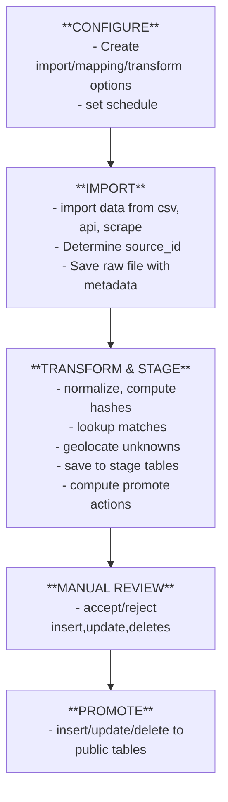
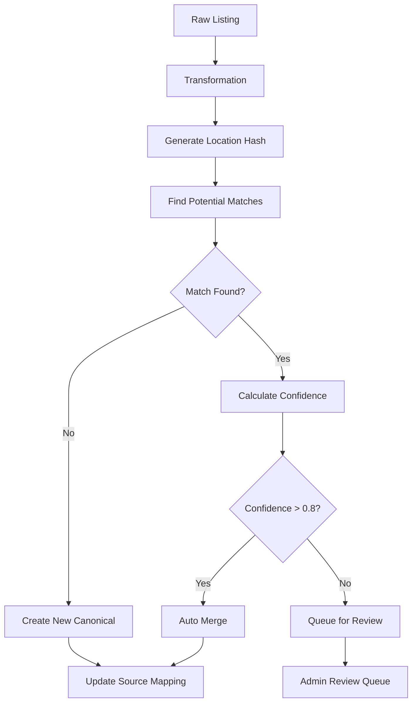

# Pipeline Design
**goal:**  Enterprise grade listings pipeline with a graphical interface for managing data pipeline:
- configuring import/scraping jobs
- ingesting and updating data
- managing content mapping
- handling conflicts
- scheduling jobs and queues

Required to scale our content quickly, and keep content up to date with client data updates and repeated scraping.

## Pipeline FLow


## Pipeline Stages

### 1. Configure
**Define pipeline behavior for a DMO and data source type**
- UI tab - 'create config' button: dialog to create/update/delete pipeline.configs
- the UI tab lists configs and lets you run a config to start a job
- Most settings use default values. Allow overriding for setting:
- Field mapping rules (CSV column → DB column).
- Normalization rules (uppercase, trim, clean special chars).
- Deduplication settings (fields to hash, rounding precision for lat/lng).
- Promotion policies (merge_policy, update_bridge_table).

### 2. Import

- **Purpose:** Capture raw source data.
- **Sources:** uploaded csv, html scrape, wordpress/drupal api, priceline api, poi data sets (ESRI, HERE, OSM)
- **Actions:**
- Upload CSV / JSON, run API import, or scrape website (saves temp file)
- Determine source_id.
- Add metadata columns: rec_num, source_id, dmo_id, timestamp, etc.
- Save raw file for audit / retry purposes.
- **Note:** Raw file is immutable; all transformations happen later.

✅ input issue - most imports are all backend, csv needs an upload dialog though

Your executeStage endpoint is normally autonomous:
	•	It figures out which stage to run next (import, stage, review, promote
	•	It runs everything server-side (e.g., fetch API, scrape, etc.)

But now you have a stage (importType = csv) that can’t start until the frontend provides a file.

So you need a way for:
	1.	The backend to tell the frontend: “This stage requires a file.”
	2.	The frontend to collect the file and send it back.
	3.	The backend to continue the pipeline normally.

Two-Phase Stage Execution Pattern

Overview

In a backend-driven pipeline (e.g., /executeStage), all stages normally run autonomously — such as fetching, transforming, or promoting data. However, some stages (like importType = csv) require user input (e.g., uploading a file) before execution can continue. To handle this cleanly without breaking backend orchestration, implement a two-phase stage execution pattern.

Concept

Phase 1: The frontend triggers the stage. The backend determines that the stage requires user input (e.g., a file) and responds with status waiting_for_input, an inputType indicating what is needed, and a stageId to track the workflow.

Phase 2: The frontend collects the required input (e.g., via file picker) and sends it to the backend using a separate upload endpoint. Once uploaded, the frontend re-calls /executeStage to resume the pipeline.

Example Flow
	1.	Frontend calls /executeStage
The frontend requests execution of a stage. If the backend needs user input, it responds with a waiting_for_input status and the type of input required.
	2.	Backend determines stage type
The backend checks the stage configuration. For CSV imports, it returns a response indicating that a file upload is needed. Otherwise, it executes the stage normally.
	3.	Frontend uploads the file
The frontend opens a file picker, collects the file, and uploads it to a dedicated backend endpoint. After successful upload, the frontend calls /executeStage again with a flag to indicate continuation.
	4.	Backend receives upload and resumes
The backend stores the temporary file, then resumes the pipeline for the stage using the uploaded file. Once processing is complete, the pipeline continues as normal.

Benefits
	•	Backend remains orchestrator: Frontend only reacts when input is needed.
	•	Scalable: Can support future input types (text, parameters, approvals).
	•	Clean separation: /executeStage handles orchestration logic, /uploadStageFile handles input.
	•	Re-usable: Same structure works for any interactive stage in the pipeline.


### 3. Stage

**Purpose:** take raw data and get ready for promote step

**flow**

1. do normal step setup: get the job and configsnapshot.

2. find out the filetype, if csv then import the csv file.

3. loop through records:
```
if source is empty generate source_id and generate l_match_hash

lookup listing in bridge_source_target using source_id
if listing not found
  use l_match_hash to lookup listing in public listings (listings.match_hash)
endif

if (listing found)
  if listings.google_place_id is not empty
    get the location fields from the public listing and update the location fields.
  else (listings.google_place_id is empty)
    lookup location information for listing using the GooglePlacesApi service functions
  endif

  generate l_hash, l_location_hash, l_attributes_hash
  compare these hashes and set actions
  
  if find lookup listing_info by listing_id and dmo_id
    generate li_hash, li_contact_info_hash, li_images_hash, li_open_hash
    compare these hashes and set actions
  else (listing_info not found)
    set all listing_info actions to insert
  endif 

else (listing not found)
  set all actions = 'insert'
  lookup location information for listing using the GooglePlacesApi service functions.
endif
```
4. go through records and deduplicate, if any duplicate l_match_hash, leave actions alone for the first one and set the l_action to 'duplicate' for the rest of the duplicates

5. find any deleted listings, set action to 'delete'

6. insert all records into the stage table


#### Duplicate Detection
- Within the staging table:
- use source_id as dedup key
- Flag rows with the same key:
- Keep one “primary” row for promotion.
- Set action = 'duplicated' for duplicates.
- Optionally, mark duplicates for human review (ok_to_promote = false).

**Partial transforms are supported:** if a job fails mid-way, already-looked-up geolocations and hashes are persisted in stage table, avoiding repeat API calls. If retry transform, read raw import, skip over already transformed records and start transforming at last failed record.


#### Detect Deletions / Soft-Deletes
- For each listing_info under the dmo:
- If no matching staging row, then 
    - lookup parent listing
    - add record with listing and listing_info data
    - listing_info action = 'delete'
    - if the listing has no other listing_info records, then set listing action = delete
- Mark both for manual review

----

### 4. Manual Review
- Display stage rows:
- New listings
- Updates
- Duplicates
- Deletions
- Allow reviewers to:
- Approve / reject changes
- Override actions
- Change ok_to_promote flags

----

### 5. Promote
- Iterate rows with ok_to_promote = TRUE:
- Listing:
- 'insert' → insert
- 'update' → update
- 'delete' → set public.listings.listing_visible = false, listing_status = 'missing_from_import'
- Listing Info:
- 'insert' / 'update'
- 'delete' → set public.listing_info.info_visible = false,  info_status = 'missing_from_import'
- Dependent Objects:
- 'insert' / 'update'
- Reset manually_modified flag if overridden

6. Key Advantages
- Stage table is single source of truth for review + promotion.
- No need for separate transform/validation files (optionally save JSON for audit).
- Partial transforms possible; retries do not repeat geolocation/lookups unnecessarily.
- Promotion decisions are deterministic; no runtime logic needed.
- Supports duplicates, deletions, soft-deletes, manual overrides.


## Key Concepts

### File Sizes, batch and splitting rules
**Assumptions**
- Average record size: 10 KB (high estimate)
-	DB insert batch: keep under 1–2 MB per batch for safety
-	Concurrent jobs: 3–5 workers at a time
-	Target memory use: ≤100 MB per worker

#### 1. DMO Import Batching / Splitting Guide

- Small DMOs (<500 listings): process in one go (~5 MB memory)
- Medium DMOs (500–5,000 listings): split into files ~500 records (~5 MB per file)
- Large DMOs (5,000–50,000 listings): split into files ~2,000–5,000 records (~20–50 MB per file), stream from disk/S3
- Always monitor memory per worker and DB transaction size
- Parallelism: 3–5 concurrent workers is safe; adjust based on worker memory

#### 2. Recommended File Sizes per Split File

- Small (≤500 listings): 1–5 MB per file
- Medium (500–5,000 listings): 5–10 MB per file
- Large (5,000–20,000 listings): 10–25 MB per file
- Very large (20,000–50,000 listings): 20–50 MB per file

#### 3. File Splitting Strategy (Dual Threshold)

- Limit file by maximum records OR maximum file size, whichever comes first
- Sequential file numbers: 001, 002, 003… for multiple files in a single import
- Store import metadata: import_id, record_count, file_size for monitoring and retries

#### 4. Streaming / Memory-Safe Processing Pattern

- Stream file from disk or S3
- Accumulate a batch (by records or file size)
- Process the batch records (save to file, process, insert to stage etc)
- Clear batch from memory
- Continue reading and processing batches until all records have been handled

#### 5. Example Listing JSON Size Estimates

- Average single listing (with 5-paragraph description, images, socials): 10–14 KB
- Gzipped: 2–3 KB
- 100 listings per file: ~1 MB
- 1,000 listings per file: ~10 MB
- 5,000 listings per file: ~50 MB (at 10 KB per listing)
- 5,000 listings per file: ~100 MB (at 20 KB per listing)

#### 6. Safe File Insert / Concurrency Guidelines

- Keep insert files ≤ 500–1,000 records for medium DMOs
- Use streaming for large DMOs to limit memory usage
- 3–5 concurrent workers per DMO is a safe default
- Monitor Postgres transaction size and memory per worker
- Smaller files are better for retries and failure isolation


### S3 File Naming Convention (Import ID + Sequential Number)
**originally I wanted to add country and state to file names, but it doesn't hold for objects that span geographys. And it seems that it adds clutter and isn't neccesary. Add this info to the files table and/or S3 metadata.**

#### raw file names

s3://{environment}-trippl-data/{stage}/{data-domain}/{dmo-id}/{date}/job-{job-id}-{file-seq}.{format}.gz

- job-id padded to 6 characters
- file-seq padded to 2 characters

#### Fields
  - environment: dev, staging, prod
  - stage: raw
  - data-domain: listings, reviews, events, etc.
  - dmo-id: your internal DMO ID (numeric or alphanumeric)
  - date: date of import in YYYYMMDD
  - import-id: timestamp or DMO+date combination that identifies the **entire import run**
  - file-seq: sequential number for files split from the same import (01, 02, 03…)
  - format: json, csv, xls
  - .gz: optional compression

- Notes:
  - All files with the same **import-id** belong to the same logical import run.
  - `file-seq` ensures unique filenames within a split import.
  - This approach eliminates confusion with multiple “batches” and keeps grouping and ordering simple.
  - geography will be stored in the db with pipeline.files and as metadata with files.  

#### image names
s3://{environment}-trippl-images/{dmo-id}/{listing-id}/{filename}.{ext}


### Public Hashes Generation
**public schema**

listings.listing_match_hash
- listings.name
- locations.address1
- locations.city

listings comparison fields
- listings.name

listings.attributes comparison fields
- hash all bridge_attributes_listings.attribute_id fields with bridge_attributes_listings.listing_id = listings.id

listing_info.listing_info comparison fields
- listing_info.description

listing_info.images comparison fields
- hash all listing_images where listing_info_id = listing_info.id using fields image

locations.location_ comparison fields
- address1
- address2
- city
- state
- zip
- country
- lat
- lng
- regionName

contact_info.contact_info comparison fields
- name
- email
- local_phone
- international_phone
- website_url
- socials

opening_dates. opening dates and hours comparison fields
- compare all dates and hours - use convert function to get array ...

### Deterministic Internal IDs
- **Internal IDs are SERIAL IDs**: We use the database SERIAL primary keys (`public.listings.id`, `public.listing_info.id`, etc.) as our deterministic canonical identifiers.
- **Generation occurs during Promotion stage**: When data is promoted from stage to production, PostgreSQL automatically assigns SERIAL IDs which become our canonical internal IDs.
- Maps multiple source IDs (DMO, website, Priceline, GooglePlaceID) to a single internal `listing_id`.
- Maps one-to-one source IDs to a single internal `listing_info_id`.
- Mappings stored in `pipeline.bridge_source_target`.
- Ensures **consistent internal IDs** across multiple sources and imports.
- **Conflict Resolution Rules:**
  - **Listings level**: Multiple sources can map to the same `listing_id`
  - **Listing info level**: Only one source should map to a given `listing_info_id`
  - **Multiple listing_info per listing**: Allowed and expected, as long as IDs are unique.


### Deduplication
- **Stage table only:** `source_id` used for deduplication
- **Production:** dedupe_key recomputed on-the-fly for matching; not stored in production.


### Additional things for Cursor to implement directly
- Implement real geocoding API calls in Transform stage if lat/lng missing from raw and listing or listing_info match not found.  If match found then fill in lat/lng and missing address fields from production locations record.
- Idempotency: repeated promotions should not create duplicates
- Job queue workers: handle retry_count, locked_by, dequeue_attempts, next_attempt_at
- Admin UI: simple staging review table with promote button


## Import
**Upload or import raw data**
-	Upload CSV, import from API, scrape from website.
- Save original as Raw File in raw area (audit trail).
-	Store metadata: import timestamp, user, source identifier ...

### Metadata added to raw import files
**the columns that we need added to the raw import file are:**
```
const metadataColumns = {
  'rec_num': index + 1,       // Sequential record number within file
  dmo_id: importConfig.dmoId, // DMO identifier
  source_id: sourceId,        // Unique source identifier
  imported_at: importedAt,    // Import timestamp
  imported_by: uploadedBy,    // User who imported (0 for pipeline system)
};
```

### source_id
- per-record unique identifier from the original source system (WordPress slug, Priceline ID, Foursquare ID, etc.)
- Can detect duplicates and support upserts
- Is deterministic (same record → same ID)
- Comes with the imported record; exists before Transform. It is used to check if this record already exists in your DB.
- an input record has one source_id, which can be used to lookup listings or listing_info
- In practice:
  - use source_id to lookup listing in DB.
    - not exist - stage new listing+listing_info.
    - exist
      - lookup listing_info using source_id
        - not exist - stage new listing_info
        - exist
          - check hashes
            - changes - stage for updates
            - no changes - stage for skipped

- one external record maps to a listing and a listing_info
- the same source_id is used for the listing and the listing_info
- for each external record, there will be a one possible listing_info match
- for each listing, there could be multiple matches to import records, from different dmos

#### what if the import type changes for the same source (dmo_id)
**e.g. BookingPEI**
source: csv      record: 1   hash: dmo_id+name+city  = 51

source: wp api   record: 1   hash: dmo_id+name+city  = 51

- so the determining factor for the source_id will be the dmo and listing details.
- it won't matter if we change the input type (csv, wordpress), the source_id should stay the same.
- that way we will be doing an update of an existing record, if we did a different import type.

#### how to generate source_id
| source        | source_id                                   |
|---------------|---------------------------------------------|
| Priceline     | id                                          |
| Foursquare    | id                                          |
| Google        | placeId                                     |
| csv           | dmo_id + normalize(name) + normalize(city)  |
| wordpress api | (dont need dmo_id?) source_url? or same hash as csv? |
| BPEI website  | 
| CC website    |
| PE website    |
| TPEI website  | 

```
// fields for normalizing: dmo_id, name, address, city, postal_code, source_url
const normalize = str =>
  str?.toLowerCase().trim().replace(/[^\w\s]/g, '') || '';

import crypto from 'crypto';
const sourceIdentifier = crypto
  .createHash('sha1')
  .update(`${source_id}|${normalize(name)}|${normalize(address)}|${normalize(city)}|${normalize(country)}`)
  .digest('hex');
```

#### field type
Need one field (source_id) that can store any kind of unique identifier, regardless of source — e.g.:
- ChIJN1t_tDeuEmsRUsoyG83frY4 (Google Place ID)
- H1234567890 (Priceline hotel ID)
- https://example.com/listing/123 (WordPress permalink) - or we use the same as csv, in case of changing import type, the records will still evaluate to the same source
- abc123xyz... (hash generated from CSV fields)

```sql
source_id TEXT NOT NULL
-- Can handle strings of any length (no need to specify a max).
-- PostgreSQL stores short strings efficiently (inline up to ~2kB).
-- Works for IDs, URLs, and hashes alike.
-- Lets you normalize across sources without worrying about type casting.

// unique across a single source (dmo_id) -- ie google, priceline, bookingpei.com. question: then what about reviews, same dmo_id?
CONSTRAINT unique_source_id_per_source UNIQUE (dmo_id, source_id)

- listing_info will have a single unique source_id
- but listings can have multiple source_ids, which are mapped in the bridge table by dmo_id
```

#### mapping the source_id to listings and listing_info
- there is one source_id for an import record. so within an import job, listing and listing_info will have the same source_id.
- Use one shared bridge table (source_mappings) with a target_type column

```sql
CREATE TABLE pipeline.bridge_source_target (
  id SERIAL PRIMARY KEY,
  dmo_id INT NOT NULL,              -- distinguishes different sources (ie, google and priceline could have a listing with the same id)
  source_id TEXT NOT NULL,          -- e.g. 'ChIJN1t_tDeuEmsRUsoyG83frY4'
  target_type TEXT NOT NULL,        -- e.g. 'listing', 'listing_info'
  target_id INT NOT NULL,           -- internal DB record ID
  UNIQUE (dmo_id, source_id, target_type)
);

Example Data:

dmo_id      source_id                     target_type     target_id
200 (PL)    ChIJN1t_tDeuEmsRUsoyG83frY4   listing         101
200 (PL)    ChIJN1t_tDeuEmsRUsoyG83frY4   listing_info    201
1 (google)  ChIJN1t_tDeuEmsRUsoyG83frY4   listing         60
5 (bpei)    xxx                           listing         101
5 (bpei)    xxx                           listing_info    500

-- FIND THE DB RECORD
SELECT target_type, target_id
FROM pipeline.bridge_source_target
WHERE dmo_id = 200
  AND source_id = 'ChIJN1t_tDeuEmsRUsoyG83frY4';
```

                      +---------------------------+
                      | bridge_source_target      |
                      |---------------------------|
                      | id (PK)                   |  <-- primary key index
                      | dmo_id                    |
                      | source_id                 |
                      | target_id                 |
                      | target_type               |
                      | certainty_score           |
                      +---------------------------+
                               ^
                               |
                               |
          ----------------------------------------------
          |                                            |
          |                                            |
   1) Deduplication check                         2) Lookup by target_id
   (Check if source record already exists)        (Find internal record mappings)
          |                                            |
  SELECT * FROM bridge_source_target           SELECT source_id, dmo_id
  WHERE dmo_id = ?                              FROM bridge_source_target
    AND source_id = ?                             WHERE target_id = ?
    AND target_type = ?                                AND target_type = ?


---

**find listing_info**
- NOTE: we never really have to lookup listing_info by it's content. Once we have found the listing, and we have the import dmo_id, then a listing_info record exists for that listing and dmo_id (check for content changes), or it doesn't (create new).
- todo: figure out if we need to do a verification with a listings_info_match_hash.
- todo: also figure out how to handle duplicate records that may have different information: which is used for the update?  I guess we add to the staging table as duplicates and force checking which one is the updating record source.
- 
- if new listing record, then also new listing_info record
- (there really shouldn't be any match in the db, should we double check to catch unexpected results?)
- if listing_id was found
- listing_info_id = select target_id from bridge_source_target(source_id, source_type='listing_info', dmo_id=import_dmo_id) (this is where parent id could be used instead of dmo_id to make sure we have the right listing_info)
- if not found, then we make sure we are not just missing the mapping, lookup listing_info by listing_id and dmo_id.
- if not found (which it shouldn't be)
- create new listing_info


## Admin pages
add permissions for new pipeline functions. add all permissions to the super_admin role.

all Pipeline menus and pages should be protected on the front and back end with required permission pipeline:read.

make a new sidebar menu section called Pipeline, visible to users with permission

make admin pages to manage all steps of the pipeline. 

admin pages should follow the structure of existing admin pages (topbar, sidebar etc)


## Job Scheduling
use manual scheduling/execution on localhost.

on dev/staging/app use aws SQS to schedule and execute jobs in the job_queue

**if dmo config changes** then add a dialog at save time that checks for scheduled jobs and lets user ignore or cancel.  Changes to schedule shouldn't be an issue, though an old job with old config might overwrite new job(s).


## suggested config fields
```
// example transform field mappings
"transform": {
  "map_fields": {
    "listings.name": "Name",
    "locations.address1": "Street Address",
    "contact_info.email": "Email"
  },
  "normalize_fields": [
    "listings.name",
    "locations.address1",
    "listings.category"
  ],
  "round_lat_lng": 5,
  "hash_fields": ["listings.name", "locations.address1", "lat", "lng", "listings.category"],
  "dedupe_key_fields": ["listings.name", "locations.address1", "lat", "lng"]
}

// example config_params:
"import": {
  "source_type": "csv",   -- 'csv', 'wordpress', 'drupal', 'website', 'api', 'eventbrite'
  "file_format": "csv",   -- 'csv', 'json'
  "delimiter": ",",
  "encoding": "utf-8",
  "skip_header": true
}

// do the field mapping in the transform step, not the load-to-staging step.
// That way, your staging table always looks like your internal canonical schema (name, address, lat, lng, etc.), regardless of source.

"validate": {
  "data_types": {
    "locations.lat": "numeric",
    "locations.lng": "numeric",
    "contact_info.email": "email",
    "contact_info.local_phone": "phone"
  },
  "required_fields": [
    "listings.name",
    "locations.address1",
    "locations.city"
  ],
  "business_rules": {
    "lat_bounds": [-90, 90],
    "lng_bounds": [-180, 180],
    "dmo_geographic_bounds": {
      "min_lat": 40.0,
      "max_lat": 45.0,
      "min_lng": -80.0,
      "max_lng": -70.0
    }
  },
  "quality_scoring": {
    "enabled": true,
    "weights": {
      "completeness": 0.4,
      "accuracy": 0.3,
      "consistency": 0.3
    }
  }
}

"stage": {
  "match_on": [
    "listings.dedupe_key",
    "locations.dedupe_key",
    "contact_info.dedupe_key"
  ],
  "conflict_resolution": "update_if_changed",
  "status_field": {
    "listings": "ok_to_promote",
    "locations": "ok_to_promote",
    "contact_info": "ok_to_promote"
  },
  "audit_fields": ["created_at", "updated_at", "imported_from"]
}

"promote": {
  "merge_policy": "latest_wins", // if a row exists then staging version overwrites it
  // "merge_policy": "skip_if_exists" // keep production data if it already exists
  // "merge_policy": "field_level_merge" // update only fields that changed
  "update_bridge_table": true  // using a bridge table for many-to-many relationships, set to true to ensure relationships are updated during promotion. If false, only the main tables (listings, locations) are updated, but bridge/assocaiation tables are left stale (?)
  "conflict_resolution": {
    "listings": "latest_wins",
    "locations": "field_level_merge",
    "contact_info": "latest_wins"
  }
}
```

✅ Key Design Points for Enterprise-Grade Traceability
1.	Staging = full audit, full imported data, dedupe & normalized fields
2.	Production = clean, promoted data, audit of promotion + manual edits
3.	Multi-table mapping is explicit: listings.name, contact_info.email, locations.address1
4.	Deduplication & hashing: staging generates dedupe_key per record; production dedupe is computed on-the-fly during promotion
5.	Audit fields everywhere: imported_from, created_at, updated_at, updated_by
6.	Bridge tables follow the same pattern for relational mapping, with promotion/audit fields


## Matching Process for Stage
:REVIEW:
