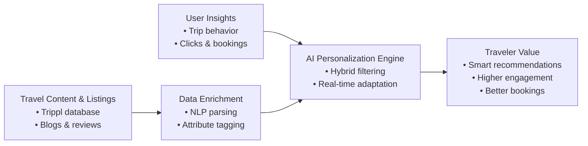
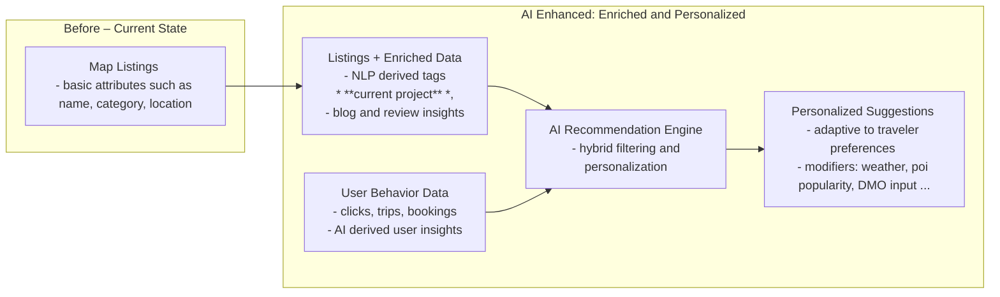

```mermaid
flowchart LR
    %% Top row
    A[Travel Content & Listings<br />• Trippl database<br />• Blogs & reviews] 
        --> B[Data Enrichment<br />• NLP parsing<br />• Attribute tagging]

    %% Bottom row
    C[User Insights<br />• Trip behavior<br />• Clicks & bookings] 
        --> D[AI Personalization Engine<br />• Hybrid filtering<br />• Real-time adaptation] 
        --> E[Traveler Value<br />• Smart recommendations<br />• Higher engagement<br />• Better bookings]

    %% Connect rows
    B --> D

```

```mermaid
flowchart LR
    subgraph Before["Before – Current State"]
        L1[Map Listings <br />- basic attributes such as name, category, location]
    end

    subgraph After["AI Enhanced: Enriched and Personalized"]
        L2[Listings + Enriched Data<br /> - NLP derived tags <br /> * **current project** *,<br />- blog and review insights]
        U1[User Behavior Data <br />- clicks, trips, bookings <br /> - AI derived user insights]
        R1[AI Recommendation Engine<br /> - hybrid filtering and personalization]
        O1[Personalized Suggestions <br />- adaptive to traveler preferences <br />- modifiers: weather, poi popularity, DMO input ... ]
    end

    L1 --> L2
    L2 --> R1
    U1 --> R1
    R1 --> O1

```