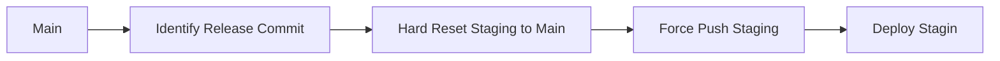

# Trippl App Versioning & Release Workflow

This document describes the **versioning and release process** for Trippl’s Dev, Staging (RC), and Production environments. It also includes the automated GitHub Actions workflows.

---

## **1. Versioning Overview**

| Environment | Version Format         | How Set / Source        | Notes |
|------------|----------------------|------------------------|------|
| **Dev**    | `X.Y.Z-dev-<shortSHA>` | From `package.json` / `VERSION` + Git SHA | Auto-generated per build, no Git tags |
| **Staging (RC)** | `X.Y.Z-RCn`          | Git tag auto-created when `main` merges into `staging` | RC number auto-increments per merge |
| **Production** | `X.Y.Z`              | Current `package.json` version used for Git tag | Release notes added in GitHub Release; app displays version & notes; `package.json` bumped after release for next cycle |

**Rules:**

1. Dev builds **never modify `package.json` or create tags**.  
2. Staging merges create **incremental RC tags** automatically.  
3. Production releases:
   - Use current `package.json` version for Git tag.
   - Create GitHub Release with release notes.
   - Build app with embedded version & notes.
   - **Then bump `package.json`** for the next development cycle.

---

## **2. Version Flow Diagram**

```
         +----------------+
         |  Dev Branches  |
         +----------------+
                 |
                 | builds: X.Y.Z-dev-SHA
                 v
         +----------------+
         |      Main      |
         +----------------+
                 |
                 | merge
                 v
         +----------------+
         |    Staging     |
         +----------------+
                 |
                 | RC tag auto: X.Y.Z-RCn
                 v
         +----------------+
         |   RC Testing   |
         +----------------+
                 |
                 | (Release approved)
                 v
         +----------------+
         |   Production   |
         +----------------+
                 |
                 | Manual workflow triggered on GitHub
                 |
                 | Build app with version & notes
                 | Use current version for Git tag
                 | Create GitHub Release with notes
                 |
                 | Bump package.json for next cycle
                 v
        Next Dev / Staging cycle starts
```

---

## **3. Notes**

- **Dev builds:** Auto version with SHA, no tagging.  
- **Staging RCs:** Auto-incremented RC tags, visible in staging.  
- **Production:** Uses current `package.json` version, release notes embedded in app, then `package.json` bumped for the next cycle.  
- **App UI:** Reads version and release notes from environment variables or embedded config at build time.

---

# Change Staging Release Method: 
## Use Hard Reset Staging -> Main vs old way of PR Merge Main -> Staging

2025-09-11 (mo)
We started our main and staging branches with all dev going into main, and if we wanted a stage release, we would PR and merge main to staging.  

Now we are switching that up. I want to tag the stage releases with -RCx.  And it looks like the merging strategy isn't as clean as strictly doing a hard reset on stage to point to main and doing a tag.  Here is the rational ...

This document compares two common strategies for preparing a `staging` branch for release: merging `main` via Pull Request (PR) vs hard resetting `staging` to a specific `main` commit.

---
## 1. PR Merge (`main → staging`)  (old)

### Workflow
1. Develop features on feature branches.
2. Merge into `main` when ready.
3. Open a PR from `main` → `staging`.
4. Review and merge PR.
5. Deploy `staging`.

### Mermaid Diagram


### Pros
- Maintains **branch history** on `staging`.
- Safe: can revert the PR if needed.
- Works well with **code review** workflows.
- Keeps `staging` as an actual branch, useful for shared environments.

### Cons
- **Extra merge commits** may clutter history.
- Can include **non-release commits** accidentally.
- May require conflict resolution if `staging` diverges.

### Git Example
```bash
# Assuming staging is checked out
git fetch origin
git checkout staging
git merge origin/main
# Resolve conflicts if any, then push
git push origin staging
```

---
## 2. Hard Reset (`staging → main`) (new)

### Workflow
1. Identify the target commit on main for release.
2. Hard reset staging to that commit.
3. Force push staging.
4. Deploy staging.

### Mermaid Diagram

### Pros
- Exact copy of main on staging.
- Clean history: no extra merge commits.
- Ideal for pre-release testing.

### Cons
- Destroys staging history beyond the reset point.
- Risky if staging has unmerged changes.
- Requires force push, which can disrupt other developers.

Git Example
```bash
git fetch origin
git checkout staging
git reset --hard origin/main
git push origin staging --force
```
---
## 3. Comparison Table
| Feature / Aspect          | PR Merge (`main → staging`) | Hard Reset (`staging → main`) |
| ------------------------- | --------------------------- | ----------------------------- |
| Branch history retained   | ✅ Yes                       | ❌ No                          |
| Extra merge commits       | ✅ Yes                       | ❌ No                          |
| Safety                    | ✅ Safer                     | ⚠️ Risky (force push)         |
| Exact main copy           | ⚠️ Might not be exact       | ✅ Yes                         |
| Good for code review      | ✅ Yes                       | ❌ No                          |
| Good for pre-release test | ⚠️ Sometimes                | ✅ Ideal                       |


## 4. Recommendations
- Use PR merge if staging is a shared branch and history/review is important.
- Use hard reset if you want staging to match main exactly for release testing.
- Never force push to staging if others are actively working on it without coordination.

## 5. Notes
- Tags can be applied on commits independently of either strategy.
- For CI/CD deployments, both workflows can trigger automated builds.

---
