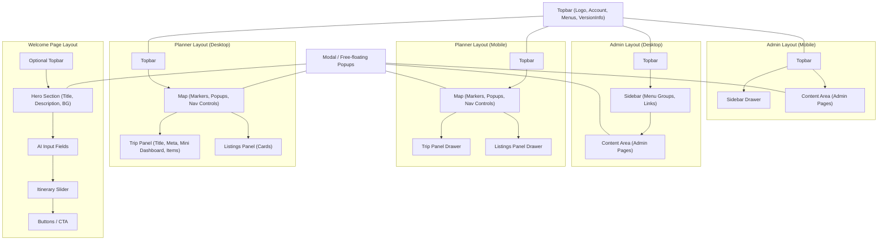

```bash
/src
  /components           # Pure, reusable UI components (domain-agnostic)
    /ui
      Button.tsx
      Input.tsx
      AiInput.tsx
      Modal.tsx
      Typography.tsx
      Slider.tsx
      Card.tsx
      MapMarker.tsx
    /layout
      Topbar.tsx
      Sidebar.tsx
      Footer.tsx
      Header.tsx
    /branding
      Logo.tsx
      WhitelabelLogo.tsx
      PopupMenu.tsx
    /dashboard
      StatsBox.tsx
      MiniDashboard.tsx
    /version
      VersionInfo.tsx

  /features             # Self-contained domain features
    /TripPlanner
      /components
        Map.tsx
        NavControls.tsx
        TripPanel.tsx
        TripItem.tsx
        TripItemMeta.tsx
        TripItemBooking.tsx
        ListingsPanel.tsx
        ListingCard.tsx
        ListingDetail.tsx
        CategoryFilterBar.tsx
      /hooks
        useTrip.ts
        useListings.ts
      /api
        tripApi.ts
        listingsApi.ts
      /types
        trip.ts
        listing.ts
      index.ts
    /Welcome
      /components
        HeroSection.tsx
        ItinerarySlider.tsx
        WelcomeAiInput.tsx
      /hooks
        useWelcomeData.ts
      index.ts
    /Admin
      /components
        AdminPageLayout.tsx
        BrandingPage.tsx
        DmosPage.tsx
        ListingManagementPage.tsx
        ImportPage.tsx
        SecurityPage.tsx
        AccountsPage.tsx
      /hooks
        useAdmin.ts
      /api
        adminApi.ts
      index.ts

  /pages                 # Pages / routes of the SPA
    /Planner
      PlannerPage.tsx
      PlannerPage.styles.ts
    /Welcome
      WelcomePage.tsx
      WelcomePage.styles.ts
    /Admin
      AdminDashboard.tsx
      AdminDashboard.styles.ts

  /contexts              # React contexts / providers
    AuthContext.tsx
    FeatureFlagContext.tsx
    TripContext.tsx

  /hooks                 # Global hooks not tied to a feature
    useFetch.ts
    useDebounce.ts

  /utils                 # Pure utility functions
    formatDate.ts
    apiClient.ts
    geoUtils.ts

  /styles                # Global styles, design tokens, themes
    theme.ts
    globals.css

  /assets                # Images, icons, fonts
    branding/
      logo.svg
      whitelabel-logo.svg
      bg-welcome.jpg
    icons/
      map-marker.svg
      trip-icon.svg

  /config                # Configurations, constants
    apiEndpoints.ts
    env.ts

```
✅ Key Design Decisions

Base UI (/components/ui): Completely generic, reusable, no domain knowledge.

Layout Components (/components/layout): Topbar, Sidebar, Footer — reusable across pages.

Feature Components (/features/*/components): Domain-specific, high-level components that combine base UI and logic.

Example: TripItemBooking uses Button, Typography, etc., but is tied to trip planner data.

Pages (/pages/*): Compose features and layouts to create actual SPA routes/screens.

Branding / Icons / Dashboard / VersionInfo separated for clarity; can be reused across features.

Hooks, API, Types organized under features so each domain module is self-contained.

Contexts provide shared state, e.g., auth, trip, feature flags.

# complex SPA responsive layout
## 1️⃣ What “Layout” really is

A layout component is a page shell that defines how major sections are arranged.

Example sections:

Topbar (logo, menus, account info)

Sidebar / panels (trip panel, listings, admin menu)

Content area (map, welcome content, admin page content)

Free-floating elements (popups, modals, drawers)

The layout does not include the inner content itself — just the skeleton.

## 2️⃣ Mapping your pages to layouts
| Page                | Sections / Components                                                                           | Notes                                                                               |
| ------------------- | ----------------------------------------------------------------------------------------------- | ----------------------------------------------------------------------------------- |
| **Planner Page**    | Topbar, Map, Trip Panel, Listings Panel, Category Filter                                        | Map + panels are “feature-specific”; layout manages positioning and responsiveness. |
| **Admin Pages**     | Topbar, Sidebar, Content Area                                                                   | Layout controls the sidebar menu (desktop vs drawer), topbar, content slot.         |
| **Welcome Page**    | Topbar (optional), Hero section, content blocks (branding, AI input, itinerary slider, buttons) | Layout mostly vertical stack; less structure than planner/admin.                    |
| **Popups / Modals** | Free-floating, overlaid on page layouts                                                         | Can be rendered from anywhere; layout may provide a portal for modals.              |

## 3️⃣ Handling Mobile vs Desktop
### Option A: Single layout with responsive design

Use CSS / component props to handle breakpoints:

Desktop: panels visible side-by-side

Mobile: panels slide in via drawers or menus

Layout decides: isMobile ? renderDrawer(panel) : renderSideBySide(panel)

Pros: single layout per page type, less duplication

Cons: more conditional logic inside layout

### Option B: Separate layouts for mobile

PlannerLayoutDesktop.tsx vs PlannerLayoutMobile.tsx

Your page chooses layout based on a hook or viewport:

```bash
const Layout = isMobile ? PlannerLayoutMobile : PlannerLayoutDesktop;
return <Layout>{children}</Layout>;
```


Pros: clear separation, easier to maintain complex differences

Cons: duplicate code, may need to refactor shared sections (Topbar, Map, TripPanel) into separate components

Recommendation:

Use shared layout components (Topbar, Sidebar, TripPanel) that are responsible only for their own rendering logic.

Then have desktop vs mobile layouts that compose those components differently.

Example: TripPanel knows how to render itself in a drawer if isMobile. The layout just decides placement.

## 4️⃣ Folder structure suggestion for layouts
```pgsql
/components/layout
  Topbar.tsx
  Sidebar.tsx
  Footer.tsx
  Drawer.tsx
  ModalPortal.tsx

/features/Planner/components
  PlannerLayoutDesktop.tsx
  PlannerLayoutMobile.tsx
  Map.tsx
  TripPanel.tsx
  ListingsPanel.tsx

/features/Admin/components
  AdminLayoutDesktop.tsx
  AdminLayoutMobile.tsx
  AdminSidebar.tsx
  AdminContent.tsx

/features/Welcome/components
  WelcomeLayout.tsx  # mostly vertical, stacked content
```

## 5️⃣ Key principles

1 Layouts = “where components go”
- Desktop layout: panels side-by-side
- Mobile layout: panels in drawers/menus

2 Components = “what to render”
- TripPanel, ListingCard, Topbar render themselves
- They can receive isMobile prop for internal adjustments

3 Feature-first approach
- Planner layout uses Planner components
- Admin layout uses Admin components
- Shared components like Topbar or VersionInfo are imported into any layout



## ✅ Notes on this diagram:

1 Desktop vs Mobile:
- Desktop layouts show panels side-by-side.
- Mobile layouts move panels into drawers or overlays.

2 Shared Components:
- Topbar is reused across all layouts.
- ModalPortal handles free-floating popups, used in every layout.

3 Feature-specific components:
- Planner: Map, TripPanel, ListingsPanel
- Admin: Sidebar, ContentArea
- Welcome: Hero, AI Input, Slider, Buttons

4 Props for responsiveness:
- Individual panels (TripPanel, ListingsPanel, Sidebar) can internally handle isMobile logic.
- Layouts determine placement, panels determine presentation.