# 🌿 Dev Workflow Cheat Sheet

This workflow keeps branches, PRs, and releases traceable and consistent for a solo developer using ticket IDs (e.g., `TT-131`).

image.png

---

## 🏷 Branch Naming

Format:

```
<type>/TT-<ticket-number>-<short-description>
```

| Type         | Badge                                                 | Use for                             | Example Branch Name          |
| ------------ | ----------------------------------------------------- | ----------------------------------- | ---------------------------- |
| **feat/**    |        | new features                        | feat/TT-131-rbac             |
| **bug/**     |        | broken or wrong things              | bug/TT-142-login-fails       |
| **fix/**     |         | fixes, UI, design, optimizations    | fix/TT-142-login-redirect    |
| **task/**    |   | chores, infra, docs, CI/CD          | task/TT-150-liquibase-sync   |
| **idea/**    |      | ideas for future or improvements    | idea/TT-160-mapbox-prototype |
| **support/** |  | customer issues, requests, feedback | support/TT-170-pricing-api   |

**Tips:**

- Lowercase + hyphens.
- Branch off `main` unless dependent on another branch.
- Delete branches after merge.
- Ticket IDs link branch → PR → commits → tracker.

---

## 📝 PR Titles

Format:

```
<type>: TT-<ticket-number> <short description>
```

Examples:

- `feat: TT-131 RBAC implementation`
- `fix: TT-142 Login redirect bug`
- `task: TT-150 Liquibase sync`

> PR titles mirror branch names and include ticket IDs for traceability.

---

## 🎨 PR Labels (Optional)

| Label    | Badge                                                                                                                                                                                                       | Use for           |
| -------- | ----------------------------------------------------------------------------------------------------------------------------------------------------------------------------------------------------------- | ----------------- |
| priority |                                               | Urgency           |
| status   |            | Workflow tracking |
| context  |                                                                          | Area of work      |
| special  |    | Nuance tags       |

---

## ⚡ Version Bump Rules

| Branch Type  | Badge                                                | SemVer Bump | Example               |
| ------------ | ---------------------------------------------------- | ----------- | --------------------- |
| **feat/**    |       | MINOR       | 0.3.0 → 0.4.0         |
| **bug/**     |       | PATCH       | 0.4.0 → 0.4.1         |
| **fix/**     |        | PATCH       | 0.4.0 → 0.4.1         |
| **task/**    |  | build #?    | Usually internal only |
| **idea/**    |     | None        |                       |
| **support/** |  | None        |                       |

---

## 🚀 Release Flow (Mermaid Diagram)



```mermaid
flowchart TD
    A[TT-131: RBAC feature] --> B[Create Branch: feat/TT-131-rbac]
    B --> C[Work & Commit: feat: TT-131 RBAC implementation]
    C --> D[Push Branch: git push origin feat/TT-131-rbac]
    D --> E[Open PR: feat: TT-131 RBAC implementation]
    E --> F[Review & Merge PR]
    F --> G[Merge to main]
    G --> H[Version Bump: feat → MINOR]
    H --> I[Tag: git tag app-v0.4.0 && git push origin app-v0.4.0]
    I --> J[Delete Branch: git branch -d feat/TT-131-rbac && git push origin --delete feat/TT-131-rbac]
```

> Mermaid diagrams render automatically on GitHub and Notion for visual clarity.

---

## Release Flow (similar for api-server and app-web)
0. version is in package.json - automanaged.
1. Develop on branches.
2. Merge branch to `main` with PR.
- auto deployment to dev happens
3. Staging release - click `STAGE` workflow in Github Actions tab.
- can choose a specific commit or default `HEAD` of main branch
- a lint, test, package, copy to S3, and `auto-deploy` happens
- tag is automatically created - RCx suffix.
- subsequent releases to staging increase the RCx
4. Production release - click `PROD` workflow in Github Actions tab.
- choose tag to release. default is `HEAD` of main.
- enter release notes, release title, and level for next version bump.
- a lint, test, package, copy to S3, and `auto-deploy` happens

2. Determine bump type based on **highest-impact merged branch** (feat → minor, fix → patch).
3. Update version in your repo (`package.json`, `app config`, etc.).
4. Tag release (ticket IDs stay in branch/PR):

```
git tag app-v0.4.1
git push origin app-v0.4.1
```

### Delete merged branches:

```git branch -d <branch-name>
git push origin --delete <branch-name>
```

## Workflow Diagram

```
[TT-131: RBAC feature]
        │
        ▼
   Create Branch
feat/TT-131-rbac
        │
        ▼
   Work & Commit
git add . && git commit -m "feat: TT-131 RBAC implementation"
        │
        ▼
   Push Branch
git push origin feat/TT-131-rbac
        │
        ▼
   Open PR
PR Title: "feat: TT-131 RBAC implementation"
Labels: feat / backend / p1
        │
        ▼
   Review & Merge PR
        │
        ▼
   Merge to main
        │
        ▼
   Version Bump
feat → bump MINOR
git tag app-v0.4.0
git push origin app-v0.4.0
        │
        ▼
  Delete Branch
git branch -d feat/TT-131-rbac
git push origin --delete feat/TT-131-rbac
```

### 🐛 Bugfix Example

```
[TT-142: Login bug]
fix/TT-142-login-redirect
# PR & merge
fix → PATCH 
git tag app-v0.4.1
```

---

### 🛠 Task / Internal Example

```
[TT-150: CI update]
task/TT-150-update-ci
# PR & merge
task → optional PATCH / no version bump 
```

---

This workflow ensures **ticket → branch → PR → merge → version tag** is traceable, visually clear, and predictable for solo developers using semantic versioning with ticket IDs.

_Badges, emojis, and Mermaid diagrams make it easy to scan in GitHub or Notion at a glance._

⚡ Optional Automation You could set up a GitHub Action or a small script that:

- Scans merged branch names or PR labels.
- Decides whether to bump patch or minor.
- Creates a Git tag like app-v0.5.0.
  This way, your releases are predictable, even for a solo developer.

1️⃣ Scan merged branch names or PR labels

Every branch or PR follows a naming convention (feat/TT-131-rbac, fix/TT-142-login-bug).

Labels on PRs might also indicate type (feat, fix, task).

An automated script or GitHub Action can look at all merged branches since the last release and figure out what changed.

Why: This removes the guesswork. You don’t have to manually decide if it’s a minor or patch bump.

2️⃣ Decide whether to bump patch or minor

Rules:

```
feat → minor bump (0.4.0 → 0.5.0)

fix → patch bump (0.4.1 → 0.4.2)

task / docs → usually no bump
```

The automation reads the branch type or label and calculates the next version number.

Why: You always follow semantic versioning consistently, even if you forget or make multiple small changes.

3️⃣ Create a Git tag like app-v0.5.0

Once the automation has the new version number, it can run:

```
git tag app-v0.5.0
git push origin app-v0.5.0
```

This marks that point in Git as a release.

Why: Tags are used by CI/CD pipelines, package managers, or just for clarity in your Git history.

✅ How this benefits a solo developer

You don’t have to remember to bump the version manually.

Reduces mistakes and keeps branch → PR → release flow consistent.

Makes your Git history and releases predictable and traceable.

### .github/workflows/version-bump.yml

```
name: Version Bump

on:
  pull_request:
    types: [closed]

jobs:
  bump-version:
    if: github.event.pull_request.merged == true
    runs-on: ubuntu-latest
    steps:
      - name: Checkout repository
        uses: actions/checkout@v3

      - name: Set up Node.js
        uses: actions/setup-node@v3
        with:
          node-version: 18

      - name: Get latest version
        id: get_version
        run: |
          VERSION=$(git describe --tags --abbrev=0 || echo "0.0.0")
          echo "Latest version is $VERSION"
          echo "VERSION=$VERSION" >> $GITHUB_ENV

      - name: Determine bump type
        id: bump
        run: |
          LABELS="${{ github.event.pull_request.labels.*.name }}"
          echo "PR labels: $LABELS"
          BUMP="patch"
          if [[ "$LABELS" == *"feat"* ]]; then
            BUMP="minor"
          elif [[ "$LABELS" == *"fix"* ]]; then
            BUMP="patch"
          fi
          echo "Bump type: $BUMP"
          echo "BUMP=$BUMP" >> $GITHUB_ENV

      - name: Bump version
        id: new_version
        run: |
          IFS='.' read -r MAJOR MINOR PATCH <<< "${VERSION#v}"
          if [ "$BUMP" == "minor" ]; then
            MINOR=$((MINOR+1))
            PATCH=0
          else
            PATCH=$((PATCH+1))
          fi
          NEW_VERSION="v$MAJOR.$MINOR.$PATCH"
          echo "New version: $NEW_VERSION"
          echo "NEW_VERSION=$NEW_VERSION" >> $GITHUB_ENV

      - name: Create git tag
        run: |
          git config user.name "github-actions[bot]"
          git config user.email "github-actions[bot]@users.noreply.github.com"
          git tag $NEW_VERSION
          git push origin $NEW_VERSION

```

2️⃣ How it works

Triggered when a PR is closed and merged.

Checks out your repository.

Gets the latest tag (defaults to 0.0.0 if none exists).

Reads the labels on the merged PR:

feat → minor bump

fix → patch bump

anything else → patch (or you could skip)

Calculates the new version number.

Creates a Git tag and pushes it to the remote.

3️⃣ Notes & Tips

This works best if you consistently label PRs (feat, fix).

You can expand it to also update package.json or version.txt if needed.

Works fully automated — no manual tagging required.

---

1️⃣ Save the workflow

.github/workflows/version-bump-package.json.yml:

name: Auto Version Bump & Tag

on:
pull_request:
types: [closed]

jobs:
bump-version:
if: github.event.pull_request.merged == true
runs-on: ubuntu-latest
steps: - name: Checkout repository
uses: actions/checkout@v3

      - name: Set up Node.js
        uses: actions/setup-node@v3
        with:
          node-version: 18

      - name: Get PR labels
        id: labels
        run: |
          echo "PR labels: ${{ github.event.pull_request.labels.*.name }}"
          echo "LABELS=${{ github.event.pull_request.labels.*.name }}" >> $GITHUB_ENV

      - name: Determine bump type
        id: bump
        run: |
          BUMP="patch"
          if [[ "$LABELS" == *"feat"* ]]; then
            BUMP="minor"
          elif [[ "$LABELS" == *"fix"* ]]; then
            BUMP="patch"
          fi
          echo "Bump type: $BUMP"
          echo "BUMP=$BUMP" >> $GITHUB_ENV

      - name: Bump package.json version
        id: version
        run: |
          npm version $BUMP -m "chore: bump version to %s [skip ci]"
          NEW_VERSION=$(node -p "require('./package.json').version")
          echo "New version: $NEW_VERSION"
          echo "NEW_VERSION=$NEW_VERSION" >> $GITHUB_ENV

      - name: Push changes
        run: |
          git config user.name "github-actions[bot]"
          git config user.email "github-actions[bot]@users.noreply.github.com"
          git push origin HEAD:main
          git push origin --tags

2️⃣ How it works

Triggered on merged PR.

Reads PR labels to determine bump type:

feat → minor

fix → patch

Runs npm version <patch|minor>:

Updates package.json version.

Creates a Git commit: "chore: bump version to x.y.z [skip ci]".

Creates a Git tag.

Pushes both commit and tag back to main.

3️⃣ Benefits

Fully automated versioning → no manual tag creation.

Maintains semantic versioning based on PR type.

Keeps your package.json in sync.

Works for solo developers or small teams.

---

Perfect! Here’s a plain text version bump workflow that doesn’t require Node/npm. It uses a VERSION.txt file in your repo to track the current version, bumps it based on PR labels, tags it, and commits the updated file back to main.

1️⃣ Create the workflow

.github/workflows/version-bump-txt.yml:

name: Auto Version Bump (VERSION.txt)

on:
pull_request:
types: [closed]

jobs:
bump-version:
if: github.event.pull_request.merged == true
runs-on: ubuntu-latest
steps: - name: Checkout repository
uses: actions/checkout@v3

      - name: Get PR labels
        id: labels
        run: |
          echo "PR labels: ${{ github.event.pull_request.labels.*.name }}"
          echo "LABELS=${{ github.event.pull_request.labels.*.name }}" >> $GITHUB_ENV

      - name: Read current version
        id: read_version
        run: |
          if [ ! -f VERSION.txt ]; then
            echo "0.0.0" > VERSION.txt
          fi
          VERSION=$(cat VERSION.txt)
          echo "Current version: $VERSION"
          echo "VERSION=$VERSION" >> $GITHUB_ENV

      - name: Determine bump type
        id: bump
        run: |
          BUMP="patch"
          if [[ "$LABELS" == *"feat"* ]]; then
            BUMP="minor"
          elif [[ "$LABELS" == *"fix"* ]]; then
            BUMP="patch"
          fi
          echo "Bump type: $BUMP"
          echo "BUMP=$BUMP" >> $GITHUB_ENV

      - name: Bump VERSION.txt
        id: new_version
        run: |
          IFS='.' read -r MAJOR MINOR PATCH <<< "$VERSION"
          if [ "$BUMP" == "minor" ]; then
            MINOR=$((MINOR+1))
            PATCH=0
          else
            PATCH=$((PATCH+1))
          fi
          NEW_VERSION="$MAJOR.$MINOR.$PATCH"
          echo $NEW_VERSION > VERSION.txt
          echo "New version: $NEW_VERSION"
          echo "NEW_VERSION=$NEW_VERSION" >> $GITHUB_ENV

      - name: Commit and push
        run: |
          git config user.name "github-actions[bot]"
          git config user.email "github-actions[bot]@users.noreply.github.com"
          git add VERSION.txt
          git commit -m "chore: bump version to $NEW_VERSION [skip ci]"
          git push origin HEAD:main
          git tag v$NEW_VERSION
          git push origin v$NEW_VERSION

2️⃣ How it works

Triggered on merged PR.

Reads the VERSION.txt file (or creates 0.0.0 if missing).

Checks PR labels to decide bump type:

feat → minor

fix → patch

Calculates the new version, writes it to VERSION.txt.

Commits the updated file, pushes to main.

Creates a Git tag with the new version.

3️⃣ Benefits

No Node/npm required — works for any project.

Keeps a single source of truth in VERSION.txt.

Fully automated: branch → PR → merge → version bump → tag.

Compatible with solo developers or small teams.

---

# COMPLETE all in one

# 🌿 Solo Dev Workflow Cheat Sheet + Automated Versioning

This is a complete reference for solo developers, including branch naming, PR conventions, versioning, badges, Mermaid diagram, and automated GitHub Actions workflows (both npm and plain text versions).

---

## 🏷 Branch Naming

Format:

```
<type>/TT-<ticket-number>-<short-description>
```

| Type         | Badge                                                | Use for                          | Example Branch Name          |
| ------------ | ---------------------------------------------------- | -------------------------------- | ---------------------------- |
| **feat/**    |       | New features                     | feat/TT-131-rbac             |
| **fix/**     |        | Bug fixes, tweaks, optimizations | fix/TT-142-login-redirect    |
| **task/**    |  | Chores, infra, docs, CI/CD       | task/TT-150-liquibase-sync   |
| **idea/**    |     | Experiments / backlog            | idea/TT-160-mapbox-prototype |
| **support/** |  | Customer requests / external     | support/TT-170-pricing-api   |

---

## 📝 PR Titles

Format:

```
<type>: TT-<ticket-number> <short description>
```

Examples:

- `feat: TT-131 RBAC implementation`
- `fix: TT-142 Login redirect bug`
- `task: TT-150 Liquibase sync`

---

## 🎨 PR Labels (Optional)

| Label    | Badge                                                                                                                                                                                                       | Use for           |
| -------- | ----------------------------------------------------------------------------------------------------------------------------------------------------------------------------------------------------------- | ----------------- |
| priority |                                               | Urgency           |
| status   |            | Workflow tracking |
| context  |                                                                          | Area of work      |
| special  |    | Nuance tags       |

---

## ⚡ Version Bump Rules

| Branch Type  | Badge                                                | SemVer Bump           | Example               |
| ------------ | ---------------------------------------------------- | --------------------- | --------------------- |
| **feat/**    |       | MINOR                 | 0.3.0 → 0.4.0         |
| **fix/**     |        | PATCH                 | 0.4.0 → 0.4.1         |
| **task/**    |  | None / optional PATCH | Usually internal only |
| **idea/**    |     | None                  | Experimental          |
| **support/** |  | PATCH / optional      | If user-facing        |

---

## 🚀 Release Flow (Mermaid Diagram)

```mermaid
flowchart TD
    A[TT-131: RBAC feature] --> B[Create Branch: feat/TT-131-rbac]
    B --> C[Work & Commit: "feat: TT-131 RBAC implementation"]
    C --> D[Push Branch: git push origin feat/TT-131-rbac]
    D --> E[Open PR: feat: TT-131 RBAC implementation]
    E --> F[Review & Merge PR]
    F --> G[Merge to main]
    G --> H[Version Bump: feat → MINOR]
    H --> I[Tag: git tag app-v0.4.0 && git push origin app-v0.4.0]
    I --> J[Delete Branch: git branch -d feat/TT-131-rbac && git push origin --delete feat/TT-131-rbac]
```

---

## ⚡ Optional Automation

Automate version bumps and tags using GitHub Actions:

### 1️⃣ Node/npm project

- Reads PR labels (`feat`, `fix`).
- Uses `npm version <patch|minor>` to bump `package.json`.
- Commits the new version and pushes tags automatically.

See [Node/npm example](#node-npm-github-action) below.

### 2️⃣ Plain text VERSION.txt project

- Uses `VERSION.txt` instead of `package.json`.
- Reads PR labels and bumps patch/minor.
- Commits updated file and tags new version automatically.

See [VERSION.txt example](#version-txt-github-action) below.

---

### Node/npm GitHub Action Example

```yaml
name: Auto Version Bump & Tag

on:
  pull_request:
    types: [closed]

jobs:
  bump-version:
    if: github.event.pull_request.merged == true
    runs-on: ubuntu-latest
    steps:
      - uses: actions/checkout@v3
      - uses: actions/setup-node@v3
        with:
          node-version: 18
      - name: Get PR labels
        run: echo "LABELS=${{ github.event.pull_request.labels.*.name }}" >> $GITHUB_ENV
      - name: Determine bump type
        run: |
          BUMP="patch"
          if [[ "$LABELS" == *"feat"* ]]; then BUMP="minor"; fi
          echo "BUMP=$BUMP" >> $GITHUB_ENV
      - name: Bump package.json version
        run: |
          npm version $BUMP -m "chore: bump version to %s [skip ci]"
          NEW_VERSION=$(node -p "require('./package.json').version")
          echo "NEW_VERSION=$NEW_VERSION" >> $GITHUB_ENV
      - name: Push changes
        run: |
          git config user.name "github-actions[bot]"
          git config user.email "github-actions[bot]@users.noreply.github.com"
          git push origin HEAD:main
          git push origin --tags
```

---

### VERSION.txt GitHub Action Example

```yaml
name: Auto Version Bump (VERSION.txt)

on:
  pull_request:
    types: [closed]

jobs:
  bump-version:
    if: github.event.pull_request.merged == true
    runs-on: ubuntu-latest
    steps:
      - uses: actions/checkout@v3
      - name: Get PR labels
        run: echo "LABELS=${{ github.event.pull_request.labels.*.name }}" >> $GITHUB_ENV
      - name: Read current version
        run: |
          if [ ! -f VERSION.txt ]; then echo "0.0.0" > VERSION.txt; fi
          VERSION=$(cat VERSION.txt)
          echo "VERSION=$VERSION" >> $GITHUB_ENV
      - name: Determine bump type
        run: |
          BUMP="patch"
          if [[ "$LABELS" == *"feat"* ]]; then BUMP="minor"; fi
          echo "BUMP=$BUMP" >> $GITHUB_ENV
      - name: Bump VERSION.txt
        run: |
          IFS='.' read -r MAJOR MINOR PATCH <<< "$VERSION"
          if [ "$BUMP" == "minor" ]; then MINOR=$((MINOR+1)); PATCH=0; else PATCH=$((PATCH+1)); fi
          NEW_VERSION="$MAJOR.$MINOR.$PATCH"
          echo $NEW_VERSION > VERSION.txt
          echo "NEW_VERSION=$NEW_VERSION" >> $GITHUB_ENV
      - name: Commit and push
        run: |
          git config user.name "github-actions[bot]"
          git config user.email "github-actions[bot]@users.noreply.github.com"
          git add VERSION.txt
          git commit -m "chore: bump version to $NEW_VERSION [skip ci]"
          git push origin HEAD:main
          git tag v$NEW_VERSION
          git push origin v$NEW_VERSION
```

---

✅ With this, you have **full documentation + automation** for solo dev workflow, versioning, badges, Mermaid flowchart, and GitHub Actions.
