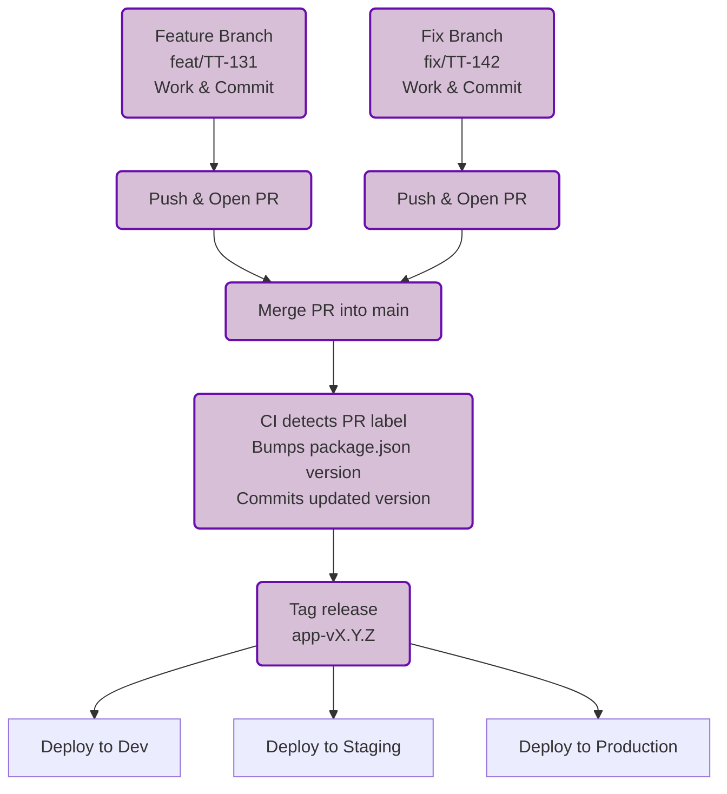

# Versioning Guide

## 📝 Overview

This workflow is designed as essentially a solo developer workflow for Git, PRs, and semantic versioning. I'll revisit when the team grows.

The **`main` branch is the single source of truth** for production-ready code.

- **Feature branches:** for new features.
- **Fix branches:** for bug fixes or improvements.
- **Versioning:** follows semantic versioning (`major.minor.patch`).

### Reasoning for Versioning rules

### 1️⃣ Each repo maintains it's own semantic versioning

- even though in fall 2025 both API and APP were both at v0.3.0, they are not intended to stay in sync, neccesarily.
- Fast-forwarding minor versions doesn’t scale - artifical bumps creates noise and conflicts.
- CI/CD would trigger unnecessary deployments.

### 2️⃣ Use metadata or mapping for releases (not done yet, will do if needed)

Maintain a release table or changelog that maps compatible versions:

| Release | API Version | App Version | DB Version | Notes                   |
| ------- | ----------- | ----------- | ---------- | ----------------------- |
|         | v1.2.0      | v1.4.0      | db-v1.2.0  |                         |
| 2025-08 | v1.2.0      | v1.5.0      | db-v1.2.0  | Front-end features only |
| 2025-08 | v1.3.0      | v1.5.0      | db-v1.3.0  | API added endpoints     |

This allows teams to see which versions are compatible, without forcing version numbers to align artificially.

- we're not actually versioning db-schema, since the liqubase tags are self-evident
- however we should be tracking liquibase changes with the minor tag for table updates, for example

### 3️⃣ Automate or document compatibility

Use CI/CD checks or a version matrix to ensure deployed App works with a given API version.

For critical dependencies, tag combined releases (like “release v1.5-app + v1.3-api + db-v1.3”) for production.

---

## 🎫 Ticket / Branch Types

| Type         | Badge                                                 | Use for                             | Example Branch Name          |
| ------------ | ----------------------------------------------------- | ----------------------------------- | ---------------------------- |
| **feat/**    |        | new features                        | feat/TT-131-rbac             |
| **bug/**     |        | broken or wrong things              | bug/TT-142-login-fails       |
| **fix/**     |         | fixes, UI, design, optimizations    | fix/TT-142-login-redirect    |
| **task/**    |   | chores, infra, docs, CI/CD          | task/TT-150-liquibase-sync   |
| **idea/**    |      | ideas for future or improvements    | idea/TT-160-mapbox-prototype |
| **support/** |  | customer issues, requests, feedback | support/TT-170-pricing-api   |

---

## 🚀 Branching & Version Bumps

### 1️⃣ Feature Branch Workflow

1. Create a feature branch:

   ```bash
   git checkout -b feat/TT-131-whitelabel
   ```

2. Implement feature.
3. Optionally use `-dev` suffix for local testing (e.g., `0.5.0-dev.<commit>`).
4. Open a PR, label it as `feat`.
5. Merge into `main` (CI will bump **minor** version automatically).

### 2️⃣ Fix Branch Workflow

1. Create a fix branch:

   ```bash
   git checkout -b fix/TT-142-bug
   ```

2. Apply fix.
3. Open a PR, label it as `fix`.
4. Merge into `main` (CI will bump **patch** version automatically).

---

## 📦 Versioning Rules

| Type  | When to bump                      | Example       |
| ----- | --------------------------------- | ------------- |
| Major | Breaking changes                  | 1.0.0         |
| Minor | New feature (backward compatible) | 0.5.0 → 0.6.0 |
| Patch | Bug fix or improvement            | 0.6.0 → 0.6.1 |

- Tags on `main` match `package.json` version.
- Dev/staging deployments do **not require tags**; production deployment uses tags.

---

## 🖼 Workflow Diagram (Mermaid)



---

# TODO this is messy, fix it up sometime

🗂 Database Deployment

🟢 Commit & push dev changes to dev branch

✅ Verify production migrations (tables, indexes, constraints, sample queries)

🔗 SSH / tunnel to production DB server

🏷 Tag production release (e.g., v1.2.0) in GitHub

📦 Build production release (API, app, migrations)

```

🟢 Green → Dev

🟡 Yellow → Staging

🔴 Red → Production

# Find the commit you want from staging a week ago
git checkout staging
git log --oneline --since="1 week ago"

# Suppose the commit hash is abc1234
git tag v1.2.3 abc1234
git push origin v1.2.3


┌───────────────────────────────────────────────────────────────┐
│                        Local (LOCALHOST)                                           │
└───────────────────────────────────────────────────────────────┘
api-server                app-web                  db-schema
   │                        │                        │
   │ push dev branch        │ runapp (hotload)       │ Docker Container: trippl-db
   │                        │ localhost:3000/        │
   │ npm install/build      │                        │ Liquibase changelog(s) + tag
   │ Run tests + lint       │ build                  │
   │                        │ prbuild                │ $ cddb; dbup
   │ PR commit              │                        │ $ dbrb 0.0.15
   │ GitHub: action         │                        │ $ dbup
  📦                       📦                       │
   │                        │                        │
   │                        │                        │ PR merge -> main
   │                        │                        │
   │                        │                        │
   ▼                        ▼                        ▼

┌────────────────────────────────────────────────────────────┐
│                        Development (DEV)                                       │
└────────────────────────────────────────────────────────────┘
api-server                app-web                  db-schema
   │                        │                        │
   │ push dev branch        │ push dev branch        │ tunnel to dev db machine
   │                        │                        │ $ cdms;
   │ npm install/build      │ npm install/build      │ Validate Liquibase
   │ Run tests + lint       │ Run tests + lint       │ Update local dev DB
   │                        │                        │
   ▼                       ▼                        ▼
  [🟢 Dev deployed]       [🟢 Dev deployed]        [🟢 Dev DB updated]

    v2.1.0-dev.11           v1.8.0-dev.1              v1.5.0-dev.7


┌────────────────────────────────────────────────────────────┐
│                         Staging (STAGING)                                           │
└────────────────────────────────────────────────────────────┘
api-server                app-web                  db-schema
   │                        │                        │
   │ merge → staging        │ merge → staging        │ merge → staging
   │ build RC               │ build RC               │ RC migrations
   │ tag vX.Y.Z-rc.N        │ tag vX.Y.Z-rc.N        │ tag vX.Y.Z-rc.N
   ▼                        ▼                       ▼
  [🟡 Staging deployed]    [🟡 Staging deployed]   [🟡 Staging DB updated]

    v2.1.0-rc.1              v1.8.0-rc.3              v1.5.0-rc.1


┌───────────────────────────────────────────────────────────────┐
│                        Production (APP)                                        │
└───────────────────────────────────────────────────────────────┘
api-server           app-web             db-schema
   │                   │                   │
   │ merge → main      │ merge → main      │ merge → main
   │ tag vX.Y.Z         │ tag vX.Y.Z        │ tag vX.Y.Z
   │ deploy via SSH    │ deploy via SSH    │ deploy via SSH
   │ update /bootstrap/update.sh │ update /bootstrap/update.sh │ Liquibase update + app_versions
   ▼                   ▼                   ▼
  [🔴 Prod live]      [🔴 Prod live]      [🔴 Prod DB updated]
  Version: 2.1.0      Version: 1.8.0      Version: 1.5.0


```
