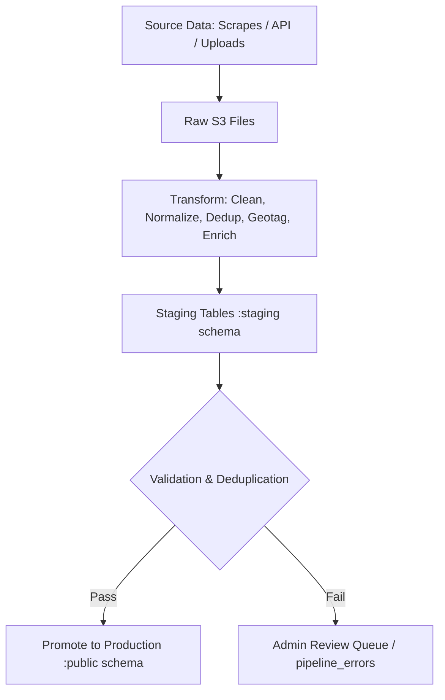

# Listings Pipeline Implementation Plan

Based on the design document and codebase analysis, this implementation plan follows existing patterns and standards.

## Current Infrastructure Analysis

**S3 Integration:**
- ✅ Already using AWS S3 with `@aws-sdk/client-s3`
- ✅ S3 bucket naming: `{env}-trippl-images` (e.g., `app-trippl-images`)
- ✅ Image URLs: `https://img.{env}.trippl.ca/{dmoId}/{googlePlaceId}/{filename}`
- ✅ Localhost and dev both use the same S3 environment

**Queue System:**
- ✅ Currently using `better-queue` for user events
- ✅ No AWS SQS integration yet
- ✅ Need to implement AWS SQS for pipeline jobs

**Image Processing:**
- ✅ `sharp` library is installed but not actively used
- ✅ Currently just storing raw images without processing
- ✅ No thumbnail generation or optimization

## Database Strategy

### Schema Organization

| Schema     | Purpose                                                                                       |
| ---------- | ----------------------------------------------------------------------------------------------|
| `staging`  | pre-production data. Used for checking new, updates, soft-deletes before promotion.           |
| `public`   | Production/canonical data for all listings and related tables. Immutable-ish identity.        |
| `pipeline` | Pipeline management tables: Keeps scraping, metadata, queue, job status, and mapping info.    |

### Key Principles
- **Staging mirrors production schema** for safe promotion
- **Staging holds all rows for the batch** being ingested, not just deltas
- **Bridge table tracks source record → canonical listing mapping**
- **Immutable raw/transformed files** always stored in S3
- **Hash-based deduplication** reduces unnecessary geotag calls

## Implementation Plan

### Phase 1: Database Schema Updates (Priority: High)

**New Schema: `pipeline`**
```sql
-- Create pipeline schema
CREATE SCHEMA pipeline;

-- Pipeline management tables
CREATE TABLE pipeline.queue (
    id SERIAL PRIMARY KEY,
    job_type TEXT NOT NULL, -- 'scrape', 'transform', 'ingest', 'image_process'
    source_id TEXT,
    dmo_id INT REFERENCES public.dmos(id),
    status TEXT NOT NULL DEFAULT 'queued', -- 'queued', 'running', 'completed', 'failed'
    priority INT DEFAULT 0,
    payload JSONB,
    error_message TEXT,
    created_at TIMESTAMP DEFAULT NOW(),
    started_at TIMESTAMP,
    completed_at TIMESTAMP
);

CREATE TABLE pipeline.files (
    id SERIAL PRIMARY KEY,
    s3_path TEXT NOT NULL,
    stage TEXT NOT NULL, -- 'raw', 'transformed'
    data_domain TEXT NOT NULL, -- 'listings', 'reviews', 'events'
    country TEXT,
    state_province TEXT,
    dmo_name TEXT,
    date_created DATE,
    batch_number INT,
    timestamp_created TIMESTAMP,
    file_format TEXT, -- 'json', 'csv', 'xls'
    file_size BIGINT,
    record_count INT,
    job_id INT REFERENCES pipeline.jobs(id),
    created_at TIMESTAMP DEFAULT NOW()
);

CREATE TABLE pipeline.jobs (
    id SERIAL PRIMARY KEY,
    job_code TEXT,
    source TEXT NOT NULL,
    stage TEXT NOT NULL, -- 'raw', 'transformed', 'staging', 'production'
    status TEXT NOT NULL DEFAULT 'queued', -- 'queued', 'running', 'completed', 'failed'
    record_count INT DEFAULT 0,
    error_message TEXT,
    metadata JSONB,
    created_on TIMESTAMP DEFAULT NOW(),
    updated_on TIMESTAMP DEFAULT NOW()
);

CREATE TABLE pipeline.configs (
    id SERIAL PRIMARY KEY,
    dmo_id INT REFERENCES public.dmos(id),
    source_type TEXT NOT NULL, -- 'WORDPRESS', 'WEBSITE', 'API', 'DRUPAL', 'CSV'
    base_url TEXT,
    scrape_config JSONB,
    field_mappings JSONB,
    scrape_frequency TEXT DEFAULT 'manual', -- 'manual', 'daily', 'weekly', 'monthly'
    last_scrape_at TIMESTAMP,
    created_at TIMESTAMP DEFAULT NOW(),
    updated_at TIMESTAMP DEFAULT NOW()
);

CREATE TABLE pipeline.bridge_source_listing (
    id SERIAL PRIMARY KEY,
    file_path TEXT NOT NULL,
    record_hash CHAR(64) NOT NULL, -- SHA256 of name + address
    listing_id INT REFERENCES public.listings(id),
    source_id TEXT,
    dmo_id INT REFERENCES public.dmos(id),
    created_at TIMESTAMP DEFAULT NOW(),
    PRIMARY KEY (file_path, record_hash)
);

CREATE TABLE pipeline.errors (
    id SERIAL PRIMARY KEY,
    job_id INT REFERENCES pipeline.jobs(id),
    record_id TEXT,
    error_type TEXT,
    error_message TEXT,
    error_data JSONB,
    status TEXT DEFAULT 'pending', -- 'pending', 'resolved', 'ignored'
    created_at TIMESTAMP DEFAULT NOW(),
    resolved_at TIMESTAMP,
    resolved_by INT REFERENCES public.accounts(id)
);

CREATE TABLE pipeline.batches (
    id SERIAL PRIMARY KEY,
    batch_id TEXT NOT NULL,
    source TEXT NOT NULL,
    total_records INT,
    new_records INT,
    updated_records INT,
    error_records INT,
    processing_time_ms INT,
    created_at TIMESTAMP DEFAULT NOW()
);
```

**New Schema: `staging`**
```sql
-- Create staging schema
CREATE SCHEMA staging;

-- Staging tables mirror public schema structure
CREATE TABLE staging.listings (
    id SERIAL PRIMARY KEY,
    name TEXT,
    google_place_id TEXT,
    location_id INT,
    listing_visible BOOLEAN DEFAULT TRUE,
    listing_status TEXT DEFAULT 'active',
    manually_modified BOOLEAN DEFAULT FALSE,
    manually_modified_at TIMESTAMP,
    created_on TIMESTAMP,
    updated_on TIMESTAMP,
    -- Staging-specific fields
    batch_id TEXT,
    source_id TEXT,
    record_hash CHAR(64),
    staging_status TEXT DEFAULT 'pending' -- 'pending', 'approved', 'rejected'
);

CREATE TABLE staging.listing_info (
    id SERIAL PRIMARY KEY,
    listing_id INT REFERENCES staging.listings(id),
    description TEXT,
    dmo_id INT REFERENCES public.dmos(id),
    contact_info_id INT,
    source_id TEXT,
    info_visible BOOLEAN DEFAULT TRUE,
    info_status TEXT DEFAULT 'active',
    last_seen_at TIMESTAMP DEFAULT NOW(),
    created_on TIMESTAMP,
    updated_on TIMESTAMP,
    -- Staging-specific fields
    batch_id TEXT,
    staging_status TEXT DEFAULT 'pending'
);

CREATE TABLE staging.locations (
    id SERIAL PRIMARY KEY,
    address1 TEXT,
    address2 TEXT,
    city TEXT,
    state TEXT,
    zip TEXT,
    country CHAR(2),
    lat DECIMAL(10, 8),
    lng DECIMAL(11, 8),
    created_on TIMESTAMP,
    updated_on TIMESTAMP,
    -- Staging-specific fields
    batch_id TEXT,
    staging_status TEXT DEFAULT 'pending'
);

CREATE TABLE staging.contact_info (
    id SERIAL PRIMARY KEY,
    name TEXT,
    email TEXT,
    local_phone TEXT,
    international_phone TEXT,
    created_on TIMESTAMP,
    updated_on TIMESTAMP,
    -- Staging-specific fields
    batch_id TEXT,
    staging_status TEXT DEFAULT 'pending'
);

CREATE TABLE staging.listing_images (
    id SERIAL PRIMARY KEY,
    listing_info_id INT REFERENCES staging.listing_info(id),
    image TEXT,
    rank INT,
    created_on TIMESTAMP,
    updated_on TIMESTAMP,
    -- Staging-specific fields
    batch_id TEXT,
    staging_status TEXT DEFAULT 'pending'
);

CREATE TABLE staging.opening_dates (
    id SERIAL PRIMARY KEY,
    start_date DATE,
    end_date DATE,
    listing_info_id INT REFERENCES staging.listing_info(id),
    created_on TIMESTAMP,
    updated_on TIMESTAMP,
    -- Staging-specific fields
    batch_id TEXT,
    staging_status TEXT DEFAULT 'pending'
);

CREATE TABLE staging.opening_hours (
    id SERIAL PRIMARY KEY,
    opening_date_id INT REFERENCES staging.opening_dates(id),
    day_id INT,
    open_time TIME,
    close_time TIME,
    created_on TIMESTAMP,
    updated_on TIMESTAMP,
    -- Staging-specific fields
    batch_id TEXT,
    staging_status TEXT DEFAULT 'pending'
);

CREATE TABLE staging.bridge_attributes_listings (
    id SERIAL PRIMARY KEY,
    attribute_id INT REFERENCES public.ref_attributes(id),
    listing_id INT REFERENCES staging.listings(id),
    created_on TIMESTAMP,
    updated_on TIMESTAMP,
    -- Staging-specific fields
    batch_id TEXT,
    staging_status TEXT DEFAULT 'pending'
);

-- Reference tables (read-only from public schema)
-- staging.ref_attributes - references public.ref_attributes
-- staging.ref_days - references public.ref_days

-- Enhanced public schema tables
ALTER TABLE public.dmos ADD COLUMN source_type TEXT;
ALTER TABLE public.dmos ADD COLUMN scrape_config JSONB;
ALTER TABLE public.dmos ADD COLUMN base_url TEXT;
ALTER TABLE public.dmos ADD COLUMN last_scrape_at TIMESTAMP;
ALTER TABLE public.dmos ADD COLUMN scrape_frequency TEXT DEFAULT 'manual';

ALTER TABLE public.listings ADD COLUMN listing_visible BOOLEAN DEFAULT TRUE;
ALTER TABLE public.listings ADD COLUMN listing_status TEXT DEFAULT 'active';
ALTER TABLE public.listings ADD COLUMN manually_modified BOOLEAN DEFAULT FALSE;
ALTER TABLE public.listings ADD COLUMN manually_modified_at TIMESTAMP;

ALTER TABLE public.listing_info ADD COLUMN source_id TEXT;
ALTER TABLE public.listing_info ADD COLUMN info_visible BOOLEAN DEFAULT TRUE;
ALTER TABLE public.listing_info ADD COLUMN info_status TEXT DEFAULT 'active';
ALTER TABLE public.listing_info ADD COLUMN last_seen_at TIMESTAMP DEFAULT NOW();

-- Indexes for performance
CREATE INDEX idx_pipeline_queue_status ON pipeline.queue(status);
CREATE INDEX idx_pipeline_queue_job_type ON pipeline.queue(job_type);
CREATE INDEX idx_pipeline_files_stage ON pipeline.files(stage);
CREATE INDEX idx_pipeline_files_dmo_name ON pipeline.files(dmo_name);
CREATE INDEX idx_bridge_source_listing_hash ON pipeline.bridge_source_listing(record_hash);
CREATE INDEX idx_staging_listings_batch_id ON staging.listings(batch_id);
CREATE INDEX idx_staging_listings_staging_status ON staging.listings(staging_status);
```

### Phase 2: AWS SQS Integration (Priority: High)

**New Dependencies:**
```json
{
  "@aws-sdk/client-sqs": "^3.485.0"
}
```

**SQS Service Structure:**
```
src/services/
├── SqsService.ts              # SQS client wrapper
├── PipelineQueueService.ts    # Pipeline-specific queue operations
└── JobProcessorService.ts     # Background job processing
```

**Environment Variables:**
```typescript
// Add to config interface and .env files:
aws: {
  region: process.env.AWS_REGION || 'us-east-1',
  accessKeyId: process.env.AWS_ACCESS_KEY_ID,
  secretAccessKey: process.env.AWS_SECRET_ACCESS_KEY,
}
sqs: {
  pipelineJobsQueueUrl: process.env.PIPELINE_JOBS_QUEUE_URL,
  imageProcessingQueueUrl: process.env.IMAGE_PROCESSING_QUEUE_URL,
}
pipeline: {
  enableQueues: process.env.PIPELINE_ENABLE_QUEUES === 'true', // false for localhost
  batchSize: parseInt(process.env.PIPELINE_BATCH_SIZE || '100'),
  maxRetries: parseInt(process.env.PIPELINE_MAX_RETRIES || '3'),
}
```

**SQS Configuration:**
```typescript
// src/config/sqs.ts
export const sqsConfig = {
  region: config.aws.region,
  queues: {
    pipelineJobs: config.sqs.pipelineJobsQueueUrl,
    imageProcessing: config.sqs.imageProcessingQueueUrl,
  },
  // Localhost/dev use same SQS environment
  localhost: {
    enabled: false, // Skip queues for localhost
  },
  dev: {
    enabled: config.pipeline.enableQueues,
  }
};
```

### Phase 3: Enhanced S3 Integration (Priority: High)

**Updated S3 File Naming Convention:**
```
Raw / Transformed Files:
s3://{environment: dev, staging, app}-trippl-data/{stage: raw, transformed}/{data-domain: listings, reviews, events}/{country}/{state-province}/{dmo-id}/{date: YYYYMMDD}/{batch: nnn}-{timestamp: YYYYMMDDTHHMMSS}.{format: json, csv, xls}.gz

Images (canonical):
s3://{environment: dev, staging, app}-trippl-images/{country}/{state}/{dmo-id}/{listing-id}/{filename}.{ext}
```

**Extend Existing S3 Utils:**
```typescript
// src/utils/AwsUtils.ts - Add pipeline-specific functions
export const uploadPipelineFile = async (
  s3BucketPrefix: string,
  stage: 'raw' | 'transformed',
  dataDomain: 'listings' | 'reviews' | 'events',
  country: string,
  stateProvince: string,
  dmoId: number,
  date: string,
  batch: string,
  timestamp: string,
  format: 'json' | 'csv' | 'xls',
  fileContents: Buffer
) => {
  const key = `${stage}/${dataDomain}/${country}/${stateProvince}/${dmoId}/${date}/${batch}-${timestamp}.${format}.gz`;
  const bucketName = `${s3BucketPrefix}-trippl-data`;
  
  const params: PutObjectCommandInput = {
    Bucket: bucketName,
    Key: key,
    Body: fileContents,
    ContentType: 'application/gzip',
  };

  const command = new PutObjectCommand(params);
  return s3Client.send(command);
};

export const uploadPipelineImage = async (
  s3BucketPrefix: string,
  country: string,
  state: string,
  dmoId: number,
  listingId: string,
  filename: string,
  fileContents: Buffer
) => {
  const key = `${country}/${state}/${dmoId}/${listingId}/${filename}`;
  const bucketName = `${s3BucketPrefix}-trippl-images`;
  
  const params: PutObjectCommandInput = {
    Bucket: bucketName,
    Key: key,
    Body: fileContents,
  };

  const command = new PutObjectCommand(params);
  return s3Client.send(command);
};
```

### Phase 4: Pipeline Permissions (Priority: High)

**Add to `app-web/src/constants/permissions.ts`:**
```typescript
// Pipeline management permissions
PIPELINE_READ = 'pipeline:read',
PIPELINE_CREATE = 'pipeline:create',
PIPELINE_UPDATE = 'pipeline:update',
PIPELINE_DELETE = 'pipeline:delete',

// Pipeline jobs permissions
PIPELINE_JOBS_READ = 'pipeline:jobs:read',
PIPELINE_JOBS_CREATE = 'pipeline:jobs:create',
PIPELINE_JOBS_UPDATE = 'pipeline:jobs:update',
PIPELINE_JOBS_DELETE = 'pipeline:jobs:delete',
PIPELINE_JOBS_RETRY = 'pipeline:jobs:retry',

// Pipeline files permissions
PIPELINE_FILES_READ = 'pipeline:files:read',
PIPELINE_FILES_DOWNLOAD = 'pipeline:files:download',
PIPELINE_FILES_UPLOAD = 'pipeline:files:upload',

// Pipeline staging permissions
PIPELINE_STAGING_READ = 'pipeline:staging:read',
PIPELINE_STAGING_PROMOTE = 'pipeline:staging:promote',
PIPELINE_STAGING_MERGE = 'pipeline:staging:merge',

// Pipeline duplicates permissions
PIPELINE_DUPLICATES_READ = 'pipeline:duplicates:read',
PIPELINE_DUPLICATES_MERGE = 'pipeline:duplicates:merge',

// Pipeline images permissions
PIPELINE_IMAGES_READ = 'pipeline:images:read',
PIPELINE_IMAGES_PROCESS = 'pipeline:images:process',
PIPELINE_IMAGES_REPROCESS = 'pipeline:images:reprocess',
```

**Add to PermissionGroups:**
```typescript
// Pipeline management
PIPELINE: [
  Permissions.PIPELINE_READ,
  Permissions.PIPELINE_CREATE,
  Permissions.PIPELINE_UPDATE,
  Permissions.PIPELINE_DELETE,
  Permissions.PIPELINE_JOBS_READ,
  Permissions.PIPELINE_JOBS_CREATE,
  Permissions.PIPELINE_JOBS_UPDATE,
  Permissions.PIPELINE_JOBS_DELETE,
  Permissions.PIPELINE_JOBS_RETRY,
  Permissions.PIPELINE_FILES_READ,
  Permissions.PIPELINE_FILES_DOWNLOAD,
  Permissions.PIPELINE_FILES_UPLOAD,
  Permissions.PIPELINE_STAGING_READ,
  Permissions.PIPELINE_STAGING_PROMOTE,
  Permissions.PIPELINE_STAGING_MERGE,
  Permissions.PIPELINE_DUPLICATES_READ,
  Permissions.PIPELINE_DUPLICATES_MERGE,
  Permissions.PIPELINE_IMAGES_READ,
  Permissions.PIPELINE_IMAGES_PROCESS,
  Permissions.PIPELINE_IMAGES_REPROCESS,
],
```

### Phase 5: Field Mapping and Transformation Design (Priority: High)

**Field Mapping Configuration:**
```typescript
// src/services/TransformationService.ts
interface FieldMapping {
  sourceField: string;
  targetField: string;
  transformFunction?: string;
  required: boolean;
  defaultValue?: any;
}

interface SourceConfig {
  sourceType: 'WORDPRESS' | 'WEBSITE' | 'API' | 'DRUPAL' | 'CSV';
  fieldMappings: FieldMapping[];
  validationRules: ValidationRule[];
  geotaggingConfig: GeotaggingConfig;
}

interface GeotaggingConfig {
  enabled: boolean;
  addressFields: string[]; // ['address1', 'city', 'state', 'country']
  fallbackToGooglePlaces: boolean;
  cacheResults: boolean;
}

// Example field mappings for different source types
const WORDPRESS_FIELD_MAPPINGS: FieldMapping[] = [
  { sourceField: 'post_title', targetField: 'name', required: true },
  { sourceField: 'post_content', targetField: 'description', required: false },
  { sourceField: 'meta.address', targetField: 'address1', required: true },
  { sourceField: 'meta.city', targetField: 'city', required: true },
  { sourceField: 'meta.state', targetField: 'state', required: false },
  { sourceField: 'meta.country', targetField: 'country', required: true },
  { sourceField: 'meta.phone', targetField: 'local_phone', required: false },
  { sourceField: 'meta.website', targetField: 'website', required: false },
  { sourceField: 'meta.latitude', targetField: 'lat', transformFunction: 'parseFloat', required: false },
  { sourceField: 'meta.longitude', targetField: 'lng', transformFunction: 'parseFloat', required: false },
];

const CSV_FIELD_MAPPINGS: FieldMapping[] = [
  { sourceField: 'Name', targetField: 'name', required: true },
  { sourceField: 'Description', targetField: 'description', required: false },
  { sourceField: 'Address1', targetField: 'address1', required: true },
  { sourceField: 'Address2', targetField: 'address2', required: false },
  { sourceField: 'City', targetField: 'city', required: true },
  { sourceField: 'State', targetField: 'state', required: false },
  { sourceField: 'Zip', targetField: 'zip', required: false },
  { sourceField: 'Country', targetField: 'country', required: true },
  { sourceField: 'Phone', targetField: 'local_phone', required: false },
  { sourceField: 'Website', targetField: 'website', required: false },
  { sourceField: 'Latitude', targetField: 'lat', transformFunction: 'parseFloat', required: false },
  { sourceField: 'Longitude', targetField: 'lng', transformFunction: 'parseFloat', required: false },
];
```

**Geotagging Integration:**
```typescript
// src/services/GeotaggingService.ts
import { getGooglePlaceFromAddress } from '../services/GooglePlacesApi';

export class GeotaggingService {
  async geotagListing(listing: any, config: GeotaggingConfig): Promise<any> {
    // If lat/lng already exists, skip geotagging
    if (listing.lat && listing.lng) {
      return listing;
    }

    // Build address string from configured fields
    const addressParts = config.addressFields
      .map(field => listing[field])
      .filter(part => part && part.trim() !== '');
    
    const address = addressParts.join(', ');
    
    if (!address) {
      throw new Error('No address available for geotagging');
    }

    try {
      // Use existing Google Places API integration
      const googlePlace = await getGooglePlaceFromAddress(address);
      
      if (googlePlace && googlePlace.geometry) {
        return {
          ...listing,
          lat: googlePlace.geometry.location.lat,
          lng: googlePlace.geometry.location.lng,
          google_place_id: googlePlace.place_id,
        };
      }
    } catch (error) {
      console.error('Geotagging failed:', error);
    }

    // If geotagging fails and no fallback, return original listing
    return listing;
  }

  async batchGeotagListings(listings: any[], config: GeotaggingConfig): Promise<any[]> {
    const results = [];
    
    for (const listing of listings) {
      try {
        const geotaggedListing = await this.geotagListing(listing, config);
        results.push(geotaggedListing);
        
        // Add delay to respect API rate limits
        await new Promise(resolve => setTimeout(resolve, 100));
      } catch (error) {
        console.error(`Failed to geotag listing ${listing.name}:`, error);
        results.push(listing); // Keep original listing if geotagging fails
      }
    }
    
    return results;
  }
}
```

**Data Validation Rules:**
```typescript
// src/services/ValidationService.ts
interface ValidationRule {
  field: string;
  type: 'required' | 'email' | 'url' | 'number' | 'date' | 'custom';
  message: string;
  customValidator?: (value: any) => boolean;
}

const BASIC_VALIDATION_RULES: ValidationRule[] = [
  { field: 'name', type: 'required', message: 'Name is required' },
  { field: 'address1', type: 'required', message: 'Address is required' },
  { field: 'city', type: 'required', message: 'City is required' },
  { field: 'country', type: 'required', message: 'Country is required' },
  { field: 'email', type: 'email', message: 'Invalid email format' },
  { field: 'website', type: 'url', message: 'Invalid website URL' },
  { field: 'lat', type: 'number', message: 'Latitude must be a number' },
  { field: 'lng', type: 'number', message: 'Longitude must be a number' },
  { 
    field: 'lat', 
    type: 'custom', 
    message: 'Latitude must be between -90 and 90',
    customValidator: (value) => value >= -90 && value <= 90
  },
  { 
    field: 'lng', 
    type: 'custom', 
    message: 'Longitude must be between -180 and 180',
    customValidator: (value) => value >= -180 && value <= 180
  },
];

export class ValidationService {
  validateListing(listing: any, rules: ValidationRule[] = BASIC_VALIDATION_RULES): ValidationResult {
    const errors: string[] = [];
    
    for (const rule of rules) {
      const value = listing[rule.field];
      
      switch (rule.type) {
        case 'required':
          if (!value || (typeof value === 'string' && value.trim() === '')) {
            errors.push(rule.message);
          }
          break;
        case 'email':
          if (value && !/^[^\s@]+@[^\s@]+\.[^\s@]+$/.test(value)) {
            errors.push(rule.message);
          }
          break;
        case 'url':
          if (value && !/^https?:\/\/.+/.test(value)) {
            errors.push(rule.message);
          }
          break;
        case 'number':
          if (value && isNaN(Number(value))) {
            errors.push(rule.message);
          }
          break;
        case 'custom':
          if (value && rule.customValidator && !rule.customValidator(value)) {
            errors.push(rule.message);
          }
          break;
      }
    }
    
    return {
      isValid: errors.length === 0,
      errors
    };
  }
}
```

### Phase 6: Backend API Implementation (Priority: High)

**New Service Structure:**
```
src/services/
├── PipelineService.ts          # Main pipeline orchestration
├── DataJobService.ts           # Job management
├── StagingService.ts           # Staging operations
├── TransformationService.ts    # Data transformation logic
├── MatchingService.ts          # Deduplication and matching
└── ImageProcessingService.ts   # Image handling with Sharp

src/dao/pipeline/
├── QueueDao.ts
├── FilesDao.ts
├── JobsDao.ts
├── ConfigsDao.ts
├── BridgeSourceListingDao.ts
├── ErrorsDao.ts
└── BatchesDao.ts

src/dao/staging/
├── StagingListingsDao.ts
├── StagingListingInfoDao.ts
├── StagingLocationsDao.ts
├── StagingContactInfoDao.ts
├── StagingListingImagesDao.ts
├── StagingOpeningDatesDao.ts
├── StagingOpeningHoursDao.ts
└── StagingBridgeAttributesListingsDao.ts

src/routes/v1/admin/pipeline/
├── jobs.ts
├── sources.ts
├── files.ts
├── staging.ts
├── duplicates.ts
└── images.ts
```

**Key API Endpoints:**
```typescript
// Admin Pipeline Management
GET    /v1/admin/pipeline/jobs                    # List all jobs
GET    /v1/admin/pipeline/jobs/:id               # Job details
POST   /v1/admin/pipeline/jobs                   # Create new job
PUT    /v1/admin/pipeline/jobs/:id               # Update job
DELETE /v1/admin/pipeline/jobs/:id               # Delete job
POST   /v1/admin/pipeline/jobs/:id/retry        # Retry failed job

// Source Management
GET    /v1/admin/pipeline/sources               # List sources (DMOs)
GET    /v1/admin/pipeline/sources/:id           # Source details
PUT    /v1/admin/pipeline/sources/:id           # Update source config
POST   /v1/admin/pipeline/sources/:id/scrape    # Trigger scrape

// File Management
GET    /v1/admin/pipeline/files                 # List files
GET    /v1/admin/pipeline/files/:id/download    # Download file
GET    /v1/admin/pipeline/files/:id/preview     # Preview file content

// Staging Management
GET    /v1/admin/pipeline/staging               # List staging records
GET    /v1/admin/pipeline/staging/:id           # Staging record details
POST   /v1/admin/pipeline/staging/promote       # Promote to production
POST   /v1/admin/pipeline/staging/:id/merge      # Manual merge

// Matching & Deduplication
GET    /v1/admin/pipeline/duplicates            # List potential duplicates
GET    /v1/admin/pipeline/duplicates/:id        # Duplicate details
POST   /v1/admin/pipeline/duplicates/:id/merge  # Merge duplicates

// Image Processing
GET    /v1/admin/pipeline/images                # Image processing queue
GET    /v1/admin/pipeline/images/:id            # Image details
POST   /v1/admin/pipeline/images/:id/reprocess  # Reprocess image
```

### Phase 5: Frontend Admin Pages (Priority: High)

**Complete Admin Pages Structure:**
```
src/app/admin/pipeline/
├── page.tsx                    # Pipeline dashboard
├── jobs/
│   ├── page.tsx               # Jobs list with filters
│   ├── [id]/page.tsx         # Job details and logs
│   └── create/page.tsx        # Create new job
├── sources/
│   ├── page.tsx               # Sources management
│   ├── [id]/page.tsx         # Source configuration
│   └── [id]/scrape/page.tsx   # Trigger scrape
├── files/
│   ├── page.tsx               # File browser with S3 integration
│   ├── [id]/page.tsx         # File details and preview
│   └── upload/page.tsx        # File upload interface
├── staging/
│   ├── page.tsx               # Staging records
│   ├── [id]/page.tsx         # Staging record details
│   └── promote/page.tsx       # Bulk promote interface
├── duplicates/
│   ├── page.tsx               # Duplicate management
│   ├── [id]/page.tsx         # Duplicate resolution
│   └── merge/page.tsx         # Bulk merge interface
└── images/
    ├── page.tsx               # Image processing queue
    ├── [id]/page.tsx         # Image details and processing
    └── reprocess/page.tsx     # Bulk reprocess interface
```

**Admin Sidebar Updates:**
```typescript
// src/components/templates/AdminTemplate/components/AdminSidebar/AdminSidebar.tsx
{
  title: 'Pipeline',
  items: [
    { text: 'Dashboard', icon: <SpeedIcon />, path: '/admin/pipeline' },
    { text: 'Jobs', icon: <WorkIcon />, path: '/admin/pipeline/jobs' },
    { text: 'Sources', icon: <SourceIcon />, path: '/admin/pipeline/sources' },
    { text: 'Files', icon: <FolderIcon />, path: '/admin/pipeline/files' },
    { text: 'Staging', icon: <StorageIcon />, path: '/admin/pipeline/staging' },
    { text: 'Duplicates', icon: <CompareIcon />, path: '/admin/pipeline/duplicates' },
    { text: 'Images', icon: <ImageIcon />, path: '/admin/pipeline/images' },
  ],
}
```

### Phase 6: Image Processing Implementation (Priority: Medium)

**Image Processing Service:**
```typescript
// src/services/ImageProcessingService.ts
import sharp from 'sharp';

export const processImage = async (
  imageBuffer: Buffer,
  options: {
    width?: number;
    height?: number;
    quality?: number;
    format?: 'jpeg' | 'png' | 'webp';
  }
) => {
  let processor = sharp(imageBuffer);
  
  if (options.width || options.height) {
    processor = processor.resize(options.width, options.height, {
      fit: 'inside',
      withoutEnlargement: true
    });
  }
  
  if (options.format === 'jpeg') {
    processor = processor.jpeg({ quality: options.quality || 80 });
  } else if (options.format === 'png') {
    processor = processor.png({ quality: options.quality || 80 });
  } else if (options.format === 'webp') {
    processor = processor.webp({ quality: options.quality || 80 });
  }
  
  return processor.toBuffer();
};

export const generateThumbnail = async (imageBuffer: Buffer) => {
  return processImage(imageBuffer, {
    width: 300,
    height: 200,
    format: 'jpeg',
    quality: 85
  });
};
```

**Image Processing Pipeline:**
1. Download original image from source URL
2. Validate image format and size
3. Generate thumbnail (300x200)
4. Generate medium size (800x600)
5. Store all versions in S3 using new naming convention
6. Update database with processed image URLs

### Phase 7: Queue System Implementation (Priority: Medium)

**SQS Job Processing:**
```typescript
// src/services/PipelineQueueService.ts
export class PipelineQueueService {
  private sqsClient: SQSClient;
  
  async sendJobToQueue(job: PipelineJob) {
    if (config.env === 'localhost') {
      // Skip queues for localhost - process immediately
      return this.processJobLocally(job);
    }
    
    // Send to SQS for dev/prod environments
    const params = {
      QueueUrl: sqsConfig.queues.pipelineJobs,
      MessageBody: JSON.stringify(job),
      MessageAttributes: {
        jobType: { DataType: 'String', StringValue: job.type },
        priority: { DataType: 'Number', StringValue: job.priority.toString() }
      }
    };
    
    return this.sqsClient.send(new SendMessageCommand(params));
  }
  
  async processJobLocally(job: PipelineJob) {
    // Direct processing for localhost
    return PipelineService.processJob(job);
  }
}
```

## Data Flow Implementation



**Workflow:**
1. **Scrape / upload** → save raw files to S3
2. **Transform stage** → clean, normalize, hash for deduplication, conditional geotag, enrichment. Store transformed files to S3
3. **Staging** → load transformed data into `staging.*` tables for validation, deduplication, and pre-ingestion checks
4. **Promotion to public** → insert/update canonical listings, listing_info, contact_info, and locations
5. **Bridge table** tracks mapping of source records (record_hash) → canonical listings
6. **Errors / admin review** → `pipeline_errors` table or queue for manual resolution

## Implementation Timeline

**Week 1-2:** Database schema updates and migrations
**Week 3-4:** AWS SQS integration and backend API implementation
**Week 5-6:** Frontend admin pages (all pages)
**Week 7-8:** S3 integration and file management
**Week 9-10:** Image processing with Sharp
**Week 11-12:** Testing and validation

## Key Features Summary

✅ **Three-Schema Architecture** - `staging`, `public`, `pipeline` schemas
✅ **AWS SQS Integration** - Skip queues for localhost, use SQS for dev/prod
✅ **Enhanced S3 Integration** - Updated file naming convention
✅ **Complete Admin Pages** - All 7 admin page sections
✅ **Image Processing** - Sharp-based image optimization and thumbnails
✅ **Staging-to-Production Workflow** - Safe promotion with validation
✅ **Bridge Table Mapping** - Source record to canonical listing tracking
✅ **Error Handling** - Comprehensive error tracking and admin review

This plan leverages your existing infrastructure while implementing the sophisticated three-schema pipeline management system outlined in the design document.
