# **Trippl CI/CD Release Flow Documentation**
2025-09-14 - Mo

## **High-Level Overview**

Trippl uses a **multi-environment CI/CD pipeline** with automated deployments across **localhost**, **dev**, **staging**, and **production** environments. The system employs **GitHub Actions** for automation, **AWS infrastructure** for hosting, and **custom deployment scripts** for seamless releases.

### **Key Components:**
- **API Server** (`api-server`): Express.js backend with TypeScript
- **Web App** (`app-web`): Next.js frontend with React
- **AWS Infrastructure** (`aws-infrastructure`): CDK-based infrastructure as code
- **Database Schema** (`db-schema`): Liquibase-managed PostgreSQL schemas

### **Deployment Architecture:**
- **GitHub Actions** → **AWS S3** → **DMZ Server** → **EC2 Instances**
- **Environment-specific secrets** and configurations
- **Automated versioning** with Git tags and release notes
- **Zero-downtime deployments** via SSH tunneling

---

## **Environment Details**

### **🏠 Localhost Environment**
**Purpose**: Local development and testing
**Trigger**: Manual (`npm run start:local`)
**Version Format**: `vX.Y.Z-local-<git-sha>`

**Process:**
1. **Local Development**: Developers run `npm run start:local` 
2. **Version Generation**: Uses `get-version.sh` script
3. **Database**: Local PostgreSQL via Docker
4. **Configuration**: `CONFIG_ENV=localhost`

---

### **🚀 Dev Environment**
**Purpose**: Continuous integration and testing
**Trigger**: Push to `main` branch (automatic)
**Version Format**: `vX.Y.Z-dev-<git-sha>`
**URL**: `https://dev.trippl.ca` / `https://api.dev.trippl.ca`

**Process:**
1. **Auto-trigger**: Every push to `main` branch
2. **Build & Test**: Lint, test, and build applications
3. **Version**: Auto-generated with Git SHA
4. **Deploy**: Automated via GitHub Actions → AWS → EC2

---

### **🧪 Staging Environment (RC)**
**Purpose**: Release candidate testing
**Trigger**: Manual workflow dispatch
**Version Format**: `vX.Y.Z-RCn` (auto-incrementing RC numbers)
**URL**: `https://staging.trippl.ca` / `https://api.staging.trippl.ca`

**Process:**
1. **Manual Trigger**: GitHub Actions workflow dispatch
2. **Hard Reset**: Staging branch reset to specific main commit
3. **RC Tagging**: Auto-incrementing release candidate tags
4. **Testing**: Full staging environment for QA

---

### **🏭 Production Environment**
**Purpose**: Live production deployment
**Trigger**: Manual workflow dispatch with approval
**Version Format**: `vX.Y.Z` (semantic versioning)
**URL**: `https://app.trippl.ca` / `https://api.app.trippl.ca`

**Process:**
1. **Manual Trigger**: Requires explicit approval
2. **Release Notes**: Manual input of release notes
3. **Git Tagging**: Creates Git tag and GitHub Release
4. **Version Bump**: Auto-increments `package.json` for next cycle

---

## **Detailed Workflow Diagrams**

### **🔄 Dev Environment Flow**

```mermaid
graph TD
    A[Developer Push to Main] --> B[GitHub Actions Triggered]
    B --> C[Checkout Code]
    C --> D[Lint & Test]
    D --> E[Configure AWS Credentials]
    E --> F[Generate Version: vX.Y.Z-dev-SHA]
    F --> G[Build & Package]
    G --> H[Upload to S3]
    H --> I[Deploy via DMZ → EC2]
    I --> J[Dev Environment Updated]
    
    style A fill:#e1f5fe
    style J fill:#c8e6c9
```

### **🧪 Staging Environment Flow**

```mermaid
graph TD
    A[Manual Workflow Dispatch] --> B[Select Main Commit]
    B --> C[Hard Reset Staging Branch]
    C --> D[Lint & Test]
    D --> E[Generate RC Version: vX.Y.Z-RCn]
    E --> F[Build & Package]
    F --> G[Upload to S3]
    G --> H[Deploy via DMZ → EC2]
    H --> I[Create RC Git Tag]
    I --> J[Staging Environment Updated]
    
    style A fill:#fff3e0
    style J fill:#c8e6c9
```

### **🏭 Production Environment Flow**

---

## **API Server Specific Process**

### **Build Process:**
1. **TypeScript Compilation**: `tsc --project tsconfig.json`
2. **Production Dependencies**: `npm install --production`
3. **File Cleanup**: Remove dev files and scripts
4. **Package Creation**: Create deployment-ready zip

### **Deployment Process:**
1. **S3 Upload**: Build artifacts uploaded to environment-specific S3 bucket
2. **DMZ Access**: SSH through DMZ server for security
3. **EC2 Deployment**: Direct deployment to EC2 instances
4. **Service Management**: Systemd service restart and environment variable updates

### **Version Management:**
- **Dev**: `v0.3.4-dev-a1b2c3d` (package version + dev + git SHA)
- **Staging**: `v0.3.4-RC1` (package version + auto-incrementing RC)
- **Production**: `v0.3.4` (semantic version from package.json)

### **Environment Variables:**
- **API_SERVER_VERSION**: Set during deployment
- **CONFIG_ENV**: Environment-specific configuration
- **Database**: Environment-specific PostgreSQL connections
- **AWS Credentials**: Per-environment AWS access

---

## **App-Web Specific Process**

### **Build Process:**
1. **Next.js Build**: `next build` with environment-specific config
2. **Static Assets**: Optimized images and static files
3. **Environment Variables**: `NEXT_PUBLIC_DEPLOYED_VERSION` injected at build time
4. **Package Creation**: Create deployment-ready zip

### **Deployment Process:**
1. **S3 Upload**: Build artifacts uploaded to environment-specific S3 bucket
2. **DMZ Access**: SSH through DMZ server for security
3. **EC2 Deployment**: Direct deployment to EC2 instances
4. **Service Management**: Systemd service restart and environment variable updates

### **Version Management:**
- **Dev**: `v0.3.3-dev-a1b2c3d` (package version + dev + git SHA)
- **Staging**: `v0.3.3-RC1` (package version + auto-incrementing RC)
- **Production**: `v0.3.3` (semantic version from package.json)

### **Environment Variables:**
- **NEXT_PUBLIC_DEPLOYED_VERSION**: Set during build time
- **NEXT_PUBLIC_CONFIG_ENV**: Environment-specific configuration
- **API URLs**: Environment-specific API endpoints
- **Auth0 Configuration**: Per-environment authentication settings

---

## **GitHub Actions Workflows**

### **Dev Workflow** (`dev.yml`)
- **Trigger**: Push to `main` branch
- **Environment**: `dev`
- **Steps**:
  1. Checkout code
  2. Lint and test
  3. Configure AWS credentials
  4. Generate version with Git SHA
  5. Build and upload to S3
  6. Deploy via DMZ → EC2

### **Staging Workflow** (`staging.yml`)
- **Trigger**: Manual workflow dispatch
- **Environment**: `staging`
- **Steps**:
  1. Checkout code with full history
  2. Hard reset staging branch to main commit
  3. Lint and test
  4. Generate RC version (auto-incrementing)
  5. Build and upload to S3
  6. Deploy via DMZ → EC2
  7. Create RC Git tag

### **Production Workflow** (`prod.yml`)
- **Trigger**: Manual workflow dispatch
- **Environment**: `production`
- **Steps**:
  1. Checkout code with full history
  2. Resolve commit or tag
  3. Lint and test
  4. Generate production version
  5. Build and upload to S3
  6. Deploy via DMZ → EC2
  7. Create Git tag
  8. Create GitHub Release
  9. Write release notes JSON
  10. Bump package.json version

---

## **Custom GitHub Actions**

### **Install-Lint-Test Action**
- **Purpose**: Standardized linting and testing
- **Steps**:
  1. Setup Node.js
  2. Install dependencies
  3. Run ESLint
  4. Run Jest tests

### **Build-Zip-S3 Action**
- **Purpose**: Build and upload artifacts
- **Steps**:
  1. Build application
  2. Create deployment zip
  3. Upload to S3 bucket

### **Deploy Action**
- **Purpose**: Deploy via DMZ to EC2
- **Steps**:
  1. Setup SSH keys for DMZ access
  2. Add known hosts
  3. Deploy via DMZ → EC2 using SSH tunneling
  4. Execute deployment script on EC2

---

## **AWS Infrastructure**

### **S3 Buckets**
- **Purpose**: Artifact storage for deployments
- **Structure**: Environment-specific buckets
- **Access**: GitHub Actions upload, EC2 instances download

### **EC2 Instances**
- **Purpose**: Application hosting
- **Access**: Via DMZ server for security
- **Services**: Systemd-managed application services
- **Environment Variables**: Set via deployment scripts

### **DMZ Server**
- **Purpose**: Secure gateway to EC2 instances
- **Access**: SSH key-based authentication
- **Function**: Proxy for EC2 deployments

---

## **Database Management**

### **Local Development**
- **Database**: PostgreSQL via Docker
- **Schema**: Liquibase-managed migrations
- **Connection**: Localhost configuration

### **Deployed Environments**
- **Database**: PostgreSQL on AWS RDS
- **Schema**: Liquibase-managed migrations
- **Connection**: Environment-specific configurations

---

## **Key Features**

### **🔒 Security:**
- **DMZ-based deployment** for secure EC2 access
- **Environment-specific secrets** in GitHub
- **SSH key-based authentication**
- **Private network communication**

### **📊 Monitoring:**
- **GitHub Actions logs** for deployment tracking
- **Environment-specific logging** on EC2 instances
- **Version tracking** in application UI
- **Release notes** embedded in production builds

### **🔄 Automation:**
- **Automatic dev deployments** on main branch pushes
- **Auto-incrementing RC tags** for staging
- **Automated version bumping** after production releases
- **GitHub Release creation** with embedded notes

### **🛠️ Infrastructure:**
- **AWS CDK** for infrastructure as code
- **EC2 instances** for application hosting
- **S3 buckets** for artifact storage
- **PostgreSQL** databases per environment
- **Docker** for local development

---

## **Versioning Strategy**

### **Semantic Versioning**
- **Format**: `MAJOR.MINOR.PATCH`
- **Major**: Breaking changes
- **Minor**: New features (backward compatible)
- **Patch**: Bug fixes (backward compatible)

### **Environment-Specific Versions**
- **Localhost**: `vX.Y.Z-local-<git-sha>`
- **Dev**: `vX.Y.Z-dev-<git-sha>`
- **Staging**: `vX.Y.Z-RCn`
- **Production**: `vX.Y.Z`

### **Git Tagging**
- **RC Tags**: Auto-created for staging releases
- **Release Tags**: Created for production releases
- **GitHub Releases**: Created with release notes

---

## **Deployment Scripts**

### **Update Script** (`update.sh`)
- **Location**: `/bootstrap/update.sh` on EC2 instances
- **Purpose**: Deploy new application version
- **Steps**:
  1. Download artifacts from S3
  2. Stop application services
  3. Extract new version
  4. Set environment variables
  5. Start application services
  6. Verify deployment

### **Version Scripts** (`get-version.sh`)
- **Purpose**: Generate version strings for local development
- **Format**: `v<package-version>-local-<git-sha>`

---

## **Troubleshooting**

### **Common Issues**
1. **Deployment Failures**: Check GitHub Actions logs
2. **Version Mismatches**: Verify environment variables
3. **Database Connection**: Check environment-specific configs
4. **SSH Access**: Verify DMZ and EC2 key permissions

### **Debugging Steps**
1. **Check GitHub Actions**: Review workflow logs
2. **Verify Secrets**: Ensure environment secrets are set
3. **Test SSH Access**: Verify DMZ and EC2 connectivity
4. **Review Logs**: Check application logs on EC2 instances

---

This CI/CD pipeline ensures **reliable**, **traceable**, and **secure** deployments across all environments while maintaining **development velocity** and **production stability**.
