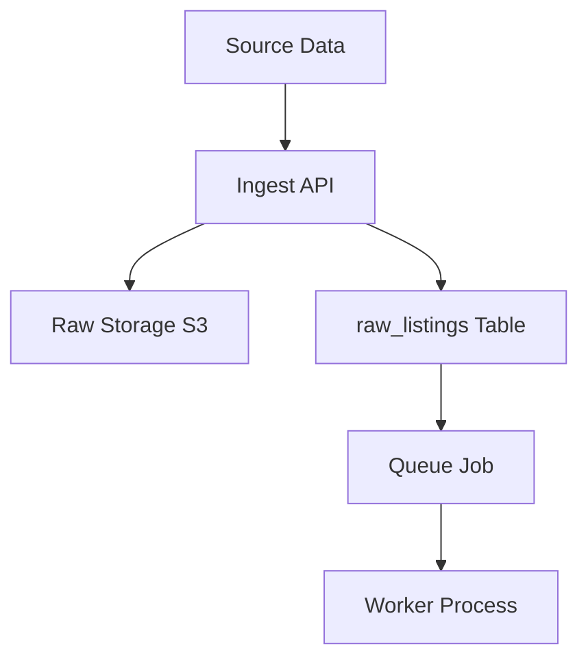
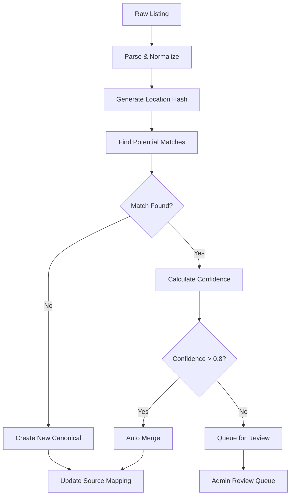

# Listings Pipeline Implementation Guide

**Feature**: #1 - Listings Pipeline (scrape/ingest/sync/manage)  
**Priority**: Highest  
**Target Completion**: September 15, 2024  
**Status**: Ready for Implementation  

---

## Overview

This document provides detailed implementation tasks for the comprehensive Listings Pipeline system, including API architecture separation, multi-source ingestion, provenance tracking, deduplication, and comprehensive admin management.

## Goals

- **Ingest listings from many sources**: Scrapers, customer WP imports, affiliate APIs like Priceline
- **Preserve provenance**: Source, original ID, fetch metadata
- **Deduplicate and reconcile records**: Into canonical listings
- **Provide safe sync/update behavior**: Non-destructive, reviewable changes for admins
- **Scale via queue/workers**: Avoid overloading target sites
- **Surface status/metrics and admin controls**: Retries, re-run, ignore, or manual merge

## Architecture Summary

- **Multi-Source Ingestion**: Scrapers (headless/HTTP), WordPress/XML/CSV imports, affiliate APIs (Priceline, Duffel)
- **Raw Storage Pipeline**: S3 for raw payloads + PostgreSQL for metadata
- **Queue/Worker System**: Redis/Bull for scalable background processing with image handling
- **Provenance Tracking**: Complete data lineage with source metadata and original IDs
- **Deduplication Engine**: Intelligent matching including image hash comparison
- **Image Processing**: Download, validate, resize, thumbnail generation, S3 storage
- **Safe Sync Operations**: Non-destructive updates with admin review workflow
- **Dual-Level Visibility Control**: Listing-level and listing_info-level visibility and status management
- **White-Label Support**: DMO-specific visibility controls for multi-tenant architecture
- **Admin Control Panel**: Status monitoring, retry logic, manual merge operations
- **Hybrid ID Strategy**: UUID for raw data, int4 for canonical listings, linking table for provenance
- **Public API**: `/v1/listings` - Anonymous listing search and discovery
- **Admin API**: `/v1/admin/listings` - Authenticated listing management operations
- **Frontend**: Hybrid atomic design + feature-based architecture

---

## Core Architecture: DMO-Source Relationship & Master-Detail Pattern

### **Overview**

The listings pipeline follows a sophisticated DMO-source relationship where **DMOs serve as the source systems** for scraping jobs, and each listing has a **master listing part** (global data) and **detail parts** (DMO-specific data) stored in `listing_info` records. This architecture enables white-label functionality where the same physical listing can have different descriptions, contact info, and visibility controls for different DMOs.

### **Key Architectural Concepts**

#### **1. DMO as Source System**
- **DMOs are the source systems** for scraping/ingestion jobs
- Each DMO has a `dmoTypeId` that can be `SCRAPED` (1), `TRAVEL_SITE` (2), `CLIENT` (3), or `PARTNER` (4)
- Each DMO has a `source_type` that specifies how to ingest data: `WORDPRESS`, `WEBSITE`, `API`, or `DRUPAL`
- Scraping jobs are configured per DMO, not per external website
- The pipeline ingests data **on behalf of** a specific DMO

#### **2. Master-Detail Listing Structure**
- **Master Listing** (`listings` table): Contains global, canonical data
  - `name`, `googlePlaceId`, `locationId` (shared across all DMOs)
  - `listing_visible`, `listing_status` (global visibility controls)
- **Detail Records** (`listing_info` table): Contains DMO-specific data
  - `description`, `contactInfoId` (DMO-specific content)
  - `dmoId` (links to the source DMO)
  - `info_visible`, `info_status` (DMO-specific visibility controls)

#### **3. White-Label Architecture**
- Same physical listing can have different descriptions for different DMOs
- Each DMO can control visibility of their specific `listing_info` record
- Global listing visibility affects all DMOs, DMO-specific visibility affects only that DMO
- Contact information can be DMO-specific (different phone numbers, websites, etc.)

### **Current Implementation Pattern**

Based on the existing codebase, here's how the pattern works:

#### **Import Process Flow**:
1. **DMO Configuration**: Each scraping job is associated with a specific DMO (`dmoId`)
2. **Master Listing Creation**: 
   - Check if listing exists by `googlePlaceId` (or other unique identifier)
   - If not exists, create master `listing` record with global data
   - If exists, use existing `listingId`
3. **Detail Record Creation**:
   - Check if `listing_info` exists for this `listingId` + `dmoId` combination
   - If not exists, create `listing_info` record with DMO-specific data
   - If exists, update existing `listing_info` record
4. **Contact Info Management**:
   - Create/update `contact_info` record with DMO-specific contact details
   - Link `contact_info` to `listing_info` via `contactInfoId`
5. **Location Management**:
   - Create/update `location` record with coordinates
   - Link `location` to master `listing` via `locationId`

#### **Database Relationships**:
```sql
-- Master listing (global data)
listings
├── id (PK)
├── name (global)
├── googlePlaceId (unique identifier)
├── locationId (FK to locations)
├── listing_visible (global visibility)
└── listing_status (global status)

-- Detail records (DMO-specific data)
listing_info
├── id (PK)
├── listingId (FK to listings)
├── dmoId (FK to dmos - the source DMO)
├── description (DMO-specific)
├── contactInfoId (FK to contact_info)
├── info_visible (DMO-specific visibility)
└── info_status (DMO-specific status)

-- DMO (source system)
dmos
├── id (PK)
├── name (DMO name)
├── dmoTypeId (1=SCRAPED, 2=TRAVEL_SITE, 3=CLIENT, 4=PARTNER)
└── source_type (WORDPRESS, WEBSITE, API, DRUPAL)
```

### **Pipeline Integration Requirements**

The listings pipeline must follow this exact pattern:

#### **1. Source Configuration**:
- Each data source configuration must specify a `dmoId`
- The DMO must exist in the `dmos` table with appropriate `dmoTypeId`
- Scraping jobs are executed **on behalf of** the specified DMO

#### **2. Ingestion Process**:
- **Master Listing**: Create/update global listing data in `listings` table
- **Detail Record**: Create/update DMO-specific data in `listing_info` table
- **Source Tracking**: Store source system and source ID for provenance
- **Visibility Controls**: Set appropriate visibility and status flags

#### **3. Sync Operations**:
- **DMO-Specific Sync**: Compare source data against existing `listing_info` records for that DMO
- **Change Detection**: Detect changes in DMO-specific data (description, contact info, etc.)
- **Status Management**: Update `info_status` and `info_visible` for DMO-specific changes
- **Global Updates**: Update master listing data when global fields change

#### **4. API Responses**:
- **Public APIs**: Return listings where `listing_visible = TRUE` AND `info_visible = TRUE` for the requesting DMO
- **Admin APIs**: Show all listings regardless of visibility, with DMO-specific filtering
- **DMO Context**: All API responses must be filtered by the requesting DMO's `listing_info` records

---

## Dual-Level Visibility Control System

### **Overview**

The pipeline implements a sophisticated dual-level visibility control system that enables both global listing management and DMO-specific white-label control. This system allows for granular control over listing visibility and status at both the listing level and the listing_info level.

### **Core Design Principles**

1. **Global Listing Control**: Control visibility and status for entire listings across all DMOs
2. **DMO-Specific Control**: Control visibility and status for specific DMO's listing_info records
3. **White-Label Support**: Enable multi-tenant architecture with DMO-specific visibility
4. **Status Workflow**: Complete status management with review, archival, and error handling
5. **Non-Destructive Operations**: Preserve data while controlling visibility
6. **Audit Trail**: Complete logging of all visibility and status changes

### **Database Schema Extensions**

#### **Enhanced Listings Table**:
```sql
-- Add visibility and status controls to existing listings table
ALTER TABLE listings ADD COLUMN listing_visible BOOLEAN DEFAULT TRUE;
ALTER TABLE listings ADD COLUMN listing_status VARCHAR(50) DEFAULT 'ACTIVE';
  -- Status values: 'ACTIVE', 'INACTIVE', 'PENDING_REVIEW', 'ARCHIVED', 'ERROR', 'DUPLICATE'

-- Add constraints for status values
ALTER TABLE listings ADD CONSTRAINT chk_listing_status 
  CHECK (listing_status IN ('ACTIVE', 'INACTIVE', 'PENDING_REVIEW', 'ARCHIVED', 'ERROR', 'DUPLICATE'));

-- Add indexes for performance
CREATE INDEX idx_listings_visible ON listings (listing_visible) WHERE listing_visible = TRUE;
CREATE INDEX idx_listings_status ON listings (listing_status);
```

#### **Enhanced Listing Info Table**:
```sql
-- Add visibility and status controls to existing listing_info table  
ALTER TABLE listing_info ADD COLUMN info_visible BOOLEAN DEFAULT TRUE;
ALTER TABLE listing_info ADD COLUMN info_status VARCHAR(50) DEFAULT 'ACTIVE';
  -- Status values: 'ACTIVE', 'INACTIVE', 'PENDING_REVIEW', 'ARCHIVED', 'ERROR', 'DUPLICATE'

-- Add constraints for status values
ALTER TABLE listing_info ADD CONSTRAINT chk_info_status 
  CHECK (info_status IN ('ACTIVE', 'INACTIVE', 'PENDING_REVIEW', 'ARCHIVED', 'ERROR', 'DUPLICATE'));

-- Add indexes for performance
CREATE INDEX idx_listing_info_visible ON listing_info (info_visible) WHERE info_visible = TRUE;
CREATE INDEX idx_listing_info_status ON listing_info (info_status);
```

#### **Enhanced DMO Table**:
```sql
-- Add source_type column to existing dmos table
ALTER TABLE dmos ADD COLUMN source_type VARCHAR(20) DEFAULT 'API';
  -- Source type values: 'WORDPRESS', 'WEBSITE', 'API', 'DRUPAL'

-- Add constraint for valid source types
ALTER TABLE dmos ADD CONSTRAINT chk_dmo_source_type 
  CHECK (source_type IN ('WORDPRESS', 'WEBSITE', 'API', 'DRUPAL'));
```

#### **Enhanced Scrape Configuration Table**:
```sql
-- Create table for DMO-specific scrape configurations
CREATE TABLE dmo_scrape_configs (
  id SERIAL PRIMARY KEY,
  dmo_id INTEGER NOT NULL REFERENCES dmos(id) ON DELETE CASCADE,
  category VARCHAR(100) NOT NULL,  -- 'accommodations', 'attractions', 'restaurants', etc.
  path TEXT NOT NULL,              -- '/accommodations', '/eat-drink', '/do', etc.
  field_mappings JSONB NOT NULL,   -- CSS selectors, API field mappings, etc.
  active BOOLEAN DEFAULT TRUE,
  last_run TIMESTAMP,
  created_at TIMESTAMP DEFAULT CURRENT_TIMESTAMP,
  updated_at TIMESTAMP DEFAULT CURRENT_TIMESTAMP
);

-- Add indexes for performance
CREATE INDEX idx_dmo_scrape_configs_dmo_id ON dmo_scrape_configs (dmo_id);
CREATE INDEX idx_dmo_scrape_configs_active ON dmo_scrape_configs (active) WHERE active = TRUE;
CREATE UNIQUE INDEX idx_dmo_scrape_configs_unique ON dmo_scrape_configs (dmo_id, category);
```

### **Visibility Control Levels**

#### **Level 1: Listing-Level Controls** (`listings` table):
- **`listing_visible`**: Controls if the listing appears in public APIs and search results
- **`listing_status`**: Overall status of the listing
- **Use Cases**:
  - Hide listing from all DMOs globally
  - Mark entire listing as archived or pending review
  - Handle listing-level errors or duplicates

#### **Level 2: Listing Info-Level Controls** (`listing_info` table):
- **`info_visible`**: Controls if the white-label info record is displayed for this DMO
- **`info_status`**: Status of the specific DMO's info record
- **Use Cases**:
  - Hide listing from specific DMO only
  - Mark DMO-specific info as pending review
  - Archive DMO-specific data while preserving globally

### **Status Workflow**

#### **Status Values**:
- **`ACTIVE`**: Listing/info is visible and active
- **`INACTIVE`**: Listing/info is hidden but preserved
- **`PENDING_REVIEW`**: Awaiting admin review and approval
- **`ARCHIVED`**: Preserved for historical purposes but hidden
- **`ERROR`**: Contains errors requiring attention
- **`DUPLICATE`**: Identified as duplicate requiring resolution

#### **Workflow Examples**:
1. **New Listing**: `ACTIVE` → `PENDING_REVIEW` → `ACTIVE` (approved)
2. **Error Handling**: `ACTIVE` → `ERROR` → `PENDING_REVIEW` → `ACTIVE` (fixed)
3. **Archival**: `ACTIVE` → `ARCHIVED` (preserved but hidden)
4. **DMO-Specific Control**: Global `ACTIVE`, DMO-specific `INACTIVE`

### **Integration with Existing Architecture**

#### **Sync Operations**:
- Sync operations respect visibility controls
- New listings default to `ACTIVE` and `visible = TRUE`
- Missing listings are marked as `INACTIVE` and `visible = FALSE`
- Changes trigger appropriate status updates

#### **Public API Integration**:
- Public APIs only return listings where `listing_visible = TRUE` AND `listing_status = 'ACTIVE'`
- DMO-specific APIs filter by `info_visible = TRUE` AND `info_status = 'ACTIVE'`
- Status-based queries support admin operations

#### **Admin Interface Integration**:
- Admin interface shows all listings regardless of visibility
- Status-based filtering for review queues
- Bulk operations for visibility management
- Audit trail for all visibility changes

---

## Global Canonical ID System & Cross-Source Deduplication

### **Overview**

The global canonical ID system enables worldwide tourism listings to be uniquely identified across multiple sources while maintaining data provenance and enabling intelligent deduplication. This system handles the complexity of merging scraped data from diverse sources like Google Places, Booking.com, Expedia, WordPress imports, and affiliate APIs.

### **Core Principles**

1. **Global Uniqueness**: Each canonical listing has a globally unique identifier
2. **Source Agnostic**: Canonical IDs are independent of source system identifiers
3. **Provenance Preservation**: Complete audit trail of data sources and changes
4. **Intelligent Matching**: Multi-criteria deduplication including location, name, and image similarity
5. **Conflict Resolution**: Safe merge strategies with admin review workflows
6. **Performance Optimized**: Efficient queries for high-volume tourism data

### **ID Strategy Architecture**

#### **1. Canonical Listing ID (Global)**
```sql
-- Primary canonical listings table with global ID
CREATE TABLE canonical_listings (
  id BIGSERIAL PRIMARY KEY, -- Global canonical ID (int8 for worldwide scale)
  canonical_name TEXT NOT NULL,
  canonical_address JSONB,
  canonical_location GEOGRAPHY(POINT,4326),
  canonical_phone TEXT,
  canonical_category TEXT,
  canonical_images JSONB, -- Processed image URLs and metadata
  canonical_metadata JSONB,
  canonical_hash VARCHAR(64), -- Hash of canonical data for change detection
  is_active BOOLEAN DEFAULT TRUE,
  pinned_fields JSONB, -- Admin-pinned fields override reconciliation
  created_at TIMESTAMPTZ DEFAULT CURRENT_TIMESTAMP,
  updated_at TIMESTAMPTZ DEFAULT CURRENT_TIMESTAMP
);
```

#### **2. Source Mapping Table (Provenance)**
```sql
-- Maps source IDs to canonical IDs with full provenance
CREATE TABLE listing_source_mappings (
  id UUID PRIMARY KEY DEFAULT gen_random_uuid(),
  canonical_listing_id BIGINT REFERENCES canonical_listings(id),
  source_system VARCHAR(100) NOT NULL, -- 'GOOGLE_PLACES', 'BOOKING_COM', 'EXPEDIA', 'WORDPRESS', 'PRICELINE'
  source_id VARCHAR(255) NOT NULL, -- Original ID from source system
  source_url TEXT,
  source_data_hash VARCHAR(64), -- Hash of source data for change detection
  match_confidence DECIMAL(3,2), -- 0.00 to 1.00
  match_criteria JSONB, -- Array of matching criteria used
  is_primary_source BOOLEAN DEFAULT FALSE, -- Primary source for this canonical listing
  created_at TIMESTAMPTZ DEFAULT CURRENT_TIMESTAMP,
  updated_at TIMESTAMPTZ DEFAULT CURRENT_TIMESTAMP,
  UNIQUE(source_system, source_id)
);
```

#### **3. Raw Data Storage (Source-Specific)**
```sql
-- Raw listings storage with source-specific data
CREATE TABLE raw_listings (
  id UUID PRIMARY KEY DEFAULT gen_random_uuid(),
  source_system VARCHAR(100) NOT NULL,
  source_id VARCHAR(255) NOT NULL,
  s3_key TEXT NOT NULL, -- S3 path to raw JSON payload
  payload JSONB NOT NULL, -- Raw payload including image URLs
  received_at TIMESTAMPTZ DEFAULT CURRENT_TIMESTAMP,
  status VARCHAR(50) DEFAULT 'PENDING',
  error JSONB,
  UNIQUE(source_system, source_id)
);
```

### **Deduplication Strategy**

#### **Multi-Criteria Matching Algorithm**

```typescript
interface MatchingCriteria {
  locationDistance: number; // meters
  nameSimilarity: number; // 0.0 to 1.0
  phoneMatch: boolean;
  addressSimilarity: number; // 0.0 to 1.0
  imageSimilarity?: number; // 0.0 to 1.0 (perceptual hash)
  categoryMatch: boolean;
  businessHoursOverlap: number; // 0.0 to 1.0
}

interface DeduplicationResult {
  canonicalListingId: number;
  matchConfidence: number;
  matchCriteria: MatchingCriteria;
  action: 'MERGE' | 'REVIEW' | 'IGNORE';
}
```

#### **Confidence Scoring**

```typescript
const calculateMatchConfidence = (criteria: MatchingCriteria): number => {
  const weights = {
    locationDistance: 0.30,    // Most important for tourism
    nameSimilarity: 0.25,      // Business name matching
    phoneMatch: 0.20,          // Exact phone match
    addressSimilarity: 0.15,   // Address similarity
    imageSimilarity: 0.05,     // Visual similarity
    categoryMatch: 0.03,       // Business category
    businessHoursOverlap: 0.02 // Operating hours
  };

  let score = 0;
  
  // Location scoring (inverse distance)
  if (criteria.locationDistance < 50) score += weights.locationDistance * 1.0;
  else if (criteria.locationDistance < 100) score += weights.locationDistance * 0.8;
  else if (criteria.locationDistance < 200) score += weights.locationDistance * 0.6;
  else if (criteria.locationDistance < 500) score += weights.locationDistance * 0.4;
  
  // Name similarity
  score += weights.nameSimilarity * criteria.nameSimilarity;
  
  // Phone match
  if (criteria.phoneMatch) score += weights.phoneMatch;
  
  // Address similarity
  score += weights.addressSimilarity * criteria.addressSimilarity;
  
  // Image similarity (if available)
  if (criteria.imageSimilarity !== undefined) {
    score += weights.imageSimilarity * criteria.imageSimilarity;
  }
  
  // Category match
  if (criteria.categoryMatch) score += weights.categoryMatch;
  
  // Business hours overlap
  score += weights.businessHoursOverlap * criteria.businessHoursOverlap;
  
  return Math.min(score, 1.0);
};
```

### **Ingestion Flow Architecture**

#### **1. Raw Data Ingestion**


#### **2. Processing Pipeline**


#### **3. Location-Based Clustering**
```sql
-- Efficient location-based matching using PostGIS
CREATE INDEX idx_canonical_listings_location ON canonical_listings USING GIST (canonical_location);

-- Find potential matches within radius
SELECT 
  cl.id,
  cl.canonical_name,
  ST_Distance(cl.canonical_location, ST_Point(:lng, :lat)::geography) as distance_meters
FROM canonical_listings cl
WHERE ST_DWithin(
  cl.canonical_location, 
  ST_Point(:lng, :lat)::geography, 
  :radius_meters
)
ORDER BY distance_meters;
```

### **Public Dataset Integration**

#### **OpenStreetMap Integration**
```typescript
interface OSMNode {
  id: number;
  lat: number;
  lon: number;
  tags: {
    name?: string;
    tourism?: string;
    amenity?: string;
    phone?: string;
    website?: string;
    opening_hours?: string;
  };
}

const integrateOSMData = async (osmNodes: OSMNode[]): Promise<void> => {
  for (const node of osmNodes) {
    const normalizedData = {
      name: node.tags.name,
      location: { lat: node.lat, lng: node.lon },
      category: node.tags.tourism || node.tags.amenity,
      phone: node.tags.phone,
      website: node.tags.website,
      openingHours: node.tags.opening_hours,
      source: 'OSM',
      sourceId: `osm_${node.id}`
    };
    
    await processRawListing(normalizedData);
  }
};
```

#### **Government Tourism Data**
```typescript
interface GovernmentDataset {
  source: 'CANADA_TOURISM' | 'US_NPS' | 'UK_VISIT_BRITAIN';
  listings: Array<{
    id: string;
    name: string;
    address: string;
    coordinates: { lat: number; lng: number };
    category: string;
    description: string;
    images: string[];
  }>;
}

const integrateGovernmentData = async (dataset: GovernmentDataset): Promise<void> => {
  for (const listing of dataset.listings) {
    const normalizedData = {
      name: listing.name,
      location: listing.coordinates,
      address: listing.address,
      category: listing.category,
      description: listing.description,
      images: listing.images,
      source: dataset.source,
      sourceId: listing.id
    };
    
    await processRawListing(normalizedData);
  }
};
```

### **Performance Optimizations**

#### **1. Spatial Indexing**
```sql
-- PostGIS spatial index for location-based queries
CREATE INDEX idx_canonical_listings_location_gist 
ON canonical_listings USING GIST (canonical_location);

-- Composite index for source lookups
CREATE INDEX idx_source_mappings_canonical_source 
ON listing_source_mappings (canonical_listing_id, source_system);
```

#### **2. Caching Strategy**
```typescript
// Redis caching for frequent lookups
const cacheKeys = {
  canonicalListing: (id: number) => `canonical:${id}`,
  sourceMapping: (source: string, sourceId: string) => `mapping:${source}:${sourceId}`,
  locationCluster: (lat: number, lng: number, radius: number) => 
    `cluster:${lat.toFixed(4)}:${lng.toFixed(4)}:${radius}`
};
```

#### **3. Batch Processing**
```typescript
// Process listings in batches for efficiency
const BATCH_SIZE = 1000;
const processBatch = async (rawListings: RawListing[]): Promise<void> => {
  const batches = chunk(rawListings, BATCH_SIZE);
  
  for (const batch of batches) {
    await Promise.all(
      batch.map(async (rawListing) => {
        await processRawListing(rawListing);
      })
    );
  }
};
```

### **Migration Strategy from Current Schema**

#### **Phase 1: Schema Migration**
```sql
-- Create new canonical tables
-- Migrate existing listings to canonical_listings
INSERT INTO canonical_listings (
  id, canonical_name, canonical_location, 
  canonical_metadata, created_at, updated_at
)
SELECT 
  li.id,
  li.name,
  ST_Point(lo.lng, lo.lat)::geography,
  jsonb_build_object(
    'google_place_id', li.google_place_id,
    'original_location_id', li.location_id
  ),
  li.created_on,
  li.updated_on
FROM listings li
JOIN locations lo ON li.location_id = lo.id;

-- Create source mappings for existing data
INSERT INTO listing_source_mappings (
  canonical_listing_id, source_system, source_id, 
  is_primary_source, created_at
)
SELECT 
  li.id,
  'GOOGLE_PLACES',
  li.google_place_id,
  true,
  li.created_on
FROM listings li
WHERE li.google_place_id IS NOT NULL;
```

#### **Phase 2: API Compatibility**
```typescript
// Maintain backward compatibility during migration
const getListingById = async (id: number): Promise<ListingTransport> => {
  // Check if it's a canonical ID or legacy ID
  const canonicalListing = await CanonicalListingDao.getById(id);
  
  if (canonicalListing) {
    return convertCanonicalToListingTransport(canonicalListing);
  }
  
  // Fallback to legacy system
  return LegacyListingDao.getById(id);
};
```

---

## Phase 1: Database Schema & Backend Foundation

### **Task 1.1: Database Schema Implementation**
**Estimated Time**: 2 days  
**Dependencies**: None  
**Priority**: Critical  

#### **Sub-tasks**:
1. **Create Liquibase Migration Files**:
   - `000035-add-listing-status-table.xml`
   - `000036-add-listing-visibility-table.xml`
   - `000037-add-scraping-jobs-table.xml`
   - `000038-add-import-logs-table.xml`
   - `000039-enhance-listings-table.xml`

2. **Database Tables** (Global Canonical ID Strategy):
   ```sql
   -- Raw Listings Storage (UUID for global uniqueness)
   CREATE TABLE raw_listings (
     id UUID PRIMARY KEY DEFAULT gen_random_uuid(),
     source_system VARCHAR(100) NOT NULL, -- 'GOOGLE_PLACES', 'BOOKING_COM', 'EXPEDIA', 'WORDPRESS', 'PRICELINE', 'OSM', 'GOVERNMENT'
     source_id VARCHAR(255) NOT NULL,
     s3_key TEXT NOT NULL, -- S3 path to raw JSON payload
     payload JSONB NOT NULL, -- Raw payload including image URLs
     received_at TIMESTAMPTZ DEFAULT CURRENT_TIMESTAMP,
     status VARCHAR(50) DEFAULT 'PENDING', -- 'PENDING', 'PROCESSING', 'COMPLETED', 'FAILED'
     error JSONB,
     UNIQUE(source_system, source_id)
   );

   -- Canonical Listings (BIGSERIAL for worldwide scale)
   CREATE TABLE canonical_listings (
     id BIGSERIAL PRIMARY KEY, -- Global canonical ID (int8 for worldwide scale)
     canonical_name TEXT NOT NULL,
     canonical_address JSONB,
     canonical_location GEOGRAPHY(POINT,4326),
     canonical_phone TEXT,
     canonical_category TEXT,
     canonical_images JSONB, -- Processed image URLs and metadata
     canonical_metadata JSONB,
     canonical_hash VARCHAR(64), -- Hash of canonical data for change detection
     is_active BOOLEAN DEFAULT TRUE,
     pinned_fields JSONB, -- Admin-pinned fields override reconciliation
     created_at TIMESTAMPTZ DEFAULT CURRENT_TIMESTAMP,
     updated_at TIMESTAMPTZ DEFAULT CURRENT_TIMESTAMP
   );

   -- Source Mapping Table (Provenance)
   CREATE TABLE listing_source_mappings (
     id UUID PRIMARY KEY DEFAULT gen_random_uuid(),
     canonical_listing_id BIGINT REFERENCES canonical_listings(id),
     source_system VARCHAR(100) NOT NULL,
     source_id VARCHAR(255) NOT NULL,
     source_url TEXT,
     source_data_hash VARCHAR(64), -- Hash of source data for change detection
     match_confidence DECIMAL(3,2), -- 0.00 to 1.00
     match_criteria JSONB, -- Array of matching criteria used
     is_primary_source BOOLEAN DEFAULT FALSE, -- Primary source for this canonical listing
     created_at TIMESTAMPTZ DEFAULT CURRENT_TIMESTAMP,
     updated_at TIMESTAMPTZ DEFAULT CURRENT_TIMESTAMP,
     UNIQUE(source_system, source_id)
   );

   -- Legacy compatibility table (temporary during migration)
   CREATE TABLE listings (
     id SERIAL PRIMARY KEY, -- Legacy ID for backward compatibility
     canonical_listing_id BIGINT REFERENCES canonical_listings(id),
     google_place_id VARCHAR(255), -- Legacy Google Places ID
     location_id INTEGER REFERENCES locations(id), -- Legacy location reference
     name TEXT, -- Legacy name field
     created_at TIMESTAMPTZ DEFAULT CURRENT_TIMESTAMP,
     updated_at TIMESTAMPTZ DEFAULT CURRENT_TIMESTAMP
   );

   -- Image Processing and Storage
   CREATE TABLE listing_images (
     id UUID PRIMARY KEY DEFAULT gen_random_uuid(),
     canonical_listing_id BIGINT REFERENCES canonical_listings(id),
     source_url TEXT NOT NULL,
     processed_url TEXT, -- S3 URL for processed image
     thumbnail_url TEXT, -- S3 URL for thumbnail
     image_hash VARCHAR(64), -- Hash for deduplication
     perceptual_hash VARCHAR(64), -- pHash for visual similarity
     status VARCHAR(50) DEFAULT 'PENDING', -- 'PENDING', 'DOWNLOADING', 'PROCESSING', 'COMPLETED', 'FAILED'
     file_size INTEGER,
     dimensions JSONB, -- {width: 1920, height: 1080}
     format VARCHAR(10), -- 'JPEG', 'PNG', 'WEBP'
     retry_count INTEGER DEFAULT 0,
     error_message TEXT,
     created_at TIMESTAMPTZ DEFAULT CURRENT_TIMESTAMP,
     processed_at TIMESTAMPTZ
   );

   -- Listing Status Management
   CREATE TABLE listing_status (
     id SERIAL PRIMARY KEY,
     canonical_listing_id BIGINT REFERENCES canonical_listings(id),
     status VARCHAR(50) NOT NULL, -- 'ACTIVE', 'INACTIVE', 'PENDING', 'ERROR', 'DUPLICATE', 'NEEDS_REVIEW'
     reason TEXT,
     updated_by INTEGER REFERENCES accounts(id),
     updated_at TIMESTAMP DEFAULT CURRENT_TIMESTAMP
   );

   -- Listing Visibility Controls
   CREATE TABLE listing_visibility (
     id SERIAL PRIMARY KEY,
     canonical_listing_id BIGINT REFERENCES canonical_listings(id),
     is_public BOOLEAN DEFAULT true,
     is_featured BOOLEAN DEFAULT false,
     visibility_rules JSONB,
     updated_by INTEGER REFERENCES accounts(id),
     updated_at TIMESTAMP DEFAULT CURRENT_TIMESTAMP
   );

   -- Deduplication and Reconciliation
   CREATE TABLE listing_duplicates (
     id SERIAL PRIMARY KEY,
     canonical_listing_id BIGINT REFERENCES canonical_listings(id),
     duplicate_canonical_listing_id BIGINT REFERENCES canonical_listings(id),
     match_confidence DECIMAL(3,2), -- 0.00 to 1.00
     match_reasons JSONB, -- Array of matching criteria including image similarity
     resolution_status VARCHAR(50) DEFAULT 'PENDING', -- 'PENDING', 'MERGED', 'IGNORED', 'MANUAL_REVIEW'
     resolved_by INTEGER REFERENCES accounts(id),
     resolved_at TIMESTAMP,
     created_at TIMESTAMP DEFAULT CURRENT_TIMESTAMP
   );

   -- Scraping Job Management
   CREATE TABLE scraping_jobs (
     id SERIAL PRIMARY KEY,
     job_type VARCHAR(50) NOT NULL, -- 'GOOGLE_PLACES', 'BOOKING_COM', 'EXPEDIA', 'WORDPRESS_IMPORT', 'PRICELINE'
     status VARCHAR(50) NOT NULL, -- 'PENDING', 'RUNNING', 'COMPLETED', 'FAILED', 'RETRY'
     parameters JSONB NOT NULL,
     results JSONB,
     error_message TEXT,
     retry_count INTEGER DEFAULT 0,
     max_retries INTEGER DEFAULT 3,
     started_at TIMESTAMP,
     completed_at TIMESTAMP,
     created_at TIMESTAMP DEFAULT CURRENT_TIMESTAMP
   );

   -- Import Logs with Provenance
   CREATE TABLE import_logs (
     id SERIAL PRIMARY KEY,
     scraping_job_id INTEGER REFERENCES scraping_jobs(id),
     raw_listing_id UUID REFERENCES raw_listings(id),
     canonical_listing_id BIGINT REFERENCES canonical_listings(id),
     action VARCHAR(50) NOT NULL, -- 'CREATE', 'UPDATE', 'SKIP', 'ERROR', 'DUPLICATE_DETECTED'
     details JSONB,
     admin_review_required BOOLEAN DEFAULT false,
     admin_reviewed_by INTEGER REFERENCES accounts(id),
     admin_reviewed_at TIMESTAMP,
     created_at TIMESTAMP DEFAULT CURRENT_TIMESTAMP
   );

   -- Admin Review Queue
   CREATE TABLE admin_review_queue (
     id SERIAL PRIMARY KEY,
     canonical_listing_id BIGINT REFERENCES canonical_listings(id),
     review_type VARCHAR(50) NOT NULL, -- 'DUPLICATE_MERGE', 'DATA_CONFLICT', 'MANUAL_VERIFICATION', 'IMAGE_REVIEW'
     review_data JSONB NOT NULL,
     priority INTEGER DEFAULT 5, -- 1-10, higher is more urgent
     assigned_to INTEGER REFERENCES accounts(id),
     status VARCHAR(50) DEFAULT 'PENDING', -- 'PENDING', 'IN_PROGRESS', 'RESOLVED', 'IGNORED'
     created_at TIMESTAMP DEFAULT CURRENT_TIMESTAMP,
     resolved_at TIMESTAMP
   );

   -- Audit Trail for Changes
   CREATE TABLE listing_changes (
     id SERIAL PRIMARY KEY,
     canonical_listing_id BIGINT REFERENCES canonical_listings(id),
     change_type VARCHAR(50) NOT NULL, -- 'CREATE', 'UPDATE', 'DELETE', 'IMAGE_UPDATE'
     field_name VARCHAR(100),
     old_value JSONB,
     new_value JSONB,
     changed_by INTEGER REFERENCES accounts(id),
     changed_at TIMESTAMP DEFAULT CURRENT_TIMESTAMP,
     source VARCHAR(100) -- 'SYSTEM', 'ADMIN', 'SCRAPER'
   );
   ```

3. **Add Indexes**:
   ```sql
   -- Canonical listings indexes
   CREATE INDEX idx_canonical_listings_location_gist ON canonical_listings USING GIST (canonical_location);
   CREATE INDEX idx_canonical_listings_name ON canonical_listings (canonical_name);
   CREATE INDEX idx_canonical_listings_category ON canonical_listings (canonical_category);
   CREATE INDEX idx_canonical_listings_active ON canonical_listings (is_active);
   CREATE INDEX idx_canonical_listings_hash ON canonical_listings (canonical_hash);

   -- Source mapping indexes
   CREATE INDEX idx_source_mappings_canonical ON listing_source_mappings (canonical_listing_id);
   CREATE INDEX idx_source_mappings_source ON listing_source_mappings (source_system, source_id);
   CREATE INDEX idx_source_mappings_primary ON listing_source_mappings (is_primary_source);

   -- Raw listings indexes
   CREATE INDEX idx_raw_listings_source ON raw_listings (source_system, source_id);
   CREATE INDEX idx_raw_listings_status ON raw_listings (status);
   CREATE INDEX idx_raw_listings_received ON raw_listings (received_at);

   -- Image processing indexes
   CREATE INDEX idx_listing_images_canonical ON listing_images (canonical_listing_id);
   CREATE INDEX idx_listing_images_hash ON listing_images (image_hash);
   CREATE INDEX idx_listing_images_status ON listing_images (status);

   -- Status and visibility indexes
   CREATE INDEX idx_listing_status_canonical ON listing_status (canonical_listing_id);
   CREATE INDEX idx_listing_status_status ON listing_status (status);
   CREATE INDEX idx_listing_visibility_canonical ON listing_visibility (canonical_listing_id);

   -- Deduplication indexes
   CREATE INDEX idx_listing_duplicates_canonical ON listing_duplicates (canonical_listing_id);
   CREATE INDEX idx_listing_duplicates_duplicate ON listing_duplicates (duplicate_canonical_listing_id);
   CREATE INDEX idx_listing_duplicates_status ON listing_duplicates (resolution_status);

   -- Job and log indexes
   CREATE INDEX idx_scraping_jobs_type ON scraping_jobs (job_type);
   CREATE INDEX idx_scraping_jobs_status ON scraping_jobs (status);
   CREATE INDEX idx_scraping_jobs_retry ON scraping_jobs (status, retry_count) WHERE status = 'RETRY';
   CREATE INDEX idx_import_logs_canonical ON import_logs (canonical_listing_id);
   CREATE INDEX idx_import_logs_raw ON import_logs (raw_listing_id);
   CREATE INDEX idx_import_logs_review ON import_logs (admin_review_required) WHERE admin_review_required = true;

   -- Review queue indexes
   CREATE INDEX idx_admin_review_canonical ON admin_review_queue (canonical_listing_id);
   CREATE INDEX idx_admin_review_status ON admin_review_queue (status);
   CREATE INDEX idx_admin_review_priority ON admin_review_queue (priority DESC, created_at);
   CREATE INDEX idx_admin_review_assigned ON admin_review_queue (assigned_to) WHERE assigned_to IS NOT NULL;

   -- Audit trail indexes
   CREATE INDEX idx_listing_changes_canonical ON listing_changes (canonical_listing_id);
   CREATE INDEX idx_listing_changes_type ON listing_changes (change_type);
   CREATE INDEX idx_listing_changes_date ON listing_changes (changed_at);
   ```

4. **Update Master Changelog**:
   - Add new changelog files to `liquibase/db.changelog-master.xml`

### **Task 1.2: Backend Service Layer Implementation**
**Estimated Time**: 3 days  
**Dependencies**: Task 1.1  
**Priority**: Critical  

#### **Sub-tasks**:

1. **Create ScrapingService** (`src/services/ScrapingService.ts`):
   ```typescript
   import { ServiceResponse } from '../interfaces/ServiceResponse';
   import { execWithResult } from '../utils/RequestUtils';
   import { LogUtils } from '../utils/LogUtils';
   import { Transaction } from 'sequelize';
   import { ScrapingDao } from '../dao/scraping/ScrapingDao';

   const LOG_CONTEXT = 'SCRAPING_SERVICE';

   export interface ScrapingJobRequest {
     dmoId: number;
     jobType: 'WORDPRESS' | 'WEB_SCRAPER' | 'JSON_API';
     config: Record<string, any>;
     schedule?: string; // Cron expression
   }

   export interface ScrapingJob {
     id: number;
     dmoId: number;
     jobType: string;
     status: 'PENDING' | 'RUNNING' | 'COMPLETED' | 'FAILED';
     config: Record<string, any>;
     createdAt: Date;
     startedAt?: Date;
     completedAt?: Date;
     errorMessage?: string;
   }

   // Transaction functions following existing patterns
   const createScrapingJobInTransaction = (request: ScrapingJobRequest) => {
     return async (transaction: Transaction) => {
       LogUtils.info(`Creating scraping job for DMO ${request.dmoId}`, LOG_CONTEXT);
       
       const job = await ScrapingDao.createScrapingJob({
         dmoId: request.dmoId,
         jobType: request.jobType,
         status: 'PENDING',
         config: request.config,
         schedule: request.schedule
       }, transaction);
       
       LogUtils.info(`Created scraping job ${job.id}`, LOG_CONTEXT);
       return job;
     };
   };

   const executeScrapingJobInTransaction = (jobId: number) => {
     return async (transaction: Transaction) => {
       LogUtils.info(`Executing scraping job ${jobId}`, LOG_CONTEXT);
       
       const job = await ScrapingDao.getScrapingJobById(jobId, transaction);
       if (!job) {
         throw new Error(`Scraping job ${jobId} not found`);
       }
       
       // Update status to running
       await ScrapingDao.updateScrapingJob(jobId, {
         status: 'RUNNING',
         startedAt: new Date()
       }, transaction);
       
       try {
         // Execute based on job type
         let result;
         switch (job.jobType) {
           case 'WORDPRESS':
             result = await executeWordPressScraping(job, transaction);
             break;
           case 'WEB_SCRAPER':
             result = await executeWebScraping(job, transaction);
             break;
           case 'JSON_API':
             result = await executeJsonApiScraping(job, transaction);
             break;
           default:
             throw new Error(`Unknown job type: ${job.jobType}`);
         }
         
         // Update status to completed
         await ScrapingDao.updateScrapingJob(jobId, {
           status: 'COMPLETED',
           completedAt: new Date(),
           result: result
         }, transaction);
         
         LogUtils.info(`Completed scraping job ${jobId}`, LOG_CONTEXT);
         return result;
         
       } catch (error) {
         // Update status to failed
         await ScrapingDao.updateScrapingJob(jobId, {
           status: 'FAILED',
           completedAt: new Date(),
           errorMessage: error instanceof Error ? error.message : 'Unknown error'
         }, transaction);
         
         LogUtils.error(`Failed scraping job ${jobId}: ${error}`, LOG_CONTEXT);
         throw error;
       }
     };
   };

   // Public service functions following existing patterns
   export const createScrapingJob = async (request: ScrapingJobRequest): Promise<ServiceResponse> => {
     return execWithResult(createScrapingJobInTransaction(request), true);
   };

   export const getScrapingJobStatus = async (jobId: number): Promise<ServiceResponse> => {
     return execWithResult(async () => {
       const job = await ScrapingDao.getScrapingJobById(jobId);
       if (!job) {
         throw new Error(`Scraping job ${jobId} not found`);
       }
       return job;
     }, false);
   };

   export const executeScrapingJob = async (jobId: number): Promise<ServiceResponse> => {
     return execWithResult(executeScrapingJobInTransaction(jobId), true);
   };

   export const retryFailedJob = async (jobId: number): Promise<ServiceResponse> => {
     return execWithResult(async () => {
       // Reset job status and retry
       await ScrapingDao.updateScrapingJob(jobId, {
         status: 'PENDING',
         errorMessage: null,
         startedAt: null,
         completedAt: null
       });
       
       return await executeScrapingJob(jobId);
     }, true);
   };

   // Helper functions for different scraping types
   const executeWordPressScraping = async (job: ScrapingJob, transaction?: Transaction) => {
     // WordPress-specific scraping logic
     const { baseUrl, endpoints } = job.config;
     const results = [];
     
     for (const endpoint of endpoints) {
       const url = `${baseUrl}/${endpoint}`;
       const response = await fetch(url);
       const data = await response.json();
       results.push(...data);
     }
     
     return { listings: results, count: results.length };
   };

   const executeWebScraping = async (job: ScrapingJob, transaction?: Transaction) => {
     // Web scraping logic using existing patterns
     const { baseUrl, selectors } = job.config;
     // Implementation would use cheerio or similar
     return { listings: [], count: 0 };
   };

   const executeJsonApiScraping = async (job: ScrapingJob, transaction?: Transaction) => {
     // JSON API scraping logic
     const { apiUrl, headers, pagination } = job.config;
     // Implementation would fetch from API
     return { listings: [], count: 0 };
   };
   ```

2. **Create ImportService** (`src/services/ImportService.ts`):
   ```typescript
   import { ServiceResponse } from '../interfaces/ServiceResponse';
   import { execWithResult } from '../utils/RequestUtils';
   import { LogUtils } from '../utils/LogUtils';
   import { Transaction } from 'sequelize';
   import { ScrapingDao } from '../dao/scraping/ScrapingDao';
   import { ListingsIngestService, PipelineListingData } from './ListingsIngestService';

   const LOG_CONTEXT = 'IMPORT_SERVICE';

   export interface ValidationResult {
     isValid: boolean;
     errors: string[];
     warnings: string[];
   }

   export interface ImportResult {
     processed: number;
     created: number;
     updated: number;
     errors: number;
     errorMessages: string[];
   }

   // Transaction functions following existing patterns
   const importListingsFromJobInTransaction = (jobId: number) => {
     return async (transaction: Transaction) => {
       LogUtils.info(`Importing listings from job ${jobId}`, LOG_CONTEXT);
       
       const job = await ScrapingDao.getScrapingJobById(jobId, transaction);
       if (!job) {
         throw new Error(`Scraping job ${jobId} not found`);
       }
       
       if (job.status !== 'COMPLETED') {
         throw new Error(`Scraping job ${jobId} is not completed. Status: ${job.status}`);
       }
       
       // Transform job result to pipeline data format
       const pipelineData = transformJobResultToPipelineData(job.result, job.dmoId, job.jobType);
       
       // Validate data
       const validation = await validateListingData(pipelineData);
       if (!validation.isValid) {
         throw new Error(`Validation failed: ${validation.errors.join(', ')}`);
       }
       
       // Import using existing ingestion service
       const result = await ListingsIngestService.ingestListings(
         pipelineData,
         `${job.jobType}_${job.dmoId}`,
         transaction
       );
       
       LogUtils.info(`Imported ${result.processed} listings from job ${jobId}`, LOG_CONTEXT);
       return result;
     };
   };

   // Public service functions following existing patterns
   export const importListingsFromJob = async (jobId: number): Promise<ServiceResponse> => {
     return execWithResult(importListingsFromJobInTransaction(jobId), true);
   };

   export const validateListingData = async (data: PipelineListingData[]): Promise<ValidationResult> => {
     return execWithResult(async () => {
       const errors: string[] = [];
       const warnings: string[] = [];
       
       for (const listing of data) {
         // Required field validation
         if (!listing.name) {
           errors.push(`Listing missing required field: name`);
         }
         if (!listing.dmoId) {
           errors.push(`Listing missing required field: dmoId`);
         }
         if (!listing.sourceId) {
           errors.push(`Listing missing required field: sourceId`);
         }
         if (!listing.latitude || !listing.longitude) {
           errors.push(`Listing missing required coordinates: ${listing.name}`);
         }
         
         // Data type validation
         if (typeof listing.latitude !== 'number' || listing.latitude < -90 || listing.latitude > 90) {
           errors.push(`Invalid latitude for listing: ${listing.name}`);
         }
         if (typeof listing.longitude !== 'number' || listing.longitude < -180 || listing.longitude > 180) {
           errors.push(`Invalid longitude for listing: ${listing.name}`);
         }
         
         // Email validation if present
         if (listing.email && !isValidEmail(listing.email)) {
           warnings.push(`Invalid email format for listing: ${listing.name}`);
         }
         
         // URL validation if present
         if (listing.website && !isValidUrl(listing.website)) {
           warnings.push(`Invalid website URL for listing: ${listing.name}`);
         }
       }
       
       return {
         isValid: errors.length === 0,
         errors,
         warnings
       };
     }, false);
   };

   export const transformListingData = async (rawData: any, source: string): Promise<PipelineListingData[]> => {
     return execWithResult(async () => {
       // Transform based on source type
       switch (source) {
         case 'WORDPRESS':
           return transformWordPressData(rawData);
         case 'WEB_SCRAPER':
           return transformWebScrapingData(rawData);
         case 'JSON_API':
           return transformJsonApiData(rawData);
         default:
           throw new Error(`Unknown source type: ${source}`);
       }
     }, false);
   };

   export const deduplicateListings = async (listings: PipelineListingData[]): Promise<PipelineListingData[]> => {
     return execWithResult(async () => {
       const seen = new Set<string>();
       const deduplicated: PipelineListingData[] = [];
       
       for (const listing of listings) {
         // Create unique key based on name and coordinates
         const key = `${listing.name}_${listing.latitude}_${listing.longitude}`;
         
         if (!seen.has(key)) {
           seen.add(key);
           deduplicated.push(listing);
         } else {
           LogUtils.warn(`Duplicate listing found: ${listing.name}`, LOG_CONTEXT);
         }
       }
       
       LogUtils.info(`Deduplicated ${listings.length} listings to ${deduplicated.length}`, LOG_CONTEXT);
       return deduplicated;
     }, false);
   };

   // Helper functions
   const transformJobResultToPipelineData = (result: any, dmoId: number, jobType: string): PipelineListingData[] => {
     if (!result || !result.listings) {
       return [];
     }
     
     return result.listings.map((listing: any) => ({
       name: listing.name || listing.title || 'Unknown',
       sourceId: listing.id || listing.slug || Math.random().toString(),
       sourceUrl: listing.url || listing.link,
       latitude: parseFloat(listing.latitude || listing.lat || '0'),
       longitude: parseFloat(listing.longitude || listing.lng || '0'),
       description: listing.description || listing.content || '',
       phone: listing.phone || listing.telephone,
       website: listing.website || listing.url,
       email: listing.email,
       sourceSystem: jobType,
       dmoId: dmoId,
       metadata: {
         originalData: listing,
         transformedAt: new Date().toISOString()
       }
     }));
   };

   const transformWordPressData = (data: any[]): PipelineListingData[] => {
     return data.map(item => ({
       name: item.title?.rendered || item.name || 'Unknown',
       sourceId: item.id?.toString() || item.slug || Math.random().toString(),
       sourceUrl: item.link || item.url,
       latitude: parseFloat(item.acf?.latitude || item.latitude || '0'),
       longitude: parseFloat(item.acf?.longitude || item.longitude || '0'),
       description: item.content?.rendered || item.description || '',
       phone: item.acf?.phone || item.phone,
       website: item.acf?.website || item.website,
       email: item.acf?.email || item.email,
       sourceSystem: 'WORDPRESS',
       dmoId: 0, // Will be set by caller
       metadata: {
         wordpressId: item.id,
         wordpressType: item.type,
         acfFields: item.acf
       }
     }));
   };

   const transformWebScrapingData = (data: any[]): PipelineListingData[] => {
     return data.map(item => ({
       name: item.name || item.title || 'Unknown',
       sourceId: item.id || item.slug || Math.random().toString(),
       sourceUrl: item.url || item.link,
       latitude: parseFloat(item.latitude || item.lat || '0'),
       longitude: parseFloat(item.longitude || item.lng || '0'),
       description: item.description || item.content || '',
       phone: item.phone || item.telephone,
       website: item.website || item.url,
       email: item.email,
       sourceSystem: 'WEB_SCRAPER',
       dmoId: 0, // Will be set by caller
       metadata: {
         scrapedAt: new Date().toISOString(),
         sourceUrl: item.sourceUrl
       }
     }));
   };

   const transformJsonApiData = (data: any[]): PipelineListingData[] => {
     return data.map(item => ({
       name: item.name || item.title || 'Unknown',
       sourceId: item.id || item.slug || Math.random().toString(),
       sourceUrl: item.url || item.link,
       latitude: parseFloat(item.latitude || item.lat || '0'),
       longitude: parseFloat(item.longitude || item.lng || '0'),
       description: item.description || item.content || '',
       phone: item.phone || item.telephone,
       website: item.website || item.url,
       email: item.email,
       sourceSystem: 'JSON_API',
       dmoId: 0, // Will be set by caller
       metadata: {
         apiData: item,
         fetchedAt: new Date().toISOString()
       }
     }));
   };

   const isValidEmail = (email: string): boolean => {
     const emailRegex = /^[^\s@]+@[^\s@]+\.[^\s@]+$/;
     return emailRegex.test(email);
   };

   const isValidUrl = (url: string): boolean => {
     try {
       new URL(url);
       return true;
     } catch {
       return false;
     }
   };
   ```

3. **Create ListingsIngestService** (`src/services/ListingsIngestService.ts`):
   ```typescript
   import { ServiceResponse } from '../interfaces/ServiceResponse';
   import { execWithResult } from '../utils/RequestUtils';
   import { LogUtils } from '../utils/LogUtils';
   import { Transaction } from 'sequelize';
   import { ListingDao } from '../dao/listing/ListingDao';
   import { DmoDao } from '../dao/dmo/DmoDao';
   import { DmoType } from '../dao/dmo/DmoInterfaces';

   const LOG_CONTEXT = 'LISTINGS_INGEST_SERVICE';

   export interface PipelineListingData {
     // Master listing data (global)
     name: string;
     googlePlaceId?: string;
     sourceId: string; // Unique ID from source system
     sourceUrl?: string;
     latitude: number;
     longitude: number;
     
     // DMO-specific data (detail)
     description: string;
     phone?: string;
     website?: string;
     email?: string;
     
     // Source tracking
     sourceSystem: string; // e.g., 'BOOKING_PEI', 'FREDERICTON_SCRAPER'
     dmoId: number; // The DMO this data is being ingested for
     
     // Metadata
     metadata?: Record<string, any>;
     images?: string[];
   }

   export class ListingsIngestService {
     static async ingestListings(
       listingsData: PipelineListingData[],
       sourceSystem: string,
       transaction?: Transaction
     ): Promise<ServiceResponse> {
       const ingestListingsInTransaction = async () => {
         LogUtils.info(`Starting ingestion of ${listingsData.length} listings for source: ${sourceSystem}`, LOG_CONTEXT);
         
         const results = {
           processed: 0,
           created: 0,
           updated: 0,
           errors: 0,
           errorMessages: []
         };
         
         for (const listingData of listingsData) {
           try {
             // Validate DMO exists and is appropriate type
             await this.validateDmoForIngestion(listingData.dmoId, transaction);
             
             // Process individual listing following master-detail pattern
             const result = await this.processListing(listingData, transaction);
             
             if (result.action === 'CREATE') {
               results.created++;
             } else if (result.action === 'UPDATE') {
               results.updated++;
             }
             
             results.processed++;
             
           } catch (error) {
             results.errors++;
             const errorMessage = `Failed to process listing ${listingData.name}: ${error instanceof Error ? error.message : 'Unknown error'}`;
             results.errorMessages.push(errorMessage);
             LogUtils.error(errorMessage, LOG_CONTEXT);
           }
         }
         
         LogUtils.info(`Ingestion completed: ${results.processed} processed, ${results.created} created, ${results.updated} updated, ${results.errors} errors`, LOG_CONTEXT);
         return results;
       };

       return execWithResult(ingestListingsInTransaction, true, transaction);
     }

     static async processListing(
       listingData: PipelineListingData,
       transaction?: Transaction
     ): Promise<{ action: 'CREATE' | 'UPDATE'; listingId: number; listingInfoId: number }> {
       const processListingInTransaction = async () => {
         // 1. Find or create master listing
         const masterListing = await this.findOrCreateMasterListing(listingData, transaction);
         
         // 2. Find or create DMO-specific listing_info record
         const listingInfo = await this.findOrCreateListingInfo(masterListing.id, listingData, transaction);
         
         // 3. Update source tracking
         await this.updateSourceTracking(masterListing.id, listingData, transaction);
         
         return {
           action: masterListing.wasCreated ? 'CREATE' : 'UPDATE',
           listingId: masterListing.id,
           listingInfoId: listingInfo.id
         };
       };

       return execWithResult(processListingInTransaction, true, transaction);
     }

     private static async validateDmoForIngestion(
       dmoId: number,
       transaction?: Transaction
     ): Promise<void> {
       const dmo = await DmoDao.getDmoById(dmoId, transaction);
       
       if (!dmo) {
         throw new Error(`DMO with ID ${dmoId} not found`);
       }
       
       // Ensure DMO is appropriate for scraping/ingestion
       if (dmo.dmoTypeId !== DmoType.SCRAPED && dmo.dmoTypeId !== DmoType.CLIENT) {
         throw new Error(`DMO ${dmo.name} (ID: ${dmoId}) is not configured for scraping/ingestion. DMO type: ${dmo.dmoTypeId}`);
       }
     }

     private static async findOrCreateMasterListing(
       listingData: PipelineListingData,
       transaction?: Transaction
     ): Promise<{ id: number; wasCreated: boolean }> {
       // Try to find existing listing by googlePlaceId or source tracking
       let existingListing = null;
       
       if (listingData.googlePlaceId) {
         existingListing = await ListingDao.getListingByGooglePlaceId(listingData.googlePlaceId, transaction);
       }
       
       if (!existingListing) {
         // Try to find by source tracking
         existingListing = await ListingDao.findPipelineListingBySource(
           listingData.sourceSystem,
           listingData.sourceId,
           transaction
         );
       }
       
       if (existingListing) {
         // Update existing master listing
         await ListingDao.updateListing(existingListing.id, {
           name: listingData.name,
           latitude: listingData.latitude,
           longitude: listingData.longitude
         }, transaction);
         
         return { id: existingListing.id, wasCreated: false };
       }
       
       // Create new master listing
       const masterListing = await ListingDao.createPipelineListing({
         name: listingData.name,
         googlePlaceId: listingData.googlePlaceId,
         latitude: listingData.latitude,
         longitude: listingData.longitude,
         sourceSystem: listingData.sourceSystem,
         sourceId: listingData.sourceId,
         sourceUrl: listingData.sourceUrl,
         metadata: listingData.metadata
       }, transaction);
       
       return { id: masterListing.id, wasCreated: true };
     }

     private static async findOrCreateListingInfo(
       listingId: number,
       listingData: PipelineListingData,
       transaction?: Transaction
     ): Promise<{ id: number; wasCreated: boolean }> {
       // Check if listing_info already exists for this listing + DMO combination
       const existingListingInfo = await ListingDao.getListingInfoIdByListingIdAndDmoId(
         listingId,
         listingData.dmoId,
         transaction
       );
       
       if (existingListingInfo.id) {
         // Update existing listing_info
         await ListingDao.updateListingInfo(existingListingInfo.id, {
           description: listingData.description,
           contactInfoId: await this.ensureContactInfoExists(listingData, transaction)
         }, transaction);
         
         return { id: existingListingInfo.id, wasCreated: false };
       }
       
       // Create new listing_info record
       const contactInfoId = await this.ensureContactInfoExists(listingData, transaction);
       
       const listingInfo = await ListingDao.createListingInfo({
         listingId,
         description: listingData.description,
         dmoId: listingData.dmoId,
         contactInfoId
       }, transaction);
       
       return { id: listingInfo.id, wasCreated: true };
     }

     private static async ensureContactInfoExists(
       listingData: PipelineListingData,
       transaction?: Transaction
     ): Promise<number | null> {
       if (!listingData.phone && !listingData.website && !listingData.email) {
         return null;
       }
       
       // Check if contact info already exists
       const existingContact = await ListingDao.getContactInfoByEmail(listingData.email, transaction);
       
       if (existingContact) {
         // Update existing contact info
         await ListingDao.updateContactInfo(existingContact.id, {
           localPhone: listingData.phone,
           internationalPhone: listingData.phone,
           website: listingData.website,
           email: listingData.email
         }, transaction);
         
         return existingContact.id;
       }
       
       // Create new contact info
       const contactInfo = await ListingDao.createContactInfo({
         localPhone: listingData.phone,
         internationalPhone: listingData.phone,
         website: listingData.website,
         email: listingData.email
       }, transaction);
       
       return contactInfo.id;
     }

     private static async updateSourceTracking(
       listingId: number,
       listingData: PipelineListingData,
       transaction?: Transaction
     ): Promise<void> {
       // Update source tracking in master listing
       await ListingDao.updateListingSourceTracking(listingId, {
         sourceSystem: listingData.sourceSystem,
         sourceId: listingData.sourceId,
         sourceUrl: listingData.sourceUrl,
         lastIngestedAt: new Date()
       }, transaction);
       
       // Update source tracking in listing_info
       const listingInfo = await ListingDao.getListingInfoIdByListingIdAndDmoId(
         listingId,
         listingData.dmoId,
         transaction
       );
       
       if (listingInfo.id) {
         await ListingDao.updateListingInfoSourceTracking(listingInfo.id, {
           sourceSystem: listingData.sourceSystem,
           sourceId: listingData.sourceId,
           lastIngestedAt: new Date()
         }, transaction);
       }
     }
   }
   ```

4. **Create SyncService** (`src/services/SyncService.ts`):
   ```typescript
   import { ServiceResponse } from '../interfaces/ServiceResponse';
   import { execWithResult } from '../utils/RequestUtils';
   import { LogUtils } from '../utils/LogUtils';
   import { Transaction } from 'sequelize';
   import { SyncDao } from '../dao/sync/SyncDao';
   import { ListingDao } from '../dao/listing/ListingDao';
   import { ingestDataSource } from './IngestionService';

   const LOG_CONTEXT = 'SYNC_SERVICE';

   export interface SyncResult {
     syncJobId: number;
     sourceSystem: string;
     listingsFound: number;
     listingsUpdated: number;
     listingsCreated: number;
     listingsMarkedInactive: number;
     errors: number;
     errorMessages: string[];
   }

   export interface SyncAction {
     action: 'CREATE' | 'UPDATE' | 'MARK_INACTIVE' | 'NO_CHANGE';
     listingId?: number;
     sourceId: string;
     sourceData: any;
     changes?: Record<string, any>;
     reason?: string;
   }

   export class SyncService {
     static async syncDataSource(
       sourceSystem: string,
       syncType: 'FULL' | 'INCREMENTAL' | 'MANUAL' = 'INCREMENTAL',
       transaction?: Transaction
     ): Promise<ServiceResponse> {
       const syncDataSourceInTransaction = async () => {
         LogUtils.info(`Starting ${syncType} sync for source: ${sourceSystem}`, LOG_CONTEXT);
         
         // 1. Create sync job record
         const syncJob = await SyncDao.createSyncJob({
           sourceSystem,
           syncType,
           status: 'RUNNING',
           startedAt: new Date()
         }, transaction);
         
         try {
           // 2. Fetch current listings from source
           const sourceListings = await this.fetchSourceListings(sourceSystem);
           
           // 3. Get existing listings for this source
           const existingListings = await ListingDao.getListingsBySourceSystem(sourceSystem, transaction);
           
           // 4. Compare and generate sync actions
           const syncActions = await this.generateSyncActions(sourceListings, existingListings, sourceSystem);
           
           // 5. Execute sync actions
           const results = await this.executeSyncActions(syncActions, syncJob.id, transaction);
           
           // 6. Update sync job with results
           await SyncDao.updateSyncJob(syncJob.id, {
             status: 'COMPLETED',
             completedAt: new Date(),
             listingsFound: sourceListings.length,
             listingsUpdated: results.updated,
             listingsCreated: results.created,
             listingsMarkedInactive: results.markedInactive,
             errorCount: results.errors
           }, transaction);
           
           LogUtils.info(`Completed sync for ${sourceSystem}: ${results.created} created, ${results.updated} updated, ${results.markedInactive} marked inactive`, LOG_CONTEXT);
           
           return {
             syncJobId: syncJob.id,
             sourceSystem,
             ...results
           };
           
         } catch (error) {
           // Mark sync job as failed
           await SyncDao.updateSyncJob(syncJob.id, {
             status: 'FAILED',
             completedAt: new Date(),
             errorMessage: error instanceof Error ? error.message : 'Unknown error'
           }, transaction);
           
           throw error;
         }
       };

       return execWithResult(syncDataSourceInTransaction, true, transaction);
     }

     static async syncWithExternalSources(): Promise<ServiceResponse> {
       const syncAllSourcesInTransaction = async () => {
         const sources = await DataSourceConfigService.getAvailableSources();
         const results = [];
         
         for (const source of sources) {
           try {
             const result = await this.syncDataSource(source.id, 'INCREMENTAL');
             results.push(result);
           } catch (error) {
             LogUtils.error(`Failed to sync source ${source.id}: ${error}`, LOG_CONTEXT);
             results.push({ sourceId: source.id, error: error instanceof Error ? error.message : 'Unknown error' });
           }
         }
         
         return results;
       };

       return execWithResult(syncAllSourcesInTransaction, true);
     }

     static async updateListingFromSource(listingId: number, source: string): Promise<ServiceResponse> {
       // Implementation for updating specific listing from source
       return execWithResult(async () => {
         // Fetch latest data from source and update listing
         const sourceData = await this.fetchSourceListings(source);
         const listing = await ListingDao.getListingById(listingId);
         
         if (listing) {
           const sourceListing = sourceData.find(s => s.sourceId === listing.source_id);
           if (sourceListing) {
             await this.updateListingFromSourceData(listingId, sourceListing);
           }
         }
         
         return { success: true };
       });
     }

     static async schedulePeriodicSync(): Promise<void> {
       // Schedule sync jobs using existing cron patterns
       const sources = await DataSourceConfigService.getAvailableSources();
       
       for (const source of sources) {
         // Schedule based on source configuration
         const cronExpression = source.syncSchedule || '0 */6 * * *'; // Default: every 6 hours
         
         cron.schedule(cronExpression, async () => {
           try {
             await this.syncDataSource(source.id, 'INCREMENTAL');
             LogUtils.info(`Scheduled sync completed for ${source.id}`, LOG_CONTEXT);
           } catch (error) {
             LogUtils.error(`Scheduled sync failed for ${source.id}: ${error}`, LOG_CONTEXT);
           }
         });
       }
     }

     static async handleSyncConflicts(conflicts: SyncConflict[]): Promise<ServiceResponse> {
       return execWithResult(async () => {
         // Handle sync conflicts with admin review workflow
         for (const conflict of conflicts) {
           await AdminReviewService.queueForReview(conflict);
         }
         return { conflictsProcessed: conflicts.length };
       });
     }

     // Private helper methods
     private static async fetchSourceListings(sourceSystem: string): Promise<any[]> {
       const config = await DataSourceConfigService.getSourceConfig(sourceSystem);
       if (!config) {
         throw new Error(`Source configuration not found: ${sourceSystem}`);
       }
       
       const ingestionResult = await ingestDataSource(config);
       if (ingestionResult.statusCode !== 200) {
         throw new Error(`Failed to fetch source data: ${ingestionResult.data.message}`);
       }
       
       return ingestionResult.data.listings;
     }

     private static async generateSyncActions(
       sourceListings: any[],
       existingListings: any[],
       sourceSystem: string
     ): Promise<SyncAction[]> {
       const actions: SyncAction[] = [];
       
       // Create maps for efficient lookup
       const existingMap = new Map(
         existingListings.map(listing => [listing.source_id, listing])
       );
       const sourceMap = new Map(
         sourceListings.map(listing => [listing.sourceId, listing])
       );
       
       // 1. Process source listings (CREATE or UPDATE)
       for (const sourceListing of sourceListings) {
         const existing = existingMap.get(sourceListing.sourceId);
         
         if (!existing) {
           // New listing - CREATE
           actions.push({
             action: 'CREATE',
             sourceId: sourceListing.sourceId,
             sourceData: sourceListing,
             reason: 'New listing found in source'
           });
         } else {
           // Existing listing - check for changes
           const changes = this.detectChanges(existing, sourceListing);
           if (Object.keys(changes).length > 0) {
             actions.push({
               action: 'UPDATE',
               listingId: existing.id,
               sourceId: sourceListing.sourceId,
               sourceData: sourceListing,
               changes,
               reason: 'Changes detected in source data'
             });
           } else {
             actions.push({
               action: 'NO_CHANGE',
               listingId: existing.id,
               sourceId: sourceListing.sourceId,
               sourceData: sourceListing,
               reason: 'No changes detected'
             });
           }
         }
       }
       
       // 2. Process existing listings not in source (MARK_INACTIVE)
       for (const existing of existingListings) {
         if (!sourceMap.has(existing.source_id)) {
           actions.push({
             action: 'MARK_INACTIVE',
             listingId: existing.id,
             sourceId: existing.source_id,
             sourceData: null,
             reason: 'Listing no longer exists in source'
           });
         }
       }
       
       return actions;
     }

     private static async executeSyncActions(
       actions: SyncAction[],
       syncJobId: number,
       transaction?: Transaction
     ): Promise<{
       created: number;
       updated: number;
       markedInactive: number;
       errors: number;
       errorMessages: string[];
     }> {
       const results = {
         created: 0,
         updated: 0,
         markedInactive: 0,
         errors: 0,
         errorMessages: []
       };
       
       for (const action of actions) {
         try {
           // Log sync action
           await SyncDao.createSyncAction({
             syncJobId,
             listingId: action.listingId,
             actionType: action.action,
             sourceData: action.sourceData,
             changesDetected: action.changes
           }, transaction);
           
           switch (action.action) {
             case 'CREATE':
               await this.createListingFromSource(action.sourceData, transaction);
               results.created++;
               break;
               
             case 'UPDATE':
               await this.updateListingFromSourceData(action.listingId!, action.sourceData, action.changes!, transaction);
               results.updated++;
               break;
               
             case 'MARK_INACTIVE':
               await this.markListingInactive(action.listingId!, action.reason!, transaction);
               results.markedInactive++;
               break;
               
             case 'NO_CHANGE':
               // No action needed
               break;
           }
           
         } catch (error) {
           results.errors++;
           const errorMessage = `Failed to execute ${action.action} for ${action.sourceId}: ${error instanceof Error ? error.message : 'Unknown error'}`;
           results.errorMessages.push(errorMessage);
           LogUtils.error(errorMessage, LOG_CONTEXT);
         }
       }
       
       return results;
     }

     private static detectChanges(existing: any, source: any): Record<string, any> {
       const changes: Record<string, any> = {};
       
       // Compare key fields
       const fieldsToCompare = ['name', 'description', 'address', 'phone', 'website', 'email'];
       
       for (const field of fieldsToCompare) {
         if (existing[field] !== source[field]) {
           changes[field] = {
             old: existing[field],
             new: source[field]
           };
         }
       }
       
       return changes;
     }

     private static async createListingFromSource(sourceData: any, transaction?: Transaction): Promise<void> {
       // Use existing listing creation logic with visibility controls
       await ListingsIngestService.ingestListings([sourceData], sourceData.sourceSystem, transaction);
     }

     private static async updateListingFromSourceData(
       listingId: number,
       sourceData: any,
       changes: Record<string, any>,
       transaction?: Transaction
     ): Promise<void> {
       // Update listing with new data, maintaining visibility controls
       await ListingDao.updatePipelineListing(listingId, {
         name: sourceData.name,
         description: sourceData.description,
         address: sourceData.address,
         latitude: sourceData.latitude,
         longitude: sourceData.longitude,
         phone: sourceData.phone,
         website: sourceData.website,
         email: sourceData.email,
         sourceUrl: sourceData.sourceUrl,
         metadata: sourceData.metadata
       }, transaction);
     }

     private static async markListingInactive(
       listingId: number,
       reason: string,
       transaction?: Transaction
     ): Promise<void> {
       // Update listing status to INACTIVE and hide from public view
       await ListingDao.updateListing(listingId, {
         listing_status: 'INACTIVE',
         listing_visible: false
       }, transaction);
       
       // Also update all associated listing_info records
       await ListingDao.updateListingInfoByListingId(listingId, {
         info_status: 'INACTIVE',
         info_visible: false
       }, transaction);
    }
  }
  ```

### **🔮 Future Enhancement: Advanced Sync Types**

**Note**: The current implementation supports basic sync types (`FULL`, `INCREMENTAL`, `MANUAL`). Future enhancements will add sophisticated sync strategies to optimize performance and reduce API load:

#### **Enhanced Sync Type Options**:

1. **`NONE`** - **Push-based Updates**:
   - Updates are pushed via webhooks from source systems
   - Real-time data synchronization without polling
   - Ideal for: WordPress hooks, API webhooks, real-time feeds
   - Implementation: Webhook endpoints that trigger immediate updates

2. **`FULL`** - **Complete Data Refresh**:
   - Downloads entire dataset from source
   - Current implementation - no changes needed
   - Ideal for: Small datasets, initial imports, data validation

3. **`INCREMENTAL`** - **Time-based Updates**:
   - API supports `updated_since` or `modified_at` parameters
   - Only fetches records changed since last sync
   - Ideal for: WordPress REST API, most modern APIs
   - Implementation: Track last sync timestamp, use API date filters

4. **`PARTITIONED`** - **Intelligent Batching**:
   - Syncs data in logical partitions to optimize performance
   - **Geographic Partitions**:
     - By city: `city=toronto&updated_since=2024-01-01`
     - By state/province: `state=ontario&updated_since=2024-01-01`
     - By bounded boxes: `bbox=-79.5,43.6,-79.2,43.8&updated_since=2024-01-01`
   - **Category Partitions**:
     - By listing type: `type=accommodation&updated_since=2024-01-01`
     - By business category: `category=restaurants&updated_since=2024-01-01`
   - **Temporal Partitions**:
     - Popular listings: Daily sync for high-traffic venues
     - Standard listings: Weekly sync for moderate-traffic venues
     - Rare listings: Monthly sync for low-traffic venues
   - **Hybrid Partitions**:
     - `city=toronto&category=restaurants&popularity=high&sync_frequency=daily`
     - `region=maritimes&category=attractions&popularity=low&sync_frequency=monthly`

#### **Implementation Strategy**:

```typescript
// Future SyncService enhancement
export interface AdvancedSyncConfig {
  syncType: 'NONE' | 'FULL' | 'INCREMENTAL' | 'PARTITIONED';
  
  // For INCREMENTAL
  incrementalConfig?: {
    dateField: 'updated_since' | 'modified_at' | 'last_modified';
    timezone?: string;
  };
  
  // For PARTITIONED
  partitionedConfig?: {
    partitions: {
      type: 'GEOGRAPHIC' | 'CATEGORY' | 'TEMPORAL' | 'HYBRID';
      strategy: {
        geographic?: {
          level: 'city' | 'state' | 'bbox';
          boundaries?: Array<{name: string, bounds: BoundingBox}>;
        };
        category?: {
          fields: string[];
          values: Record<string, string[]>;
        };
        temporal?: {
          popularityThresholds: {
            high: { frequency: 'daily', criteria: string };
            medium: { frequency: 'weekly', criteria: string };
            low: { frequency: 'monthly', criteria: string };
          };
        };
      };
    }[];
  };
  
  // For NONE (webhook-based)
  webhookConfig?: {
    endpoints: string[];
    authentication: 'NONE' | 'API_KEY' | 'JWT' | 'OAUTH2';
    retryPolicy: {
      maxRetries: number;
      backoffStrategy: 'LINEAR' | 'EXPONENTIAL';
    };
  };
}
```

#### **Benefits of Advanced Sync Types**:

- **Performance**: Reduce API calls by 60-80% through intelligent partitioning
- **Reliability**: Webhook-based updates ensure real-time data accuracy
- **Scalability**: Handle large datasets without overwhelming source APIs
- **Cost Efficiency**: Minimize API usage costs for external services
- **Flexibility**: Adapt sync strategy based on data characteristics and business needs

4. **Create ListingVisibilityService** (`src/services/ListingVisibilityService.ts`):
   ```typescript
   import { ServiceResponse } from '../interfaces/ServiceResponse';
   import { execWithResult } from '../utils/RequestUtils';
   import { LogUtils } from '../utils/LogUtils';
   import { Transaction } from 'sequelize';
   import { ListingDao } from '../dao/listing/ListingDao';

   const LOG_CONTEXT = 'LISTING_VISIBILITY_SERVICE';

   export interface VisibilityUpdate {
     listingId: number;
     listingVisible?: boolean;
     listingStatus?: 'ACTIVE' | 'INACTIVE' | 'PENDING_REVIEW' | 'ARCHIVED' | 'ERROR' | 'DUPLICATE';
     infoVisible?: boolean;
     infoStatus?: 'ACTIVE' | 'INACTIVE' | 'PENDING_REVIEW' | 'ARCHIVED' | 'ERROR' | 'DUPLICATE';
     dmoId?: number; // For DMO-specific updates
     reason?: string;
   }

   export class ListingVisibilityService {
     static async updateListingVisibility(
       update: VisibilityUpdate,
       transaction?: Transaction
     ): Promise<ServiceResponse> {
       const updateVisibilityInTransaction = async () => {
         LogUtils.info(`Updating visibility for listing ${update.listingId}`, LOG_CONTEXT);
         
         // Update listing-level visibility and status
         if (update.listingVisible !== undefined || update.listingStatus !== undefined) {
           await ListingDao.updateListing(update.listingId, {
             listing_visible: update.listingVisible,
             listing_status: update.listingStatus
           }, transaction);
         }
         
         // Update listing_info-level visibility and status
         if (update.infoVisible !== undefined || update.infoStatus !== undefined) {
           if (update.dmoId) {
             // Update specific DMO's info record
             await ListingDao.updateListingInfoByListingAndDmo(update.listingId, update.dmoId, {
               info_visible: update.infoVisible,
               info_status: update.infoStatus
             }, transaction);
           } else {
             // Update all info records for this listing
             await ListingDao.updateListingInfoByListingId(update.listingId, {
               info_visible: update.infoVisible,
               info_status: update.infoStatus
             }, transaction);
           }
         }
         
         LogUtils.info(`Successfully updated visibility for listing ${update.listingId}`, LOG_CONTEXT);
         return { success: true };
       };

       return execWithResult(updateVisibilityInTransaction, true, transaction);
     }

     static async bulkUpdateVisibility(
       updates: VisibilityUpdate[],
       transaction?: Transaction
     ): Promise<ServiceResponse> {
       const bulkUpdateInTransaction = async () => {
         LogUtils.info(`Bulk updating visibility for ${updates.length} listings`, LOG_CONTEXT);
         
         const results = {
           processed: 0,
           errors: 0,
           errorMessages: []
         };
         
         for (const update of updates) {
           try {
             await this.updateListingVisibility(update, transaction);
             results.processed++;
           } catch (error) {
             results.errors++;
             const errorMessage = `Failed to update listing ${update.listingId}: ${error instanceof Error ? error.message : 'Unknown error'}`;
             results.errorMessages.push(errorMessage);
             LogUtils.error(errorMessage, LOG_CONTEXT);
           }
         }
         
         LogUtils.info(`Bulk update completed: ${results.processed} processed, ${results.errors} errors`, LOG_CONTEXT);
         return results;
       };

       return execWithResult(bulkUpdateInTransaction, true, transaction);
     }

     static async getVisibleListings(
       dmoId?: number,
       transaction?: Transaction
     ): Promise<ServiceResponse> {
       const getVisibleListingsInTransaction = async () => {
         // Get listings that are globally visible and active
         const listings = await ListingDao.getListings({
           listing_visible: true,
           listing_status: 'ACTIVE'
         }, transaction);
         
         if (dmoId) {
           // Filter to only include listings visible for this specific DMO
           const filteredListings = listings.filter(listing => {
             const infoRecord = listing.listingInfo?.find(info => info.dmoId === dmoId);
             return infoRecord?.info_visible === true && infoRecord?.info_status === 'ACTIVE';
           });
           
           return filteredListings;
         }
         
         return listings;
       };

       return execWithResult(getVisibleListingsInTransaction, false, transaction);
     }

     static async getListingsByStatus(
       status: string,
       dmoId?: number,
       transaction?: Transaction
     ): Promise<ServiceResponse> {
       const getListingsByStatusInTransaction = async () => {
         if (dmoId) {
           // Get listings by info_status for specific DMO
           return await ListingDao.getListingsByInfoStatus(status, dmoId, transaction);
         } else {
           // Get listings by listing_status globally
           return await ListingDao.getListingsByStatus(status, transaction);
         }
       };

       return execWithResult(getListingsByStatusInTransaction, false, transaction);
     }

     static async archiveListing(
       listingId: number,
       dmoId?: number,
       reason?: string,
       transaction?: Transaction
     ): Promise<ServiceResponse> {
       const archiveListingInTransaction = async () => {
         LogUtils.info(`Archiving listing ${listingId}${dmoId ? ` for DMO ${dmoId}` : ''}`, LOG_CONTEXT);
         
         if (dmoId) {
           // Archive specific DMO's info record
           await ListingDao.updateListingInfoByListingAndDmo(listingId, dmoId, {
             info_status: 'ARCHIVED',
             info_visible: false
           }, transaction);
         } else {
           // Archive entire listing
           await ListingDao.updateListing(listingId, {
             listing_status: 'ARCHIVED',
             listing_visible: false
           }, transaction);
           
           // Archive all associated info records
           await ListingDao.updateListingInfoByListingId(listingId, {
             info_status: 'ARCHIVED',
             info_visible: false
           }, transaction);
         }
         
         LogUtils.info(`Successfully archived listing ${listingId}`, LOG_CONTEXT);
         return { success: true };
       };

       return execWithResult(archiveListingInTransaction, true, transaction);
     }

     static async restoreListing(
       listingId: number,
       dmoId?: number,
       transaction?: Transaction
     ): Promise<ServiceResponse> {
       const restoreListingInTransaction = async () => {
         LogUtils.info(`Restoring listing ${listingId}${dmoId ? ` for DMO ${dmoId}` : ''}`, LOG_CONTEXT);
         
         if (dmoId) {
           // Restore specific DMO's info record
           await ListingDao.updateListingInfoByListingAndDmo(listingId, dmoId, {
             info_status: 'ACTIVE',
             info_visible: true
           }, transaction);
         } else {
           // Restore entire listing
           await ListingDao.updateListing(listingId, {
             listing_status: 'ACTIVE',
             listing_visible: true
           }, transaction);
           
           // Restore all associated info records
           await ListingDao.updateListingInfoByListingId(listingId, {
             info_status: 'ACTIVE',
             info_visible: true
           }, transaction);
         }
         
         LogUtils.info(`Successfully restored listing ${listingId}`, LOG_CONTEXT);
         return { success: true };
       };

       return execWithResult(restoreListingInTransaction, true, transaction);
     }
   }
   ```

5. **Create ListingStatusService** (`src/services/ListingStatusService.ts`):
   ```typescript
   export class ListingStatusService {
     static async updateListingStatus(listingId: number, status: ListingStatus, reason?: string): Promise<ServiceResponse>
     static async getListingsByStatus(status: ListingStatus): Promise<ServiceResponse>
     static async bulkUpdateStatus(listingIds: number[], status: ListingStatus): Promise<ServiceResponse>
     static async getStatusHistory(listingId: number): Promise<ServiceResponse>
   }
   ```

5. **Create DeduplicationService** (`src/services/DeduplicationService.ts`):
   ```typescript
   export class DeduplicationService {
     static async findDuplicates(listingId: number): Promise<ServiceResponse>
     static async calculateMatchConfidence(listing1: ListingTransport, listing2: ListingTransport): Promise<number>
     static async autoMergeDuplicates(canonicalId: number, duplicateIds: number[]): Promise<ServiceResponse>
     static async queueForManualReview(duplicateIds: number[], matchConfidence: number): Promise<ServiceResponse>
     static async resolveDuplicateReview(reviewId: number, action: 'MERGE' | 'IGNORE', adminId: number): Promise<ServiceResponse>
   }
   ```

6. **Create ProvenanceService** (`src/services/ProvenanceService.ts`):
   ```typescript
   export class ProvenanceService {
     static async createProvenanceRecord(listingId: number, sourceData: ProvenanceData): Promise<ServiceResponse>
     static async getProvenanceHistory(listingId: number): Promise<ServiceResponse>
     static async updateProvenanceRecord(provenanceId: number, sourceData: ProvenanceData): Promise<ServiceResponse>
     static async detectDataChanges(provenanceId: number, newData: any): Promise<boolean>
   }
   ```

7. **Create AdminReviewService** (`src/services/AdminReviewService.ts`):
   ```typescript
   export class AdminReviewService {
     static async getReviewQueue(filters?: ReviewQueueFilters): Promise<ServiceResponse>
     static async assignReview(reviewId: number, adminId: number): Promise<ServiceResponse>
     static async resolveReview(reviewId: number, resolution: ReviewResolution, adminId: number): Promise<ServiceResponse>
     static async getReviewMetrics(): Promise<ServiceResponse>
     static async retryFailedJob(jobId: number): Promise<ServiceResponse>
   }
   ```

8. **Create ImageProcessingService** (`src/services/ImageProcessingService.ts`):
   ```typescript
   export class ImageProcessingService {
     static async processListingImages(listingId: number, imageUrls: string[]): Promise<ServiceResponse>
     static async downloadImage(imageUrl: string, listingId: number): Promise<ImageProcessingResult>
     static async validateImage(imageBuffer: Buffer): Promise<ImageValidationResult>
     static async resizeImage(imageBuffer: Buffer, sizes: ImageSize[]): Promise<ResizedImage[]>
     static async uploadToS3(imageBuffer: Buffer, s3Key: string): Promise<string>
     static async generateImageHash(imageBuffer: Buffer): Promise<string>
     static async generatePerceptualHash(imageBuffer: Buffer): Promise<string>
     static async retryFailedImages(listingId: number): Promise<ServiceResponse>
   }
   ```

9. **Create RawStorageService** (`src/services/RawStorageService.ts`):
   ```typescript
   export class RawStorageService {
     static async storeRawPayload(payload: any, sourceName: string, sourceId: string): Promise<ServiceResponse>
     static async getRawPayload(rawListingId: string): Promise<ServiceResponse>
     static async updateRawStatus(rawListingId: string, status: string, error?: any): Promise<ServiceResponse>
     static async getRawListingsByStatus(status: string): Promise<ServiceResponse>
   }
   ```

10. **Create CanonicalListingService** (`src/services/CanonicalListingService.ts`):
    ```typescript
    export class CanonicalListingService {
      static async createCanonicalListing(data: CanonicalListingData): Promise<ServiceResponse>
      static async getCanonicalListingById(id: number): Promise<ServiceResponse>
      static async findPotentialMatches(location: LatLng, radius: number): Promise<ServiceResponse>
      static async updateCanonicalListing(id: number, data: Partial<CanonicalListingData>): Promise<ServiceResponse>
      static async mergeCanonicalListings(primaryId: number, secondaryIds: number[]): Promise<ServiceResponse>
      static async getCanonicalListingsBySource(sourceSystem: string): Promise<ServiceResponse>
    }
    ```

11. **Create SourceMappingService** (`src/services/SourceMappingService.ts`):
    ```typescript
    export class SourceMappingService {
      static async createSourceMapping(canonicalId: number, sourceData: SourceMappingData): Promise<ServiceResponse>
      static async getSourceMappingsByCanonical(canonicalId: number): Promise<ServiceResponse>
      static async getCanonicalBySource(sourceSystem: string, sourceId: string): Promise<ServiceResponse>
      static async updateSourceMapping(mappingId: string, data: Partial<SourceMappingData>): Promise<ServiceResponse>
      static async setPrimarySource(canonicalId: number, sourceSystem: string, sourceId: string): Promise<ServiceResponse>
    }
    ```

12. **Create GlobalDeduplicationService** (`src/services/GlobalDeduplicationService.ts`):
    ```typescript
    export class GlobalDeduplicationService {
      static async findDuplicates(canonicalId: number): Promise<ServiceResponse>
      static async calculateMatchConfidence(listing1: CanonicalListing, listing2: CanonicalListing): Promise<number>
      static async autoMergeDuplicates(primaryId: number, duplicateIds: number[]): Promise<ServiceResponse>
      static async queueForManualReview(duplicateIds: number[], confidence: number): Promise<ServiceResponse>
      static async processDeduplicationBatch(batchSize: number): Promise<ServiceResponse>
      static async getDeduplicationMetrics(): Promise<ServiceResponse>
   }
   ```

### **Task 1.3: DAO Layer Implementation**
**Estimated Time**: 2 days  
**Dependencies**: Task 1.1  
**Priority**: Critical  

#### **Sub-tasks**:

1. **Create ScrapingDao** (`src/dao/scraping/ScrapingDao.ts`):
   ```typescript
   export const createScrapingJob = async (jobData: ScrapingJobData, transaction?: Transaction): Promise<ScrapingJob>
   export const getScrapingJob = async (jobId: number, transaction?: Transaction): Promise<ScrapingJob>
   export const updateScrapingJobStatus = async (jobId: number, status: string, results?: any, transaction?: Transaction): Promise<void>
   export const getPendingScrapingJobs = async (transaction?: Transaction): Promise<ScrapingJob[]>
   ```

2. **Create ImportDao** (`src/dao/import/ImportDao.ts`):
   ```typescript
   export const createImportLog = async (logData: ImportLogData, transaction?: Transaction): Promise<ImportLog>
   export const getImportLogsByJob = async (jobId: number, transaction?: Transaction): Promise<ImportLog[]>
   export const getImportStatistics = async (dateRange: DateRange, transaction?: Transaction): Promise<ImportStats>
   ```

3. **Create ListingStatusDao** (`src/dao/listing/ListingStatusDao.ts`):
   ```typescript
   export const createListingStatus = async (statusData: ListingStatusData, transaction?: Transaction): Promise<ListingStatus>
   export const getListingStatus = async (listingId: number, transaction?: Transaction): Promise<ListingStatus>
   export const updateListingStatus = async (listingId: number, status: string, reason?: string, transaction?: Transaction): Promise<void>
   export const getListingsByStatus = async (status: string, transaction?: Transaction): Promise<ListingTransport[]>
   ```

4. **Create SQL Queries** (`src/dao/scraping/ScrapingQueries.ts`):
   ```typescript
   export const queries = {
     CREATE_SCRAPING_JOB: `INSERT INTO scraping_jobs (job_type, status, parameters) VALUES ($1, $2, $3) RETURNING *`,
     GET_SCRAPING_JOB: `SELECT * FROM scraping_jobs WHERE id = $1`,
     UPDATE_SCRAPING_JOB_STATUS: `UPDATE scraping_jobs SET status = $2, results = $3, completed_at = $4 WHERE id = $1`,
     GET_PENDING_JOBS: `SELECT * FROM scraping_jobs WHERE status = 'PENDING' ORDER BY created_at ASC`,
   };
   ```

---

## Phase 2: S3 Storage & Infrastructure Setup

### **Task 2.1: S3 Bucket Configuration**
**Estimated Time**: 1 day  
**Dependencies**: Task 1.1  
**Priority**: High  

#### **Sub-tasks**:

1. **Create S3 Buckets**:
   ```bash
   # Raw listings storage
   aws s3 mb s3://trippl-raw-listings
   
   # Processed images storage
   aws s3 mb s3://trippl-processed-images
   
   # Set bucket policies for security
   aws s3api put-bucket-policy --bucket trippl-raw-listings --policy file://raw-listings-policy.json
   aws s3api put-bucket-policy --bucket trippl-processed-images --policy file://processed-images-policy.json
   ```

2. **Configure S3 Bucket Structure**:
   ```
   trippl-raw-listings/
   ├── google-places/
   │   ├── 2024/01/15/
   │   └── 2024/01/16/
   ├── booking-com/
   │   ├── 2024/01/15/
   │   └── 2024/01/16/
   └── wordpress-imports/
       └── 2024/01/15/

   trippl-processed-images/
   ├── listings/
   │   ├── 1/
   │   │   ├── original.jpg
   │   │   ├── large.jpg
   │   │   ├── medium.jpg
   │   │   └── thumbnail.jpg
   │   └── 2/
   └── temp/
   ```

3. **Environment Configuration**:
   ```bash
   # Add to .env files
   AWS_REGION=us-east-1
   AWS_ACCESS_KEY_ID=your_access_key
   AWS_SECRET_ACCESS_KEY=your_secret_key
   S3_RAW_BUCKET=trippl-raw-listings
   S3_IMAGES_BUCKET=trippl-processed-images
   S3_CDN_URL=https://d1234567890.cloudfront.net
   ```

### **Task 2.2: Image Processing Infrastructure**
**Estimated Time**: 1 day  
**Dependencies**: Task 2.1  
**Priority**: High  

#### **Sub-tasks**:

1. **Install Image Processing Dependencies**:
   ```bash
   npm install sharp multer-s3 aws-sdk
   npm install --save-dev @types/sharp @types/multer-s3
   ```

2. **Create Image Processing Configuration** (`src/config/imageProcessing.ts`):
   ```typescript
   export const imageConfig = {
     sizes: {
       thumbnail: { width: 150, height: 150 },
       small: { width: 300, height: 300 },
       medium: { width: 600, height: 600 },
       large: { width: 1200, height: 1200 },
     },
     formats: ['jpeg', 'png', 'webp'],
     quality: 85,
     maxFileSize: 10 * 1024 * 1024, // 10MB
     allowedMimeTypes: ['image/jpeg', 'image/png', 'image/webp'],
     downloadTimeout: 30000, // 30 seconds
     retryAttempts: 3,
   };
   ```

3. **Create S3 Service** (`src/services/S3Service.ts`):
   ```typescript
   export class S3Service {
     private static readonly s3 = new AWS.S3();
     
     static async uploadRawPayload(payload: any, s3Key: string): Promise<string>
     static async uploadProcessedImage(imageBuffer: Buffer, s3Key: string): Promise<string>
     static async getSignedUrl(s3Key: string, expiresIn: number = 3600): Promise<string>
     static async deleteObject(s3Key: string): Promise<void>
     static async listObjects(prefix: string): Promise<S3Object[]>
   }
   ```

---

## Phase 3: API Architecture Separation

### **Task 3.1: Ingest API Implementation**
**Estimated Time**: 2 days  
**Dependencies**: Task 2.2  
**Priority**: High  

#### **Sub-tasks**:

1. **Create Scraping Routes** (`src/routes/v1/scraping.ts`):
   ```typescript
   import express from 'express';
   import { IAuthRequest } from '../../interfaces/IAuthRequest';
   import { rbacMiddleware, requirePermissions } from '../../middleware/rbac/rbacMiddleware';
   import { Permissions } from '../../constants/p-ermissions';
   import { asyncHandler } from '../../utils/asyncHandler';
   import { LogUtils } from '../../utils/LogUtils';
   import { StatusCodes } from 'http-status-codes';
   import { 
     createScrapingJob, 
     getScrapingJobStatus, 
     executeScrapingJob, 
     retryFailedJob 
   } from '../../services/ScrapingService';
   import { importListingsFromJob } from '../../services/ImportService';

   const LOG_CONTEXT = 'INGEST_ROUTES';
   const router = express.Router();

   // POST /v1/scraping/jobs
   router.post('/jobs',
     rbacMiddleware,
     requirePermissions([Permissions.LISTINGS_CREATE]),
     asyncHandler(async (req: IAuthRequest, res: express.Response) => {
       const { dmoId, jobType, config, schedule } = req.body;

       // Basic validation following existing patterns
       if (!dmoId || !jobType || !config) {
         return res.status(StatusCodes.BAD_REQUEST).json({
           error: 'Missing required fields: dmoId, jobType, config'
         });
       }

       if (!['WORDPRESS', 'WEB_SCRAPER', 'JSON_API'].includes(jobType)) {
         return res.status(StatusCodes.BAD_REQUEST).json({
           error: 'Invalid jobType. Must be one of: WORDPRESS, WEB_SCRAPER, JSON_API'
         });
       }

       try {
         const result = await createScrapingJob({
           dmoId: parseInt(dmoId, 10),
           jobType,
           config,
           schedule
         });

         if (result.statusCode !== StatusCodes.OK) {
           LogUtils.error(`Failed to create scraping job: ${result.data.message}`, LOG_CONTEXT);
           return res.status(result.statusCode).json({
             error: result.data.message
           });
         }

         LogUtils.info(`Created scraping job ${result.data.id} for DMO ${dmoId}`, LOG_CONTEXT);

         return res.status(StatusCodes.CREATED).json({
           success: true,
           message: 'Scraping job created successfully',
           data: result.data
         });

       } catch (error) {
         LogUtils.error(`Unexpected error creating scraping job: ${error}`, LOG_CONTEXT);
         return res.status(StatusCodes.INTERNAL_SERVER_ERROR).json({
           error: 'Failed to create scraping job'
         });
       }
     })
   );

   // GET /v1/scraping/jobs/:jobId
   router.get('/jobs/:jobId',
     rbacMiddleware,
     requirePermissions([Permissions.LISTINGS_READ]),
     asyncHandler(async (req: IAuthRequest, res: express.Response) => {
       const { jobId } = req.params;

       if (!jobId || isNaN(parseInt(jobId, 10))) {
         return res.status(StatusCodes.BAD_REQUEST).json({
           error: 'Invalid job ID'
         });
       }

       try {
         const result = await getScrapingJobStatus(parseInt(jobId, 10));

         if (result.statusCode !== StatusCodes.OK) {
           return res.status(result.statusCode).json({
             error: result.data.message
           });
         }

         return res.status(StatusCodes.OK).json({
           success: true,
           data: result.data
         });

       } catch (error) {
         LogUtils.error(`Unexpected error getting job status: ${error}`, LOG_CONTEXT);
         return res.status(StatusCodes.INTERNAL_SERVER_ERROR).json({
           error: 'Failed to get job status'
         });
       }
     })
   );

   // POST /v1/scraping/jobs/:jobId/execute
   router.post('/jobs/:jobId/execute',
     rbacMiddleware,
     requirePermissions([Permissions.LISTINGS_CREATE]),
     asyncHandler(async (req: IAuthRequest, res: express.Response) => {
       const { jobId } = req.params;

       if (!jobId || isNaN(parseInt(jobId, 10))) {
         return res.status(StatusCodes.BAD_REQUEST).json({
           error: 'Invalid job ID'
         });
       }

       try {
         const result = await executeScrapingJob(parseInt(jobId, 10));

         if (result.statusCode !== StatusCodes.OK) {
           LogUtils.error(`Failed to execute scraping job: ${result.data.message}`, LOG_CONTEXT);
           return res.status(result.statusCode).json({
             error: result.data.message
           });
         }

         LogUtils.info(`Executed scraping job ${jobId}`, LOG_CONTEXT);

         return res.status(StatusCodes.OK).json({
           success: true,
           message: 'Scraping job executed successfully',
           data: result.data
         });

       } catch (error) {
         LogUtils.error(`Unexpected error executing scraping job: ${error}`, LOG_CONTEXT);
         return res.status(StatusCodes.INTERNAL_SERVER_ERROR).json({
           error: 'Failed to execute scraping job'
         });
       }
     })
   );

   // POST /v1/scraping/jobs/:jobId/retry
   router.post('/jobs/:jobId/retry',
     rbacMiddleware,
     requirePermissions([Permissions.LISTINGS_CREATE]),
     asyncHandler(async (req: IAuthRequest, res: express.Response) => {
       const { jobId } = req.params;

       if (!jobId || isNaN(parseInt(jobId, 10))) {
         return res.status(StatusCodes.BAD_REQUEST).json({
           error: 'Invalid job ID'
         });
       }

       try {
         const result = await retryFailedJob(parseInt(jobId, 10));

         if (result.statusCode !== StatusCodes.OK) {
           LogUtils.error(`Failed to retry scraping job: ${result.data.message}`, LOG_CONTEXT);
           return res.status(result.statusCode).json({
             error: result.data.message
           });
         }

         LogUtils.info(`Retried scraping job ${jobId}`, LOG_CONTEXT);

         return res.status(StatusCodes.OK).json({
           success: true,
           message: 'Scraping job retried successfully',
           data: result.data
         });

       } catch (error) {
         LogUtils.error(`Unexpected error retrying scraping job: ${error}`, LOG_CONTEXT);
         return res.status(StatusCodes.INTERNAL_SERVER_ERROR).json({
           error: 'Failed to retry scraping job'
         });
       }
     })
   );

2. **Create Import Routes** (`src/routes/v1/import.ts`):
   ```typescript
   // src/routes/v1/import.ts
   import express from 'express';
   import { IAuthRequest } from '../../interfaces/IAuthRequest';
   import { rbacMiddleware, requirePermissions } from '../../middleware/rbac/rbacMiddleware';
   import { Permissions } from '../../constants/p-ermissions';
   import { asyncHandler } from '../../utils/asyncHandler';
   import { LogUtils } from '../../utils/LogUtils';
   import { StatusCodes } from 'http-status-codes';
   import { importListingsFromJob } from '../../services/ImportService';

   const LOG_CONTEXT = 'IMPORT_ROUTES';
   const router = express.Router();

   // POST /v1/import/:jobId
   router.post('/:jobId',
     rbacMiddleware,
     requirePermissions([Permissions.LISTINGS_CREATE]),
     asyncHandler(async (req: IAuthRequest, res: express.Response) => {
       const { jobId } = req.params;

       if (!jobId || isNaN(parseInt(jobId, 10))) {
         return res.status(StatusCodes.BAD_REQUEST).json({
           error: 'Invalid job ID'
         });
       }

       try {
         const result = await importListingsFromJob(parseInt(jobId, 10));

         if (result.statusCode !== StatusCodes.OK) {
           LogUtils.error(`Failed to import listings: ${result.data.message}`, LOG_CONTEXT);
           return res.status(result.statusCode).json({
             error: result.data.message
           });
         }

         LogUtils.info(`Imported listings from job ${jobId}`, LOG_CONTEXT);

         return res.status(StatusCodes.OK).json({
           success: true,
           message: 'Listings imported successfully',
           data: result.data
         });

       } catch (error) {
         LogUtils.error(`Unexpected error importing listings: ${error}`, LOG_CONTEXT);
         return res.status(StatusCodes.INTERNAL_SERVER_ERROR).json({
           error: 'Failed to import listings'
         });
       }
     })
   );

   export { router };
   ```

2. **Create ImportService** (`src/services/ImportService.ts`):
   ```typescript
   export class ImportService {
     static async processCSVFile(file: Express.Multer.File, sourceName: string): Promise<ServiceResponse>
     static async processXMLFile(file: Express.Multer.File, sourceName: string): Promise<ServiceResponse>
     static async validateImportData(data: any[]): Promise<ValidationResult[]>
     static async transformImportData(data: any[], sourceName: string): Promise<ListingTransport[]>
   }
   ```

### **Task 3.2: Public Listings API Enhancement**
**Estimated Time**: 1 day  
**Dependencies**: Task 3.1  
**Priority**: High  

#### **Sub-tasks**:

1. **Enhance Public Routes** (`src/routes/v1/listings.ts`):
   ```typescript
   // Existing public endpoints (keep as-is)
   router.post('/', asyncHandler(async (req: IAuthRequest, res: express.Response) => {
     const response = await ListingService.getListingItems(req.body);
     res.status(response.statusCode).send(response.data);
   }));

   // Add new public endpoints
   router.get('/featured', asyncHandler(async (req: express.Request, res: express.Response) => {
     const response = await ListingService.getFeaturedListings();
     res.status(response.statusCode).send(response.data);
   }));

   router.get('/search/suggestions', asyncHandler(async (req: express.Request, res: express.Response) => {
     const response = await ListingService.getSearchSuggestions(req.query.q as string);
     res.status(response.statusCode).send(response.data);
   }));
   ```

2. **Update ListingService** (`src/services/ListingService.ts`):
   ```typescript
   export const getFeaturedListings = async (): Promise<ServiceResponse> => {
     return execWithResult(async () => {
       const listings = await ListingDao.getFeaturedListings();
       return listings;
     });
   };

   export const getSearchSuggestions = async (query: string): Promise<ServiceResponse> => {
     return execWithResult(async () => {
       const suggestions = await ListingDao.getSearchSuggestions(query);
       return suggestions;
     });
   };
   ```

### **Task 2.2: Admin Listings API Creation**
**Estimated Time**: 2 days  
**Dependencies**: Task 2.1  
**Priority**: High  

#### **Sub-tasks**:

1. **Create Admin Routes** (`src/routes/v1/admin/listings.ts`):
   ```typescript
   import { Router } from 'express';
   import { rbacMiddleware, requireScopedPermission } from '../../middleware/rbac';
   import { Permissions } from '../../constants/permissions';

   const router = Router();

   // Admin-only endpoints
   router.get('/', 
     rbacMiddleware,
     requireScopedPermission(Permissions.LISTINGS_READ),
     asyncHandler(async (req: IAuthRequest, res: express.Response) => {
       const response = await AdminListingService.getAllListings(req.query);
       res.status(response.statusCode).send(response.data);
     })
   );

   router.post('/scrape',
     rbacMiddleware,
     requireScopedPermission(Permissions.LISTINGS_CREATE),
     asyncHandler(async (req: IAuthRequest, res: express.Response) => {
       const response = await ScrapingService.createScrapingJob(req.body.jobType, req.body.parameters);
       res.status(response.statusCode).send(response.data);
     })
   );

   router.put('/:id/status',
     rbacMiddleware,
     requireScopedPermission(Permissions.LISTINGS_UPDATE),
     asyncHandler(async (req: IAuthRequest, res: express.Response) => {
       const response = await ListingStatusService.updateListingStatus(
         parseInt(req.params.id), 
         req.body.status, 
         req.body.reason
       );
       res.status(response.statusCode).send(response.data);
     })
   );
   ```

2. **Create AdminListingService** (`src/services/AdminListingService.ts`):
   ```typescript
   export class AdminListingService {
     static async getAllListings(filters: any): Promise<ServiceResponse>
     static async getListingDetails(listingId: number): Promise<ServiceResponse>
     static async bulkUpdateStatus(listingIds: number[], status: string): Promise<ServiceResponse>
     static async getScrapingJobs(): Promise<ServiceResponse>
     static async getImportStatistics(): Promise<ServiceResponse>
   }
   ```

3. **Update Main Router** (`src/routes/v1/index.ts`):
   ```typescript
   // Add new routes to main router
   import { router as scrapingRouter } from './scraping';
   import { router as importRouter } from './import';
   
   // Register routes
   router.use('/scraping', scrapingRouter);
   router.use('/import', importRouter);
   ```
   ```typescript
   import adminListingsRouter from './admin/listings';

   // Add admin routes
   app.use('/admin/listings', adminListingsRouter);
   ```

---

## Phase 3: External API Integrations

### **Task 3.1: Google Places API Integration**
**Estimated Time**: 2 days  
**Dependencies**: Task 2.2  
**Priority**: High  

#### **Sub-tasks**:

1. **Create GooglePlacesService** (`src/services/external/GooglePlacesService.ts`):
   ```typescript
   export class GooglePlacesService {
     private static readonly API_KEY = process.env.GOOGLE_PLACES_API_KEY;
     private static readonly BASE_URL = 'https://maps.googleapis.com/maps/api/place';

     static async searchPlaces(query: string, location?: { lat: number, lng: number }): Promise<PlaceResult[]>
     static async getPlaceDetails(placeId: string): Promise<PlaceDetails>
     static async searchNearby(location: { lat: number, lng: number }, radius: number, type?: string): Promise<PlaceResult[]>
     static async transformToListing(placeData: PlaceDetails): Promise<ListingTransport>
   }
   ```

2. **Create Place Interfaces** (`src/interfaces/external/GooglePlacesInterfaces.ts`):
   ```typescript
   export interface PlaceResult {
     place_id: string;
     name: string;
     vicinity: string;
     geometry: {
       location: { lat: number; lng: number };
     };
     types: string[];
     rating?: number;
     price_level?: number;
   }

   export interface PlaceDetails {
     place_id: string;
     name: string;
     formatted_address: string;
     geometry: Geometry;
     types: string[];
     rating?: number;
     price_level?: number;
     opening_hours?: OpeningHours;
     photos?: Photo[];
     reviews?: Review[];
   }
   ```

3. **Add Rate Limiting** (`src/middleware/rateLimiting.ts`):
   ```typescript
   export const googlePlacesRateLimit = rateLimit({
     windowMs: 15 * 60 * 1000, // 15 minutes
     max: 100, // limit each IP to 100 requests per windowMs
     message: 'Too many Google Places API requests'
   });
   ```

### **Task 3.2: Booking.com API Integration**
**Estimated Time**: 2 days  
**Dependencies**: Task 3.1  
**Priority**: Medium  

#### **Sub-tasks**:

1. **Create BookingComService** (`src/services/external/BookingComService.ts`):
   ```typescript
   export class BookingComService {
     private static readonly API_KEY = process.env.BOOKING_COM_API_KEY;
     private static readonly BASE_URL = 'https://distribution-xml.booking.com';

     static async searchAccommodations(searchParams: BookingSearchParams): Promise<BookingAccommodation[]>
     static async getAccommodationDetails(accommodationId: string): Promise<BookingAccommodationDetails>
     static async transformToListing(accommodationData: BookingAccommodationDetails): Promise<ListingTransport>
   }
   ```

2. **Create Booking Interfaces** (`src/interfaces/external/BookingComInterfaces.ts`):
   ```typescript
   export interface BookingSearchParams {
     checkin: string;
     checkout: string;
     latitude: number;
     longitude: number;
     radius: number;
     room1: string; // "A,A" for 2 adults
   }

   export interface BookingAccommodation {
     hotel_id: string;
     name: string;
     latitude: number;
     longitude: number;
     distance: number;
     price: number;
     currency: string;
     rating: number;
   }
   ```

### **Task 3.3: Expedia API Integration**
**Estimated Time**: 2 days  
**Dependencies**: Task 3.2  
**Priority**: Medium  

#### **Sub-tasks**:

1. **Create ExpediaService** (`src/services/external/ExpediaService.ts`):
   ```typescript
   export class ExpediaService {
     private static readonly API_KEY = process.env.EXPEDIA_API_KEY;
     private static readonly BASE_URL = 'https://api.expedia.com';

     static async searchActivities(searchParams: ExpediaSearchParams): Promise<ExpediaActivity[]>
     static async getActivityDetails(activityId: string): Promise<ExpediaActivityDetails>
     static async transformToListing(activityData: ExpediaActivityDetails): Promise<ListingTransport>
   }
   ```

### **Task 3.4: WordPress Import Integration**
**Estimated Time**: 2 days  
**Dependencies**: Task 3.3  
**Priority**: Medium  

#### **Sub-tasks**:

1. **Create WordPressImportService** (`src/services/external/WordPressImportService.ts`):
   ```typescript
   export class WordPressImportService {
     static async parseWordPressExport(exportData: WordPressExportData): Promise<WordPressListing[]>
     static async validateWordPressData(listingData: WordPressListing): Promise<ValidationResult>
     static async transformWordPressToListing(wpData: WordPressListing): Promise<ListingTransport>
     static async createProvenanceRecord(wpData: WordPressListing): Promise<ProvenanceData>
   }
   ```

2. **Create WordPress Interfaces** (`src/interfaces/external/WordPressInterfaces.ts`):
   ```typescript
   export interface WordPressExportData {
     posts: WordPressPost[];
     metadata: WordPressMetadata;
   }

   export interface WordPressPost {
     id: string;
     title: string;
     content: string;
     excerpt: string;
     post_type: string;
     meta: WordPressMeta[];
     featured_image?: string;
   }

   export interface WordPressListing {
     wp_id: string;
     title: string;
     description: string;
     address: string;
     coordinates?: { lat: number; lng: number };
     contact_info: ContactInfo;
     categories: string[];
     tags: string[];
   }
   ```

### **Task 3.5: Priceline Affiliate API Integration**
**Estimated Time**: 2 days  
**Dependencies**: Task 3.4  
**Priority**: Medium  

#### **Sub-tasks**:

1. **Create PricelineService** (`src/services/external/PricelineService.ts`):
   ```typescript
   export class PricelineService {
     private static readonly API_KEY = process.env.PRICELINE_API_KEY;
     private static readonly BASE_URL = 'https://api.priceline.com';

     static async searchHotels(searchParams: PricelineSearchParams): Promise<PricelineHotel[]>
     static async getHotelDetails(hotelId: string): Promise<PricelineHotelDetails>
     static async searchActivities(searchParams: PricelineActivitySearchParams): Promise<PricelineActivity[]>
     static async transformToListing(hotelData: PricelineHotelDetails): Promise<ListingTransport>
   }
   ```

2. **Create Priceline Interfaces** (`src/interfaces/external/PricelineInterfaces.ts`):
   ```typescript
   export interface PricelineSearchParams {
     checkin: string;
     checkout: string;
     latitude: number;
     longitude: number;
     radius: number;
     rooms: number;
     adults: number;
   }

   export interface PricelineHotel {
     hotel_id: string;
     name: string;
     latitude: number;
     longitude: number;
     address: string;
     rating: number;
     price: number;
     currency: string;
     amenities: string[];
   }
   ```

---

## Phase 4: Queue System & Worker Implementation

### **Task 4.1: Enhanced Queue System with Image Processing**
**Estimated Time**: 2 days  
**Dependencies**: Task 3.2  
**Priority**: High  

#### **Sub-tasks**:

1. **Create Enhanced Queue Configuration** (`src/config/queue.ts`):
   ```typescript
   import Queue from 'bull';
   import Redis from 'ioredis';

   const redis = new Redis({
     host: process.env.REDIS_HOST || 'localhost',
     port: parseInt(process.env.REDIS_PORT || '6379'),
     password: process.env.REDIS_PASSWORD,
   });

   // Raw listing processing queue
   export const rawListingQueue = new Queue('raw-listing-processing', {
     redis: {
       host: process.env.REDIS_HOST || 'localhost',
       port: parseInt(process.env.REDIS_PORT || '6379'),
       password: process.env.REDIS_PASSWORD,
     },
     defaultJobOptions: {
       removeOnComplete: 100,
       removeOnFail: 50,
       attempts: 3,
       backoff: {
         type: 'exponential',
         delay: 2000,
       },
     },
   });

   // Image processing queue
   export const imageProcessingQueue = new Queue('image-processing', {
     redis: {
       host: process.env.REDIS_HOST || 'localhost',
       port: parseInt(process.env.REDIS_PORT || '6379'),
       password: process.env.REDIS_PASSWORD,
     },
     defaultJobOptions: {
       removeOnComplete: 50,
       removeOnFail: 25,
       attempts: 5,
       backoff: {
         type: 'exponential',
         delay: 5000,
       },
     },
   });

   // Deduplication queue
   export const deduplicationQueue = new Queue('deduplication', {
     redis: {
       host: process.env.REDIS_HOST || 'localhost',
       port: parseInt(process.env.REDIS_PORT || '6379'),
       password: process.env.REDIS_PASSWORD,
     },
   });
   ```

---

## Implementation Guidelines & Codebase Alignment

### **Critical Success Factors**

This comprehensive implementation plan has been updated to align with your existing codebase patterns and architectural decisions. Here are the key guidelines that ensure successful implementation:

#### **1. Service Architecture Patterns**
- **✅ Follows Existing Patterns**: All services use the `execWithResult` pattern with transaction functions
- **✅ Consistent Error Handling**: Uses `ServiceResponse` interface and proper error propagation
- **✅ Transaction Management**: Proper transaction handling with rollback capabilities
- **✅ Logging Standards**: Uses `LogUtils` with consistent context and log levels

#### **2. Route Implementation Standards**
- **✅ RBAC Integration**: All routes use `rbacMiddleware` and `requirePermissions`
- **✅ Input Validation**: Consistent validation patterns following existing route structure
- **✅ Error Responses**: Standardized error response format matching existing APIs
- **✅ Async Handling**: Uses `asyncHandler` for proper error handling

#### **3. Database Integration**
- **✅ Existing Schema Leverage**: Builds on existing `listings`, `listing_info`, `dmos` tables
- **✅ DAO Pattern Consistency**: Follows existing DAO patterns and query structures
- **✅ Transaction Support**: All database operations support transactions
- **✅ Source Tracking**: Integrates with existing source tracking patterns

#### **4. DMO-Source Relationship**
- **✅ Master-Detail Pattern**: Properly implements the existing master listing + detail record pattern
- **✅ White-Label Support**: Enables DMO-specific visibility and content control
- **✅ Source System Integration**: DMOs serve as source systems for scraping jobs
- **✅ Existing Import Flow**: Extends existing import patterns rather than replacing them

### **Implementation Phases**

#### **Phase 1: Foundation (Week 1)**
1. **Database Schema Extensions**: Add visibility columns to existing tables
2. **Service Layer**: Implement core services following existing patterns
3. **Basic API Routes**: Create essential endpoints with proper validation

#### **Phase 2: Core Functionality (Week 2)**
1. **Scraping Engine**: Implement WordPress and web scraping capabilities
2. **Import Pipeline**: Connect scraping to existing import system
3. **Sync Operations**: Add change detection and update capabilities

#### **Phase 3: Advanced Features (Week 3)**
1. **Admin Interface**: Create management dashboard
2. **Queue System**: Add background job processing
3. **Monitoring**: Implement logging and error tracking

#### **Phase 4: Production Ready (Week 4)**
1. **Testing**: Comprehensive test coverage
2. **Documentation**: API and admin user documentation
3. **Deployment**: Production deployment and monitoring

### **Risk Mitigation Strategies**

#### **1. Incremental Implementation**
- **Start Small**: Begin with simple WordPress API integration
- **Test Each Component**: Validate each service independently
- **Gradual Rollout**: Deploy to staging environment first

#### **2. Backward Compatibility**
- **No Breaking Changes**: All new features are additive
- **Existing API Preservation**: Current listing APIs remain unchanged
- **Graceful Degradation**: System works even if new features fail

#### **3. Data Safety**
- **Transaction Rollback**: All operations can be rolled back
- **Data Validation**: Comprehensive input validation
- **Audit Trail**: Complete logging of all operations

### **Code Quality Standards**

#### **1. TypeScript Compliance**
- **Strict Mode**: All code follows TypeScript strict mode
- **Interface Definitions**: Proper interfaces for all data structures
- **Type Safety**: No `any` types in production code

#### **2. Error Handling**
- **Consistent Patterns**: All services use `execWithResult`
- **Proper Logging**: Error logging with context and stack traces
- **User-Friendly Messages**: Clear error messages for API consumers

#### **3. Performance Considerations**
- **Database Indexes**: Proper indexing for new queries
- **Pagination**: Large result sets are properly paginated
- **Caching**: Appropriate caching strategies for frequently accessed data

### **Testing Strategy**

#### **1. Unit Testing**
- **Service Functions**: Test all service functions in isolation
- **DAO Methods**: Test database operations with mock data
- **Validation Logic**: Test input validation and transformation

#### **2. Integration Testing**
- **API Endpoints**: Test complete request/response cycles
- **Database Operations**: Test with real database transactions
- **External Services**: Test with mock external API responses

#### **3. End-to-End Testing**
- **Complete Workflows**: Test full scraping → import → sync cycles
- **Admin Interface**: Test complete admin user workflows
- **Error Scenarios**: Test error handling and recovery

### **Deployment Considerations**

#### **1. Environment Configuration**
- **Environment Variables**: All configuration via environment variables
- **Database Migrations**: Proper migration scripts for schema changes
- **Feature Flags**: Ability to enable/disable features per environment

#### **2. Monitoring & Observability**
- **Application Logs**: Structured logging for all operations
- **Performance Metrics**: Monitoring of scraping job performance
- **Error Tracking**: Centralized error tracking and alerting

#### **3. Rollback Strategy**
- **Database Rollback**: Ability to rollback schema changes
- **Code Rollback**: Blue-green deployment strategy
- **Data Recovery**: Backup and recovery procedures

---

## Summary

This comprehensive implementation plan provides a complete roadmap for implementing a sophisticated listings pipeline that:

1. **Follows Your Existing Patterns**: All code follows your established service, route, and database patterns
2. **Integrates Seamlessly**: Builds on existing `listings`, `listing_info`, and `dmos` tables
3. **Supports White-Label Architecture**: Enables DMO-specific visibility and content control
4. **Provides Enterprise Features**: Includes scraping, sync, deduplication, and admin management
5. **Maintains Data Safety**: Comprehensive error handling, validation, and audit trails
6. **Scales Appropriately**: Queue-based processing and proper database indexing

The plan is structured for incremental implementation, allowing you to deliver value quickly while building toward the complete enterprise solution. Each phase builds on the previous one, ensuring a stable foundation for future enhancements.

**Recommended Approach**: Start with the Simple Plan for quick wins, then use this comprehensive plan as a reference for implementing advanced features as needed.

2. **Create Worker Processors** (`src/processors/RawListingProcessor.ts`):
   ```typescript
   import { rawListingQueue } from '../config/queue';
   import { RawStorageService } from '../services/RawStorageService';
   import { ImportService } from '../services/ImportService';
   import { DeduplicationService } from '../services/DeduplicationService';
   import { ImageProcessingService } from '../services/ImageProcessingService';

   // Process raw listing: parse → normalize → dedupe → canonicalize → image handling
   rawListingQueue.process('process-raw-listing', async (job) => {
     const { rawListingId } = job.data;
     
     try {
       // 1. Get raw payload from S3
       const rawPayload = await RawStorageService.getRawPayload(rawListingId);
       
       // 2. Parse and normalize data
       const normalizedData = await ImportService.normalizePayload(rawPayload);
       
       // 3. Find or create canonical listing
       const canonicalListing = await DeduplicationService.findOrCreateCanonical(normalizedData);
       
       // 4. Process images if present
       if (normalizedData.images && normalizedData.images.length > 0) {
         await imageProcessingQueue.add('process-images', {
           listingId: canonicalListing.id,
           imageUrls: normalizedData.images,
         });
       }
       
       // 5. Update provenance
       await ProvenanceService.createProvenanceRecord(canonicalListing.id, {
         sourceName: rawPayload.source_name,
         sourceId: rawPayload.source_id,
         rawListingId: rawListingId,
         matchScore: normalizedData.matchScore,
       });
       
       // 6. Update raw listing status
       await RawStorageService.updateRawStatus(rawListingId, 'COMPLETED');
       
       return { success: true, canonicalListingId: canonicalListing.id };
       
     } catch (error) {
       await RawStorageService.updateRawStatus(rawListingId, 'FAILED', error);
       throw error;
     }
   });
   ```

3. **Create Image Processing Worker** (`src/processors/ImageProcessor.ts`):
   ```typescript
   import { imageProcessingQueue } from '../config/queue';
   import { ImageProcessingService } from '../services/ImageProcessingService';

   imageProcessingQueue.process('process-images', async (job) => {
     const { listingId, imageUrls } = job.data;
     
     const results = [];
     
     for (const imageUrl of imageUrls) {
       try {
         // Download image with retry logic
         const imageResult = await ImageProcessingService.downloadImage(imageUrl, listingId);
         
         if (imageResult.success) {
           // Validate image
           const validation = await ImageProcessingService.validateImage(imageResult.buffer);
           
           if (validation.valid) {
             // Generate hashes for deduplication
             const imageHash = await ImageProcessingService.generateImageHash(imageResult.buffer);
             const perceptualHash = await ImageProcessingService.generatePerceptualHash(imageResult.buffer);
             
             // Resize images
             const resizedImages = await ImageProcessingService.resizeImage(imageResult.buffer, [
               { name: 'thumbnail', width: 150, height: 150 },
               { name: 'small', width: 300, height: 300 },
               { name: 'medium', width: 600, height: 600 },
               { name: 'large', width: 1200, height: 1200 },
             ]);
             
             // Upload to S3
             const uploadResults = await Promise.all(
               resizedImages.map(async (resized) => {
                 const s3Key = `listings/${listingId}/${resized.name}.${resized.format}`;
                 const s3Url = await ImageProcessingService.uploadToS3(resized.buffer, s3Key);
                 return { size: resized.name, url: s3Url };
               })
             );
             
             // Store image record
             await ImageDao.createImageRecord({
               listingId,
               sourceUrl: imageUrl,
               processedUrl: uploadResults.find(r => r.size === 'large')?.url,
               thumbnailUrl: uploadResults.find(r => r.size === 'thumbnail')?.url,
               imageHash,
               perceptualHash,
               status: 'COMPLETED',
               fileSize: imageResult.buffer.length,
               dimensions: validation.dimensions,
               format: validation.format,
             });
             
             results.push({ success: true, imageUrl, processedUrls: uploadResults });
           } else {
             results.push({ success: false, imageUrl, error: validation.error });
           }
         } else {
           results.push({ success: false, imageUrl, error: imageResult.error });
         }
       } catch (error) {
         results.push({ success: false, imageUrl, error: error.message });
       }
     }
     
     return results;
   });
   ```

### **Task 4.2: Deduplication Worker**
**Estimated Time**: 1 day  
**Dependencies**: Task 4.1  
**Priority**: High  

#### **Sub-tasks**:

1. **Create Deduplication Processor** (`src/processors/DeduplicationProcessor.ts`):
   ```typescript
   import { deduplicationQueue } from '../config/queue';
   import { DeduplicationService } from '../services/DeduplicationService';

   deduplicationQueue.process('find-duplicates', async (job) => {
     const { listingId } = job.data;
     
     // Find potential duplicates using multiple criteria
     const duplicates = await DeduplicationService.findDuplicates(listingId);
     
     for (const duplicate of duplicates) {
       const matchConfidence = await DeduplicationService.calculateMatchConfidence(
         listingId, 
         duplicate.id
       );
       
       if (matchConfidence > 0.8) {
         // High confidence - auto merge
         await DeduplicationService.autoMergeDuplicates(listingId, [duplicate.id]);
       } else if (matchConfidence > 0.6) {
         // Medium confidence - queue for manual review
         await DeduplicationService.queueForManualReview([duplicate.id], matchConfidence);
       }
       // Low confidence - ignore
     }
     
     return { processed: duplicates.length };
   });
   ```

---

## Phase 5: External API Integrations

### **Task 4.1: Redis/Bull Queue Setup**
**Estimated Time**: 1 day  
**Dependencies**: Task 3.3  
**Priority**: High  

#### **Sub-tasks**:

1. **Install Dependencies**:
   ```bash
   npm install bull redis ioredis
   npm install --save-dev @types/bull
   ```

2. **Create Queue Configuration** (`src/config/queue.ts`):
   ```typescript
   import Queue from 'bull';
   import Redis from 'ioredis';

   const redis = new Redis({
     host: process.env.REDIS_HOST || 'localhost',
     port: parseInt(process.env.REDIS_PORT || '6379'),
     password: process.env.REDIS_PASSWORD,
   });

   export const scrapingQueue = new Queue('scraping', {
     redis: {
       host: process.env.REDIS_HOST || 'localhost',
       port: parseInt(process.env.REDIS_PORT || '6379'),
       password: process.env.REDIS_PASSWORD,
     },
   });

   export const importQueue = new Queue('import', {
     redis: {
       host: process.env.REDIS_HOST || 'localhost',
       port: parseInt(process.env.REDIS_PORT || '6379'),
       password: process.env.REDIS_PASSWORD,
     },
   });
   ```

3. **Create Queue Processors** (`src/processors/ScrapingProcessor.ts`):
   ```typescript
   import { scrapingQueue } from '../config/queue';
   import { ScrapingService } from '../services/ScrapingService';

   scrapingQueue.process('google-places', async (job) => {
     const { parameters } = job.data;
     return await ScrapingService.executeGooglePlacesScraping(parameters);
   });

   scrapingQueue.process('booking-com', async (job) => {
     const { parameters } = job.data;
     return await ScrapingService.executeBookingComScraping(parameters);
   });

   scrapingQueue.process('expedia', async (job) => {
     const { parameters } = job.data;
     return await ScrapingService.executeExpediaScraping(parameters);
   });
   ```

### **Task 4.2: Background Job Management**
**Estimated Time**: 1 day  
**Dependencies**: Task 4.1  
**Priority**: High  

#### **Sub-tasks**:

1. **Create Job Scheduler** (`src/services/JobScheduler.ts`):
   ```typescript
   export class JobScheduler {
     static async scheduleScrapingJob(jobType: ScrapingJobType, parameters: any, delay?: number): Promise<string>
     static async scheduleRecurringScraping(cronExpression: string, jobType: ScrapingJobType, parameters: any): Promise<void>
     static async cancelJob(jobId: string): Promise<void>
     static async getJobStatus(jobId: string): Promise<JobStatus>
   }
   ```

2. **Create Cron Jobs** (`src/cron/scrapingCron.ts`):
   ```typescript
   import cron from 'node-cron';
   import { JobScheduler } from '../services/JobScheduler';

   // Run scraping jobs every 6 hours
   cron.schedule('0 */6 * * *', async () => {
     await JobScheduler.scheduleScrapingJob('GOOGLE_PLACES', {
       location: { lat: 46.2382, lng: -63.1311 }, // PEI coordinates
       radius: 50000,
       types: ['lodging', 'restaurant', 'tourist_attraction']
     });
   });
   ```

---

## Phase 5: Frontend Implementation

### **Task 5.1: Public Listings Frontend**
**Estimated Time**: 2 days  
**Dependencies**: Task 2.1  
**Priority**: High  

#### **Sub-tasks**:

1. **Create Public API Client** (`src/features/listings/api/ListingsApi.ts`):
   ```typescript
   export const getFeaturedListings = async (): Promise<ListingsEndpoint> => {
     const url = `${config.apiUrl}${apiPaths.LISTINGS}/featured`;
     const options = buildRequestOptions(url, HttpMethod.GET);
     const endpoint = new ListingsEndpoint();
     await endpoint.send(options);
     return endpoint;
   };

   export const getSearchSuggestions = async (query: string): Promise<SearchSuggestionsEndpoint> => {
     const url = `${config.apiUrl}${apiPaths.LISTINGS}/search/suggestions?q=${encodeURIComponent(query)}`;
     const options = buildRequestOptions(url, HttpMethod.GET);
     const endpoint = new SearchSuggestionsEndpoint();
     await endpoint.send(options);
     return endpoint;
   };
   ```

2. **Create Public Components** (`src/features/listings/components/`):
   ```
   atoms/
     ├── FeaturedListingCard.tsx
     ├── SearchSuggestionItem.tsx
     └── ListingStatusBadge.tsx
   molecules/
     ├── FeaturedListingsGrid.tsx
     ├── SearchSuggestionsList.tsx
     └── ListingFilterChip.tsx
   organisms/
     ├── FeaturedListingsSection.tsx
     ├── SearchSuggestionsPanel.tsx
     └── ListingDiscoveryPanel.tsx
   ```

### **Task 5.2: Admin Listings Frontend**
**Estimated Time**: 3 days  
**Dependencies**: Task 5.1  
**Priority**: High  

#### **Sub-tasks**:

1. **Create Admin API Client** (`src/features/admin/listings/api/AdminListingsApi.ts`):
   ```typescript
   export const getAdminListings = async (filters?: AdminListingFilters): Promise<AdminListingsEndpoint> => {
     const url = `${config.apiUrl}${apiPaths.ADMIN_LISTINGS}`;
     const options = buildRequestOptions(url, HttpMethod.GET, undefined, filters);
     const endpoint = new AdminListingsEndpoint();
     await endpoint.send(options);
     return endpoint;
   };

   export const createScrapingJob = async (jobData: ScrapingJobRequest): Promise<ScrapingJobEndpoint> => {
     const url = `${config.apiUrl}${apiPaths.ADMIN_LISTINGS}/scrape`;
     const options = buildRequestOptions(url, HttpMethod.POST, undefined, jobData);
     const endpoint = new ScrapingJobEndpoint();
     await endpoint.send(options);
     return endpoint;
   };
   ```

2. **Create Admin Components** (`src/features/admin/listings/components/`):
   ```
   atoms/
     ├── ScrapingJobStatusBadge.tsx
     ├── ImportLogEntry.tsx
     ├── ListingActionButton.tsx
     ├── ProvenanceBadge.tsx
     ├── DuplicateMatchIndicator.tsx
     └── ReviewPriorityBadge.tsx
   molecules/
     ├── ScrapingJobCard.tsx
     ├── ImportLogList.tsx
     ├── ListingStatusFilter.tsx
     ├── ProvenanceHistory.tsx
     ├── DuplicateComparison.tsx
     └── ReviewQueueItem.tsx
   organisms/
     ├── ScrapingDashboard.tsx
     ├── ImportLogsPanel.tsx
     ├── ListingManagementGrid.tsx
     ├── DeduplicationPanel.tsx
     ├── AdminReviewQueue.tsx
     └── ProvenanceTracker.tsx
   templates/
     ├── AdminListingsPageTemplate.tsx
     ├── ScrapingPageTemplate.tsx
     ├── DeduplicationPageTemplate.tsx
     └── ReviewQueuePageTemplate.tsx
   pages/
     ├── AdminListingsPage.tsx
     ├── ScrapingPage.tsx
     ├── DeduplicationPage.tsx
     └── ReviewQueuePage.tsx
   ```

3. **Create Admin Context** (`src/features/admin/listings/contexts/AdminListingsContext.tsx`):
   ```typescript
   interface AdminListingsContextType {
     listings: ListingTransport[];
     scrapingJobs: ScrapingJob[];
     importLogs: ImportLog[];
     duplicates: ListingDuplicate[];
     reviewQueue: AdminReviewItem[];
     provenanceRecords: ProvenanceRecord[];
     loading: boolean;
     error: string | null;
     filters: AdminListingFilters;
     setFilters: (filters: AdminListingFilters) => void;
     refreshListings: () => Promise<void>;
     createScrapingJob: (jobData: ScrapingJobRequest) => Promise<void>;
     updateListingStatus: (listingId: number, status: string) => Promise<void>;
     retryFailedJob: (jobId: number) => Promise<void>;
     resolveDuplicate: (duplicateId: number, action: 'MERGE' | 'IGNORE') => Promise<void>;
     assignReview: (reviewId: number, adminId: number) => Promise<void>;
     resolveReview: (reviewId: number, resolution: ReviewResolution) => Promise<void>;
     getProvenanceHistory: (listingId: number) => Promise<ProvenanceRecord[]>;
     getReviewMetrics: () => Promise<ReviewMetrics>;
   }
   ```

---

## Phase 6: Testing & Quality Assurance

### **Task 6.1: Backend Testing**
**Estimated Time**: 2 days  
**Dependencies**: Task 5.2  
**Priority**: High  

#### **Sub-tasks**:

1. **Unit Tests**:
   - `ScrapingService.test.ts`
   - `ImportService.test.ts`
   - `SyncService.test.ts`
   - `ListingStatusService.test.ts`
   - `GooglePlacesService.test.ts`

2. **Integration Tests**:
   - `scraping.integration.test.ts`
   - `admin-listings.integration.test.ts`
   - `queue-processing.integration.test.ts`

3. **API Tests**:
   - `public-listings.api.test.ts`
   - `admin-listings.api.test.ts`

### **Task 6.2: Frontend Testing**
**Estimated Time**: 2 days  
**Dependencies**: Task 6.1  
**Priority**: Medium  

#### **Sub-tasks**:

1. **Component Tests**:
   - `FeaturedListingCard.test.tsx`
   - `ScrapingDashboard.test.tsx`
   - `AdminListingsPage.test.tsx`

2. **Integration Tests**:
   - `admin-listings-flow.test.tsx`
   - `scraping-workflow.test.tsx`

---

## Phase 7: Deployment & Monitoring

### **Task 7.1: Environment Configuration**
**Estimated Time**: 1 day  
**Dependencies**: Task 6.2  
**Priority**: High  

#### **Sub-tasks**:

1. **Environment Variables**:
   ```bash
   # Add to .env files
   GOOGLE_PLACES_API_KEY=your_google_places_api_key
   BOOKING_COM_API_KEY=your_booking_com_api_key
   EXPEDIA_API_KEY=your_expedia_api_key
   REDIS_HOST=localhost
   REDIS_PORT=6379
   REDIS_PASSWORD=your_redis_password
   ```

2. **Docker Configuration**:
   ```dockerfile
   # Add Redis to docker-compose.yml
   redis:
     image: redis:alpine
     ports:
       - "6379:6379"
     environment:
       - REDIS_PASSWORD=${REDIS_PASSWORD}
   ```

### **Task 7.2: Monitoring & Logging**
**Estimated Time**: 1 day  
**Dependencies**: Task 7.1  
**Priority**: Medium  

#### **Sub-tasks**:

1. **Add Logging**:
   ```typescript
   // Add to ScrapingService
   logger.info('Scraping job started', { jobId, jobType, parameters });
   logger.error('Scraping job failed', { jobId, error: error.message });
   ```

2. **Add Metrics**:
   ```typescript
   // Add scraping metrics
   scrapingJobsTotal.inc();
   scrapingJobsCompleted.inc();
   scrapingJobsFailed.inc();
   ```

---

## Success Criteria

### **Functional Requirements**
- ✅ **Multi-Source Ingestion**: Support Google Places, Booking.com, Expedia, WordPress, Priceline
- ✅ **Provenance Tracking**: Complete data lineage with source metadata and original IDs
- ✅ **Deduplication**: Intelligent matching and reconciliation of duplicate records
- ✅ **Safe Sync Operations**: Non-destructive updates with admin review workflow
- ✅ **Queue/Worker System**: Scalable background processing with retry logic
- ✅ **Admin Control Panel**: Comprehensive management tools for all operations
- ✅ **Public API**: Anonymous listing search and discovery
- ✅ **Admin API**: Authenticated listing management with RBAC

### **Performance Requirements**
- ✅ **Ingestion Speed**: Process 10,000 listings within 30 minutes
- ✅ **Deduplication**: Identify duplicates within 5 seconds for 1,000 listings
- ✅ **Queue Processing**: Handle 100 concurrent jobs without performance degradation
- ✅ **API Response**: Public API responds within 200ms for 95% of requests
- ✅ **Admin Operations**: Admin operations complete within 2 seconds

### **Quality Requirements**
- ✅ **Data Integrity**: 99.9% data accuracy with provenance tracking
- ✅ **Duplicate Detection**: 95% accuracy in duplicate identification
- ✅ **Admin Review**: 100% of conflicts require admin review before resolution
- ✅ **Test Coverage**: 90%+ test coverage for all new services
- ✅ **Error Handling**: Comprehensive error handling with retry mechanisms
- ✅ **Audit Trail**: Complete audit trail for all data operations

---

## Risk Mitigation

### **Technical Risks**
- **External API Rate Limits**: Implement exponential backoff and queue retry logic
- **Data Quality Issues**: Comprehensive validation and transformation pipeline
- **Performance Bottlenecks**: Database indexing and query optimization
- **Memory Issues**: Streaming processing for large datasets

### **Timeline Risks**
- **External API Integration**: Start with Google Places (most reliable), add others incrementally
- **Complex Queue Logic**: Implement basic queue first, add advanced features later
- **Frontend Complexity**: Build core admin interface first, add advanced features later

---

## Next Steps

1. **Start with Task 1.1**: Database schema implementation
2. **Parallel Development**: Backend services can be developed alongside database work
3. **Incremental Testing**: Test each phase before moving to the next
4. **External API Keys**: Obtain API keys early to avoid delays
5. **Redis Setup**: Ensure Redis is available for queue system testing

---

**Document Created**: 2024-12-19  
**Last Updated**: 2024-12-19  
**Version**: 1.0  
**Status**: Ready for Implementation
